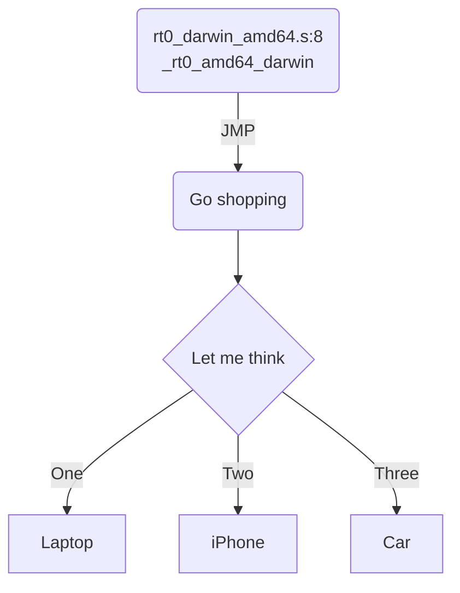

# Bootstrap

## locate entry point
思路，找到二进制文件的 entry point，在  debugger 中确定代码位置。

使用 gdb:

```shell
(gdb) info files
Symbols from "/home/ubuntu/exec_file".
Local exec file:
	`/home/ubuntu/exec_file', file type elf64-x86-64.
	Entry point: 0x448fc0
	0x0000000000401000 - 0x000000000044d763 is .text
	0x000000000044e000 - 0x00000000004704dc is .rodata
	0x0000000000470600 - 0x0000000000470d5c is .typelink
	0x0000000000470d60 - 0x0000000000470d68 is .itablink
	0x0000000000470d68 - 0x0000000000470d68 is .gosymtab
	0x0000000000470d80 - 0x00000000004997e9 is .gopclntab
	0x000000000049a000 - 0x000000000049ab58 is .noptrdata
	0x000000000049ab60 - 0x000000000049b718 is .data
	0x000000000049b720 - 0x00000000004b5d68 is .bss
	0x00000000004b5d80 - 0x00000000004ba180 is .noptrbss
	0x0000000000400fc8 - 0x0000000000401000 is .note.go.buildid
(gdb) b *0x448fc0
Breakpoint 1 at 0x448fc0: file /usr/local/go/src/runtime/rt0_linux_amd64.s, line 8.
```

或者用 readelf 找到 entry point，再配合 lldb 的 image lookup --address 找到代码位置:

```shell
ubuntu@ubuntu-xenial:~$ readelf -h ./for
ELF Header:
  Magic:   7f 45 4c 46 02 01 01 00 00 00 00 00 00 00 00 00
  Class:                             ELF64
  Data:                              2's complement, little endian
  Version:                           1 (current)
  OS/ABI:                            UNIX - System V
  ABI Version:                       0
  Type:                              EXEC (Executable file)
  Machine:                           Advanced Micro Devices X86-64
  Version:                           0x1
  Entry point address:               0x448fc0 // entry point 在这里
  Start of program headers:          64 (bytes into file)
  Start of section headers:          456 (bytes into file)
  Flags:                             0x0
  Size of this header:               64 (bytes)
  Size of program headers:           56 (bytes)
  Number of program headers:         7
  Size of section headers:           64 (bytes)
  Number of section headers:         22
  Section header string table index: 3
```

然后用 lldb:

```lldb
ubuntu@ubuntu-xenial:~$ lldb ./exec_file
(lldb) target create "./exec_file"
Current executable set to './exec_file' (x86_64).
(lldb) command source -s 1 '/home/ubuntu/./.lldbinit'
(lldb) image lookup --address 0x448fc0
      Address: exec_file[0x0000000000448fc0] (exec_file..text + 294848)
      Summary: exec_file`_rt0_amd64_linux at rt0_linux_amd64.s:8
```
mac 的可执行文件为 Mach-O：

```shell
~/test git:master ❯❯❯ file ./int
./int: Mach-O 64-bit executable x86_64
```

与 linux 的 ELF 不太一样。所以 readelf 是用不了，只能用 gdb 了，gdb 搞签名稍微麻烦一些，不过不签名理论上也可以看 entry point，结果和 linux 下应该是一样的:

```shell
(gdb) info files
Symbols from "/Users/caochunhui/test/int".
Local exec file:
	`/Users/caochunhui/test/int', file type mach-o-x86-64.
	Entry point: 0x104f8c0
	0x0000000001001000 - 0x000000000108f472 is .text
	0x000000000108f480 - 0x00000000010d4081 is __TEXT.__rodata
	0x00000000010d4081 - 0x00000000010d4081 is __TEXT.__symbol_stub1
	0x00000000010d40a0 - 0x00000000010d4c7c is __TEXT.__typelink
	0x00000000010d4c80 - 0x00000000010d4ce8 is __TEXT.__itablink
	0x00000000010d4ce8 - 0x00000000010d4ce8 is __TEXT.__gosymtab
	0x00000000010d4d00 - 0x0000000001128095 is __TEXT.__gopclntab
	0x0000000001129000 - 0x0000000001129000 is __DATA.__nl_symbol_ptr
	0x0000000001129000 - 0x0000000001135c3c is __DATA.__noptrdata
	0x0000000001135c40 - 0x000000000113c390 is .data
	0x000000000113c3a0 - 0x0000000001158aa8 is .bss
	0x0000000001158ac0 - 0x000000000115af58 is __DATA.__noptrbss

(gdb) b *0x104f8c0
Breakpoint 2 at 0x104f8c0: file /usr/local/go/src/runtime/rt0_darwin_amd64.s, line 8.
```

## 启动流程

<!--stackedit_data:
eyJoaXN0b3J5IjpbLTIwMjUzOTcyMywtNTk2NzUzMDMxXX0=
-->