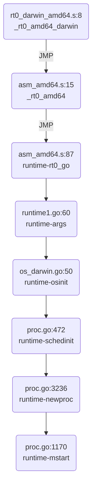

# Bootstrap

## locate entry point
思路，找到二进制文件的 entry point，在  debugger 中确定代码位置。

使用 gdb:

```shell
(gdb) info files
Symbols from "/home/ubuntu/exec_file".
Local exec file:
	`/home/ubuntu/exec_file', file type elf64-x86-64.
	Entry point: 0x448fc0
	0x0000000000401000 - 0x000000000044d763 is .text
	0x000000000044e000 - 0x00000000004704dc is .rodata
	0x0000000000470600 - 0x0000000000470d5c is .typelink
	0x0000000000470d60 - 0x0000000000470d68 is .itablink
	0x0000000000470d68 - 0x0000000000470d68 is .gosymtab
	0x0000000000470d80 - 0x00000000004997e9 is .gopclntab
	0x000000000049a000 - 0x000000000049ab58 is .noptrdata
	0x000000000049ab60 - 0x000000000049b718 is .data
	0x000000000049b720 - 0x00000000004b5d68 is .bss
	0x00000000004b5d80 - 0x00000000004ba180 is .noptrbss
	0x0000000000400fc8 - 0x0000000000401000 is .note.go.buildid
(gdb) b *0x448fc0
Breakpoint 1 at 0x448fc0: file /usr/local/go/src/runtime/rt0_linux_amd64.s, line 8.
```

或者用 readelf 找到 entry point，再配合 lldb 的 image lookup --address 找到代码位置:

```shell
ubuntu@ubuntu-xenial:~$ readelf -h ./for
ELF Header:
  Magic:   7f 45 4c 46 02 01 01 00 00 00 00 00 00 00 00 00
  Class:                             ELF64
  Data:                              2's complement, little endian
  Version:                           1 (current)
  OS/ABI:                            UNIX - System V
  ABI Version:                       0
  Type:                              EXEC (Executable file)
  Machine:                           Advanced Micro Devices X86-64
  Version:                           0x1
  Entry point address:               0x448fc0 // entry point 在这里
  Start of program headers:          64 (bytes into file)
  Start of section headers:          456 (bytes into file)
  Flags:                             0x0
  Size of this header:               64 (bytes)
  Size of program headers:           56 (bytes)
  Number of program headers:         7
  Size of section headers:           64 (bytes)
  Number of section headers:         22
  Section header string table index: 3
```

然后用 lldb:

```lldb
ubuntu@ubuntu-xenial:~$ lldb ./exec_file
(lldb) target create "./exec_file"
Current executable set to './exec_file' (x86_64).
(lldb) command source -s 1 '/home/ubuntu/./.lldbinit'
(lldb) image lookup --address 0x448fc0
      Address: exec_file[0x0000000000448fc0] (exec_file..text + 294848)
      Summary: exec_file`_rt0_amd64_linux at rt0_linux_amd64.s:8
```
mac 的可执行文件为 Mach-O：

```shell
~/test git:master ❯❯❯ file ./int
./int: Mach-O 64-bit executable x86_64
```

与 linux 的 ELF 不太一样。所以 readelf 是用不了，只能用 gdb 了，gdb 搞签名稍微麻烦一些，不过不签名理论上也可以看 entry point，结果和 linux 下应该是一样的:

```shell
(gdb) info files
Symbols from "/Users/caochunhui/test/int".
Local exec file:
	`/Users/caochunhui/test/int', file type mach-o-x86-64.
	Entry point: 0x104f8c0
	0x0000000001001000 - 0x000000000108f472 is .text
	0x000000000108f480 - 0x00000000010d4081 is __TEXT.__rodata
	0x00000000010d4081 - 0x00000000010d4081 is __TEXT.__symbol_stub1
	0x00000000010d40a0 - 0x00000000010d4c7c is __TEXT.__typelink
	0x00000000010d4c80 - 0x00000000010d4ce8 is __TEXT.__itablink
	0x00000000010d4ce8 - 0x00000000010d4ce8 is __TEXT.__gosymtab
	0x00000000010d4d00 - 0x0000000001128095 is __TEXT.__gopclntab
	0x0000000001129000 - 0x0000000001129000 is __DATA.__nl_symbol_ptr
	0x0000000001129000 - 0x0000000001135c3c is __DATA.__noptrdata
	0x0000000001135c40 - 0x000000000113c390 is .data
	0x000000000113c3a0 - 0x0000000001158aa8 is .bss
	0x0000000001158ac0 - 0x000000000115af58 is __DATA.__noptrbss

(gdb) b *0x104f8c0
Breakpoint 2 at 0x104f8c0: file /usr/local/go/src/runtime/rt0_darwin_amd64.s, line 8.
```

## 启动流程
用 lldb/gdb 可单步跟踪 Go 程序的启动流程，下面是在 OS X 上一个 Go 进程 runtime 的初始化步骤:



来具体看看每一步都在做什么。
## _rt0_amd64_darwin
```go
rt0_darwin_amd64.s:8

TEXT _rt0_amd64_darwin(SB),NOSPLIT,$-8
	JMP	_rt0_amd64(SB)
```
只做了跳转

## _rt0_amd64
```go
asm_amd64.s:15

// _rt0_amd64 is common startup code for most amd64 systems when using
// internal linking. This is the entry point for the program from the
// kernel for an ordinary -buildmode=exe program. The stack holds the
// number of arguments and the C-style argv.
TEXT _rt0_amd64(SB),NOSPLIT,$-8
	MOVQ	0(SP), DI	// argc
	LEAQ	8(SP), SI	// argv
	JMP	runtime·rt0_go(SB)
```
注释说的比较明白，64 位系统的可执行程序的内核认为的程序入口。会在特定的位置存储程序输入的 argc 和 argv。和 C 程序差不多。这里就是把这两个参数从内存拉到寄存器中。

## runtime·rt0_go
```go
asm_amd64.s:87

TEXT runtime·rt0_go(SB),NOSPLIT,$0
	// copy arguments forward on an even stack
	MOVQ	DI, AX		// argc
	MOVQ	SI, BX		// argv
	SUBQ	$(4*8+7), SP		// 2args 2auto
	ANDQ	$~15, SP
	MOVQ	AX, 16(SP)
	MOVQ	BX, 24(SP)

	// 省略了一大堆硬件信息判断和处理

	LEAQ	runtime·m0+m_tls(SB), DI
	CALL	runtime·settls(SB)

	// store through it, to make sure it works
	get_tls(BX)
	MOVQ	$0x123, g(BX)
	MOVQ	runtime·m0+m_tls(SB), AX
	CMPQ	AX, $0x123
	JEQ 2(PC)
	MOVL	AX, 0	// abort
ok:
	// set the per-goroutine and per-mach "registers"
	get_tls(BX)
	LEAQ	runtime·g0(SB), CX
	MOVQ	CX, g(BX)
	LEAQ	runtime·m0(SB), AX

	// save m->g0 = g0
	MOVQ	CX, m_g0(AX)
	// save m0 to g0->m
	MOVQ	AX, g_m(CX)

	CLD				// convention is D is always left cleared
	CALL	runtime·check(SB)

	MOVL	16(SP), AX		// copy argc
	MOVL	AX, 0(SP)
	MOVQ	24(SP), AX		// copy argv
	MOVQ	AX, 8(SP)
	CALL	runtime·args(SB)
	CALL	runtime·osinit(SB)
	CALL	runtime·schedinit(SB)

	// create a new goroutine to start program
	MOVQ	$runtime·mainPC(SB), AX		// entry，即要在 main goroutine 上运行的函数
	PUSHQ	AX
	PUSHQ	$0			// arg size
	CALL	runtime·newproc(SB)
	POPQ	AX
	POPQ	AX

	// start this M
	CALL	runtime·mstart(SB)

	MOVL	$0xf1, 0xf1  // crash
	RET
```

## runtime·args
```go
runtime1.go:60

func args(c int32, v **byte) {
	argc = c
	argv = v
	sysargs(c, v)
}

os_darwin.go:583
func sysargs(argc int32, argv **byte) {
	// skip over argv, envv and the first string will be the path
	n := argc + 1
	for argv_index(argv, n) != nil {
		n++
	}
	executablePath = gostringnocopy(argv_index(argv, n+1))

	// strip "executable_path=" prefix if available, it's added after OS X 10.11.
	const prefix = "executable_path="
	if len(executablePath) > len(prefix) && executablePath[:len(prefix)] == prefix {
		executablePath = executablePath[len(prefix):]
	}
}
```
简单的参数处理。

## runtime·osinit

```go
os_darwin.go:50

func osinit() {
	// bsdthread_register delayed until end of goenvs so that we
	// can look at the environment first.

	ncpu = getncpu()
	physPageSize = getPageSize()
	darwinVersion = getDarwinVersion()
}
```
获取 cpu 核心数。还比 os_linux.go:osinit 多了 getPageSize，getDarwinVersion 的调用。都是简单的函数。

## runtime·schedinit
```go
proc.go:472

// The bootstrap sequence is:
//
//	call osinit
//	call schedinit
//	make & queue new G
//	call runtime·mstart
//
// The new G calls runtime·main.
// 英文注释把引导到启动过程又重复说了一遍。。
func schedinit() {
	_g_ := getg()

	// 设置最大线程数 10000
	sched.maxmcount = 10000

	tracebackinit()
	moduledataverify()
	stackinit()
	mallocinit()
	mcommoninit(_g_.m)
	alginit()       // maps must not be used before this call
	modulesinit()   // provides activeModules
	typelinksinit() // uses maps, activeModules
	itabsinit()     // uses activeModules

	msigsave(_g_.m)
	initSigmask = _g_.m.sigmask

	goargs()
	goenvs()
	parsedebugvars()
	gcinit()

	sched.lastpoll = uint64(nanotime())
	procs := ncpu
	if n, ok := atoi32(gogetenv("GOMAXPROCS")); ok && n > 0 {
		procs = n
	}
	if procresize(procs) != nil {
		throw("unknown runnable goroutine during bootstrap")
	}
}
```
## runtime·newproc
```go
proc.go:3235

// Create a new g running fn with siz bytes of arguments.
// Put it on the queue of g's waiting to run.
// The compiler turns a go statement into a call to this.
// Cannot split the stack because it assumes that the arguments
// are available sequentially after &fn; they would not be
// copied if a stack split occurred.
//go:nosplit
func newproc(siz int32, fn *funcval) {
	argp := add(unsafe.Pointer(&fn), sys.PtrSize)
	pc := getcallerpc()
	systemstack(func() {
		newproc1(fn, (*uint8)(argp), siz, pc)
	})
}

// systemstack runs fn on a system stack.
// If systemstack is called from the per-OS-thread (g0) stack, or
// if systemstack is called from the signal handling (gsignal) stack,
// systemstack calls fn directly and returns.
// Otherwise, systemstack is being called from the limited stack
// of an ordinary goroutine. In this case, systemstack switches
// to the per-OS-thread stack, calls fn, and switches back.
// It is common to use a func literal as the argument, in order
// to share inputs and outputs with the code around the call
// to system stack:
//
//	... set up y ...
//	systemstack(func() {
//		x = bigcall(y)
//	})
//	... use x ...
//
//go:noescape
func systemstack(fn func())

// Create a new g running fn with narg bytes of arguments starting
// at argp. callerpc is the address of the go statement that created
// this. The new g is put on the queue of g's waiting to run.
func newproc1(fn *funcval, argp *uint8, narg int32, callerpc uintptr) {
	_g_ := getg()

	if fn == nil {
		_g_.m.throwing = -1 // do not dump full stacks
		throw("go of nil func value")
	}
	_g_.m.locks++ // disable preemption because it can be holding p in a local var
	siz := narg
	siz = (siz + 7) &^ 7

	// We could allocate a larger initial stack if necessary.
	// Not worth it: this is almost always an error.
	// 4*sizeof(uintreg): extra space added below
	// sizeof(uintreg): caller's LR (arm) or return address (x86, in gostartcall).
	if siz >= _StackMin-4*sys.RegSize-sys.RegSize {
		throw("newproc: function arguments too large for new goroutine")
	}

	_p_ := _g_.m.p.ptr()
	newg := gfget(_p_)
	if newg == nil {
		newg = malg(_StackMin)
		casgstatus(newg, _Gidle, _Gdead)
		allgadd(newg) // publishes with a g->status of Gdead so GC scanner doesn't look at uninitialized stack.
	}
	if newg.stack.hi == 0 {
		throw("newproc1: newg missing stack")
	}

	if readgstatus(newg) != _Gdead {
		throw("newproc1: new g is not Gdead")
	}

	totalSize := 4*sys.RegSize + uintptr(siz) + sys.MinFrameSize // extra space in case of reads slightly beyond frame
	totalSize += -totalSize & (sys.SpAlign - 1)                  // align to spAlign
	sp := newg.stack.hi - totalSize
	spArg := sp
	if usesLR {
		// caller's LR
		*(*uintptr)(unsafe.Pointer(sp)) = 0
		prepGoExitFrame(sp)
		spArg += sys.MinFrameSize
	}
	if narg > 0 {
		memmove(unsafe.Pointer(spArg), unsafe.Pointer(argp), uintptr(narg))
		// This is a stack-to-stack copy. If write barriers
		// are enabled and the source stack is grey (the
		// destination is always black), then perform a
		// barrier copy. We do this *after* the memmove
		// because the destination stack may have garbage on
		// it.
		if writeBarrier.needed && !_g_.m.curg.gcscandone {
			f := findfunc(fn.fn)
			stkmap := (*stackmap)(funcdata(f, _FUNCDATA_ArgsPointerMaps))
			// We're in the prologue, so it's always stack map index 0.
			bv := stackmapdata(stkmap, 0)
			bulkBarrierBitmap(spArg, spArg, uintptr(narg), 0, bv.bytedata)
		}
	}

	memclrNoHeapPointers(unsafe.Pointer(&newg.sched), unsafe.Sizeof(newg.sched))
	newg.sched.sp = sp
	newg.stktopsp = sp
	newg.sched.pc = funcPC(goexit) + sys.PCQuantum // +PCQuantum so that previous instruction is in same function
	newg.sched.g = guintptr(unsafe.Pointer(newg))
	gostartcallfn(&newg.sched, fn)
	newg.gopc = callerpc
	newg.startpc = fn.fn
	if _g_.m.curg != nil {
		newg.labels = _g_.m.curg.labels
	}
	if isSystemGoroutine(newg) {
		atomic.Xadd(&sched.ngsys, +1)
	}
	newg.gcscanvalid = false
	casgstatus(newg, _Gdead, _Grunnable)

	if _p_.goidcache == _p_.goidcacheend {
		// Sched.goidgen is the last allocated id,
		// this batch must be [sched.goidgen+1, sched.goidgen+GoidCacheBatch].
		// At startup sched.goidgen=0, so main goroutine receives goid=1.
		_p_.goidcache = atomic.Xadd64(&sched.goidgen, _GoidCacheBatch)
		_p_.goidcache -= _GoidCacheBatch - 1
		_p_.goidcacheend = _p_.goidcache + _GoidCacheBatch
	}
	newg.goid = int64(_p_.goidcache)
	_p_.goidcache++
	if raceenabled {
		newg.racectx = racegostart(callerpc)
	}
	if trace.enabled {
		traceGoCreate(newg, newg.startpc)
	}
	runqput(_p_, newg, true)

	if atomic.Load(&sched.npidle) != 0 && atomic.Load(&sched.nmspinning) == 0 && mainStarted {
		wakep()
	}
	_g_.m.locks--
	if _g_.m.locks == 0 && _g_.preempt { // restore the preemption request in case we've cleared it in newstack
		_g_.stackguard0 = stackPreempt
	}
}

```
## runtime·mstart

## runtime·main


<!--stackedit_data:
eyJoaXN0b3J5IjpbLTI3MzIyNDE2MiwtNTk2NzUzMDMxXX0=
-->