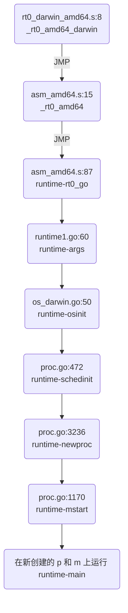

# Bootstrap

## locate entry point
思路，找到二进制文件的 entry point，在  debugger 中确定代码位置。

使用 gdb:

```shell
(gdb) info files
Symbols from "/home/ubuntu/exec_file".
Local exec file:
	`/home/ubuntu/exec_file', file type elf64-x86-64.
	Entry point: 0x448fc0
	0x0000000000401000 - 0x000000000044d763 is .text
	0x000000000044e000 - 0x00000000004704dc is .rodata
	0x0000000000470600 - 0x0000000000470d5c is .typelink
	0x0000000000470d60 - 0x0000000000470d68 is .itablink
	0x0000000000470d68 - 0x0000000000470d68 is .gosymtab
	0x0000000000470d80 - 0x00000000004997e9 is .gopclntab
	0x000000000049a000 - 0x000000000049ab58 is .noptrdata
	0x000000000049ab60 - 0x000000000049b718 is .data
	0x000000000049b720 - 0x00000000004b5d68 is .bss
	0x00000000004b5d80 - 0x00000000004ba180 is .noptrbss
	0x0000000000400fc8 - 0x0000000000401000 is .note.go.buildid
(gdb) b *0x448fc0
Breakpoint 1 at 0x448fc0: file /usr/local/go/src/runtime/rt0_linux_amd64.s, line 8.
```

或者用 readelf 找到 entry point，再配合 lldb 的 image lookup --address 找到代码位置:

```shell
ubuntu@ubuntu-xenial:~$ readelf -h ./for
ELF Header:
  Magic:   7f 45 4c 46 02 01 01 00 00 00 00 00 00 00 00 00
  Class:                             ELF64
  Data:                              2's complement, little endian
  Version:                           1 (current)
  OS/ABI:                            UNIX - System V
  ABI Version:                       0
  Type:                              EXEC (Executable file)
  Machine:                           Advanced Micro Devices X86-64
  Version:                           0x1
  Entry point address:               0x448fc0 // entry point 在这里
  Start of program headers:          64 (bytes into file)
  Start of section headers:          456 (bytes into file)
  Flags:                             0x0
  Size of this header:               64 (bytes)
  Size of program headers:           56 (bytes)
  Number of program headers:         7
  Size of section headers:           64 (bytes)
  Number of section headers:         22
  Section header string table index: 3
```

然后用 lldb:

```lldb
ubuntu@ubuntu-xenial:~$ lldb ./exec_file
(lldb) target create "./exec_file"
Current executable set to './exec_file' (x86_64).
(lldb) command source -s 1 '/home/ubuntu/./.lldbinit'
(lldb) image lookup --address 0x448fc0
      Address: exec_file[0x0000000000448fc0] (exec_file..text + 294848)
      Summary: exec_file`_rt0_amd64_linux at rt0_linux_amd64.s:8
```
mac 的可执行文件为 Mach-O：

```shell
~/test git:master ❯❯❯ file ./int
./int: Mach-O 64-bit executable x86_64
```

与 linux 的 ELF 不太一样。所以 readelf 是用不了，只能用 gdb 了，gdb 搞签名稍微麻烦一些，不过不签名理论上也可以看 entry point，结果和 linux 下应该是一样的:

```shell
(gdb) info files
Symbols from "/Users/caochunhui/test/int".
Local exec file:
	`/Users/caochunhui/test/int', file type mach-o-x86-64.
	Entry point: 0x104f8c0
	0x0000000001001000 - 0x000000000108f472 is .text
	0x000000000108f480 - 0x00000000010d4081 is __TEXT.__rodata
	0x00000000010d4081 - 0x00000000010d4081 is __TEXT.__symbol_stub1
	0x00000000010d40a0 - 0x00000000010d4c7c is __TEXT.__typelink
	0x00000000010d4c80 - 0x00000000010d4ce8 is __TEXT.__itablink
	0x00000000010d4ce8 - 0x00000000010d4ce8 is __TEXT.__gosymtab
	0x00000000010d4d00 - 0x0000000001128095 is __TEXT.__gopclntab
	0x0000000001129000 - 0x0000000001129000 is __DATA.__nl_symbol_ptr
	0x0000000001129000 - 0x0000000001135c3c is __DATA.__noptrdata
	0x0000000001135c40 - 0x000000000113c390 is .data
	0x000000000113c3a0 - 0x0000000001158aa8 is .bss
	0x0000000001158ac0 - 0x000000000115af58 is __DATA.__noptrbss

(gdb) b *0x104f8c0
Breakpoint 2 at 0x104f8c0: file /usr/local/go/src/runtime/rt0_darwin_amd64.s, line 8.
```

## 启动流程
用 lldb/gdb 可单步跟踪 Go 程序的启动流程，下面是在 OS X 上一个 Go 进程 runtime 的初始化步骤:



来具体看看每一步都在做什么。

# 分步骤说明

## _rt0_amd64_darwin
```go
rt0_darwin_amd64.s:8

TEXT _rt0_amd64_darwin(SB),NOSPLIT,$-8
	JMP	_rt0_amd64(SB)
```
只做了跳转

## _rt0_amd64
```go
asm_amd64.s:15

// _rt0_amd64 is common startup code for most amd64 systems when using
// internal linking. This is the entry point for the program from the
// kernel for an ordinary -buildmode=exe program. The stack holds the
// number of arguments and the C-style argv.
TEXT _rt0_amd64(SB),NOSPLIT,$-8
	MOVQ	0(SP), DI	// argc
	LEAQ	8(SP), SI	// argv
	JMP	runtime·rt0_go(SB)
```
注释说的比较明白，64 位系统的可执行程序的内核认为的程序入口。会在特定的位置存储程序输入的 argc 和 argv。和 C 程序差不多。这里就是把这两个参数从内存拉到寄存器中。

## runtime·rt0_go
```go
asm_amd64.s:87

TEXT runtime·rt0_go(SB),NOSPLIT,$0
	// copy arguments forward on an even stack
	MOVQ	DI, AX		// argc
	MOVQ	SI, BX		// argv
	SUBQ	$(4*8+7), SP		// 2args 2auto
	ANDQ	$~15, SP
	MOVQ	AX, 16(SP)
	MOVQ	BX, 24(SP)

	// 省略了一大堆硬件信息判断和处理

	LEAQ	runtime·m0+m_tls(SB), DI
	CALL	runtime·settls(SB)

	// store through it, to make sure it works
	get_tls(BX)
	MOVQ	$0x123, g(BX)
	MOVQ	runtime·m0+m_tls(SB), AX
	CMPQ	AX, $0x123
	JEQ 2(PC)
	MOVL	AX, 0	// abort
ok:
	// set the per-goroutine and per-mach "registers"
	get_tls(BX)
	LEAQ	runtime·g0(SB), CX
	MOVQ	CX, g(BX)
	LEAQ	runtime·m0(SB), AX

	// save m->g0 = g0
	MOVQ	CX, m_g0(AX)
	// save m0 to g0->m
	MOVQ	AX, g_m(CX)

	CLD				// convention is D is always left cleared
	CALL	runtime·check(SB)

	MOVL	16(SP), AX		// copy argc
	MOVL	AX, 0(SP)
	MOVQ	24(SP), AX		// copy argv
	MOVQ	AX, 8(SP)
	CALL	runtime·args(SB)
	CALL	runtime·osinit(SB)
	CALL	runtime·schedinit(SB)

	// create a new goroutine to start program
	MOVQ	$runtime·mainPC(SB), AX		// entry，即要在 main goroutine 上运行的函数
	PUSHQ	AX
	PUSHQ	$0			// arg size
	CALL	runtime·newproc(SB)
	POPQ	AX
	POPQ	AX

	// start this M
	CALL	runtime·mstart(SB)

	MOVL	$0xf1, 0xf1  // crash
	RET
```

## runtime·args
```go
runtime1.go:60

func args(c int32, v **byte) {
	argc = c
	argv = v
	sysargs(c, v)
}

os_darwin.go:583

func sysargs(argc int32, argv **byte) {
	// skip over argv, envv and the first string will be the path
	n := argc + 1
	for argv_index(argv, n) != nil {
		n++
	}
	executablePath = gostringnocopy(argv_index(argv, n+1))

	// strip "executable_path=" prefix if available, it's added after OS X 10.11.
	const prefix = "executable_path="
	if len(executablePath) > len(prefix) && executablePath[:len(prefix)] == prefix {
		executablePath = executablePath[len(prefix):]
	}
}
```
简单的参数处理。

## runtime·osinit

```go
os_darwin.go:50

func osinit() {
	// bsdthread_register delayed until end of goenvs so that we
	// can look at the environment first.

	ncpu = getncpu()
	physPageSize = getPageSize()
	darwinVersion = getDarwinVersion()
}
```
获取 cpu 核心数。还比 os_linux.go:osinit 多了 getPageSize，getDarwinVersion 的调用。都是简单的函数。

## runtime·schedinit
```go
proc.go:472

// The bootstrap sequence is:
//
//	call osinit
//	call schedinit
//	make & queue new G
//	call runtime·mstart
//
// The new G calls runtime·main.
// 英文注释把引导到启动过程又重复说了一遍。。
func schedinit() {
	_g_ := getg()

	// 设置最大线程数 10000
	sched.maxmcount = 10000

	// 记录一些内部函数的指令位置，并以全局变量 xxxpc的形式存储下来
	// 例如 morestackPC cgocallback_gofuncPC gogoPC
	// 主要是考虑到不同架构下的 calling convention 不一样
	// 并不都像 x86 平台一样会把函数的 return address 压到栈上
	// 可能还有 link register，简称 LR
	tracebackinit()
	// 一些校验，感觉不需要深究
	moduledataverify()
	// 一些全局的栈对象初始化，主要初始化下面注释中的几个 stack pool
	// Global pool of spans that have free stacks.
	// Stacks are assigned an order according to size.
	//     order = log_2(size/FixedStack)
	// There is a free list for each order.
	// TODO: one lock per order?
	//var stackpool [_NumStackOrders]mSpanList

	// Global pool of large stack spans.
	//var stackLarge struct {
	//	lock mutex
	//	free [_MHeapMap_Bits]mSpanList // free lists by log_2(s.npages)
	//}
	stackinit()
	// 也是和内存分配器相关的初始化操作
	// 初始化全局的 mheap 和相应的 bitmap
	// malloc.go:217
	mallocinit()
	// m 内部的一些变量初始化
	mcommoninit(_g_.m)
	// algorithm init，哈希相关的依赖初始化
	// alg.go:281
	alginit()       // maps must not be used before this call
	// plugin 相关的初始化，没啥兴趣
	modulesinit()   // provides activeModules
	// 是和 module 相关的类型初始化，没兴趣
	typelinksinit() // uses maps, activeModules
	// 同上
	itabsinit()     // uses activeModules

	// 空函数。。。。。
	msigsave(_g_.m)
	initSigmask = _g_.m.sigmask

	// goargs 和 goenvs 是把原来 kernel 传入的 argv 和 envp 处理成自己的 argv 和 env
	goargs()
	goenvs()
	
	// debug flag 处理
	parsedebugvars()
	// 读入 GOGC 环境变量，设置 GC 回收的触发 percent
	// 比如 GOGC=100，那么就是内存两倍的情况下触发回收
	// 如果 GOGC=300，那么就是内存四倍的情况下触发回收
	// 可以通过设置 GOGC=off 来彻底关闭 GC
	gcinit()

	sched.lastpoll = uint64(nanotime())
	procs := ncpu
	// 这个太简单了，没啥可说的
	if n, ok := atoi32(gogetenv("GOMAXPROCS")); ok && n > 0 {
		procs = n
	}
	// 修改 G P M 中 P 的数目
	if procresize(procs) != nil {
		throw("unknown runnable goroutine during bootstrap")
	}
}
```
## runtime·newproc
```go
proc.go:3235

// 在启动的时候，是把 runtime.main 传入到 newproc 函数中的
// 不过这个函数不只是在引导的时候用，它实际的功能是:
// 创建一个新的 g，该 g 运行传入的这个函数
// 并把这个 g 放到 g 的 waiting 列表里等待执行
// 编译器会把 go func 编译成这个函数的调用
// 更详细的还是在 scheduler 中分析吧
// Create a new g running fn with siz bytes of arguments.
// Put it on the queue of g's waiting to run.
// The compiler turns a go statement into a call to this.
// Cannot split the stack because it assumes that the arguments
// are available sequentially after &fn; they would not be
// copied if a stack split occurred.
//go:nosplit
func newproc(siz int32, fn *funcval) {
	argp := add(unsafe.Pointer(&fn), sys.PtrSize)
	pc := getcallerpc()
	systemstack(func() {
		newproc1(fn, (*uint8)(argp), siz, pc)
	})
}

```
## runtime·mstart
```go
proc.go:1170

// 启动线程 M，mac os 的有点乱，linux 的写的比较简单
// Called to start an M.
//
// This must not split the stack because we may not even have stack
// bounds set up yet.
//
// May run during STW (because it doesn't have a P yet), so write
// barriers are not allowed.
//
//go:nosplit
//go:nowritebarrierrec
func mstart() {
	_g_ := getg()

	osStack := _g_.stack.lo == 0
	if osStack {
		// Initialize stack bounds from system stack.
		// Cgo may have left stack size in stack.hi.
		size := _g_.stack.hi
		if size == 0 {
			size = 8192 * sys.StackGuardMultiplier
		}
		_g_.stack.hi = uintptr(noescape(unsafe.Pointer(&size)))
		_g_.stack.lo = _g_.stack.hi - size + 1024
	}
	// Initialize stack guards so that we can start calling
	// both Go and C functions with stack growth prologues.
	_g_.stackguard0 = _g_.stack.lo + _StackGuard
	_g_.stackguard1 = _g_.stackguard0
	
	
	mstart1(0)

	// Exit this thread.
	if GOOS == "windows" || GOOS == "solaris" || GOOS == "plan9" {
		// Window, Solaris and Plan 9 always system-allocate
		// the stack, but put it in _g_.stack before mstart,
		// so the logic above hasn't set osStack yet.
		osStack = true
	}
	mexit(osStack)
}
```
## runtime·main

```go
proc.go:109

// The main goroutine.
func main() {
	g := getg()

	// Max stack size is 1 GB on 64-bit, 250 MB on 32-bit.
	// Using decimal instead of binary GB and MB because
	// they look nicer in the stack overflow failure message.
	// 英文注释说得比较明白了。。为了好看
	if sys.PtrSize == 8 {
		maxstacksize = 1000000000
	} else {
		maxstacksize = 250000000
	}

	// Allow newproc to start new Ms.
	mainStarted = true

	// sysmon 运行的时候是脱离 G P M 的调度体系之外的，不需要依附于 P 就可以运行
	// 可以认为是后台线程
	// sysmon 中有对 checkdead 的调用，即 main goroutine deadlock的报错发源地
	systemstack(func() {
		newm(sysmon, nil)
	})

	// Lock the main goroutine onto this, the main OS thread,
	// during initialization. Most programs won't care, but a few
	// do require certain calls to be made by the main thread.
	// Those can arrange for main.main to run in the main thread
	// by calling runtime.LockOSThread during initialization
	// to preserve the lock.
	lockOSThread()

	if g.m != &m0 {
		throw("runtime.main not on m0")
	}

	// 执行runtime里面的所有init函数
	// 这个函数是编译器动态生成的，不是实际实现的函数
	// 可以用反编译工具查看
	// go tool objdump -s "runtime.\.init\b
	runtime_init() // must be before defer
	if nanotime() == 0 {
		throw("nanotime returning zero")
	}

	// Defer unlock so that runtime.Goexit during init does the unlock too.
	needUnlock := true
	defer func() {
		if needUnlock {
			unlockOSThread()
		}
	}()

	// Record when the world started. Must be after runtime_init
	// because nanotime on some platforms depends on startNano.
	runtimeInitTime = nanotime()

	gcenable()

	main_init_done = make(chan bool)
	if iscgo {
		if _cgo_thread_start == nil {
			throw("_cgo_thread_start missing")
		}
		if GOOS != "windows" {
			if _cgo_setenv == nil {
				throw("_cgo_setenv missing")
			}
			if _cgo_unsetenv == nil {
				throw("_cgo_unsetenv missing")
			}
		}
		if _cgo_notify_runtime_init_done == nil {
			throw("_cgo_notify_runtime_init_done missing")
		}
		// Start the template thread in case we enter Go from
		// a C-created thread and need to create a new thread.
		startTemplateThread()
		cgocall(_cgo_notify_runtime_init_done, nil)
	}

	fn := main_init // make an indirect call, as the linker doesn't know the address of the main package when laying down the runtime
	fn()
	close(main_init_done)

	needUnlock = false
	unlockOSThread()

	if isarchive || islibrary {
		// A program compiled with -buildmode=c-archive or c-shared
		// has a main, but it is not executed.
		return
	}
	fn = main_main // make an indirect call, as the linker doesn't know the address of the main package when laying down the runtime
	fn()


	// Make racy client program work: if panicking on
	// another goroutine at the same time as main returns,
	// let the other goroutine finish printing the panic trace.
	// Once it does, it will exit. See issues 3934 and 20018.
	if atomic.Load(&runningPanicDefers) != 0 {
		// Running deferred functions should not take long.
		for c := 0; c < 1000; c++ {
			if atomic.Load(&runningPanicDefers) == 0 {
				break
			}
			Gosched()
		}
	}
	if atomic.Load(&panicking) != 0 {
		gopark(nil, nil, "panicwait", traceEvGoStop, 1)
	}

	exit(0)
	for {
		var x *int32
		*x = 0
	}
}
```
<!--stackedit_data:
eyJoaXN0b3J5IjpbOTg0MjY4NzEzLC01OTY3NTMwMzFdfQ==
-->