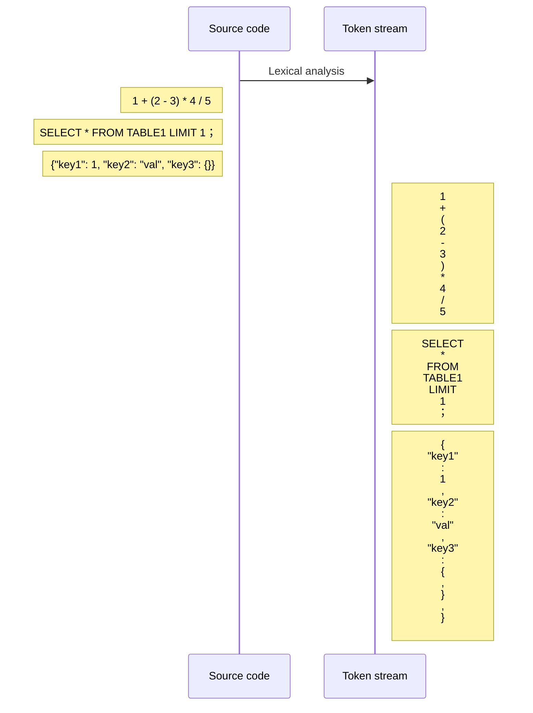

# 编译原理
> 本文主要介绍编译的几个主要过程及周边工具的使用, 对于工具内部具体实现的算法不做分析, 感兴趣的可自行搜索

## 词法分析



第一步将源代码处理成为`token stream`, 这边的源代码可以是一段简单的`go`代码, `DML`, `DSL`, 甚至是`JSON`格式的文件或者其他文本内容等等, `Lexical analysis`的目的就是按照某个定义规则将文本处理成为一连串的`token stream`
> 标记 / Token: 指处理好后的一个字串, 是构成源代码的最小单位, 比如我们可以归类 golang 中的关键字, 例如 var、const、import 等等, 或者一个字符串变量 "str" 或者操作符 :=、>=、==  等等，只要是符合我们定义的语法规则处理后出现的字串, 都可以称为一个 token

如上图, 左边框内的三条源代码案例, 经过词法分析后, 可能会(具体看自己对`token`的定义处理规则)输出右边的三块`token stream`(每一行代表一个`token`)

### lex / flex
lex / flex 是常用的词法分析器，支持正则表示某类 token

flex 文件完整格式:
```c
%{
Declarations
%}
Definitions
%%
Rules
%%
User subroutines
```

例:
test.l
```c

/* Declarations */
%{
void yyerror(const char *msg);
%}          


/* Definitions */
WHITESPACE          ([ \t\r\a]+)        
OPERATOR            ([+*-/%=,;!<>(){}]) 
INTEGER             ([0-9]+)          


/* Rules */
%%

{WHITESPACE}        { /* void */ }

{OPERATOR}          { printf("%s\n", yytext); }

{INTEGER}           { printf("%d\n", atoi(yytext)); }

\n                  { /* void */ }

.                   { printf("analysis error: unknow [%s]\n", yytext); exit(1); }

%%
       
/* User subroutines */
int main(int argc, char* argv[]) {
    FILE *fp = NULL;
    if (argc == 2) {
      fp = fopen(argv[1], "r");
      if (fp) {
        yyin = fp;
      } 
    }  
    yylex();
    if (fp) { 
       fclose(fp); 
    }
    return 0;
}

int yywrap(void) { 
    return 1;
}

void yyerror(const char *msg) {
    fprintf(stderr, "Error :\n\t%s\n", msg);
    exit(-1);
}
```


以上小段词法分析代码定义了三种`token`:`WHITESPACE`, `OPERATOR`, `INTEGER`, 分别用正则定义了他们的规则, 而后在 `Rules` 规则阶段分别对这三种 `token` 进行了各自的处理
```shell
# 编译
flex -o test.c test.l
gcc -std=c89 -o flextest test.c
./test.c test.txt
```
而后用根据我们定义的规则生成的词法分析器`flextest`来处理一个简单的案例

```shell
cat test.txt
1 + (2 - 3) * 4 / 5 sss

./flextest ./test.txt
1
+
(
2
-
3
)
*
4
/
5
analysis error: unknow [s]
```
根据输出的`token stream`可以看到, 能通过`token`规则处理的字串会完成输出一个成功处理的`token`, 规则之外的则处理失败

经过以上的小案例, 那么如果让我们自己来做一个`golang`的词法分析 `token` 的定义, 难度就不会特别大了

这边可以来简单看下`golang`编译器源码内的`token`定义

```go
// src/go/token/token.go
var tokens = [...]string{
	ILLEGAL: "ILLEGAL",

	EOF:     "EOF",
	COMMENT: "COMMENT",

	IDENT:  "IDENT",
	INT:    "INT",
	FLOAT:  "FLOAT",
	IMAG:   "IMAG",
	CHAR:   "CHAR",
	STRING: "STRING",

	ADD: "+",
	SUB: "-",
	MUL: "*",
	QUO: "/",
	REM: "%",

	AND:     "&",
	OR:      "|",
	XOR:     "^",
	SHL:     "<<",
	SHR:     ">>",
	AND_NOT: "&^",

	ADD_ASSIGN: "+=",
	SUB_ASSIGN: "-=",
	MUL_ASSIGN: "*=",
	QUO_ASSIGN: "/=",
	REM_ASSIGN: "%=",

	AND_ASSIGN:     "&=",
	OR_ASSIGN:      "|=",
	XOR_ASSIGN:     "^=",
	SHL_ASSIGN:     "<<=",
	SHR_ASSIGN:     ">>=",
	AND_NOT_ASSIGN: "&^=",

	LAND:  "&&",
	LOR:   "||",
	ARROW: "<-",
	INC:   "++",
	DEC:   "--",

	EQL:    "==",
	LSS:    "<",
	GTR:    ">",
	ASSIGN: "=",
	NOT:    "!",

	NEQ:      "!=",
	LEQ:      "<=",
	GEQ:      ">=",
	DEFINE:   ":=",
	ELLIPSIS: "...",

	LPAREN: "(",
	LBRACK: "[",
	LBRACE: "{",
	COMMA:  ",",
	PERIOD: ".",

	RPAREN:    ")",
	RBRACK:    "]",
	RBRACE:    "}",
	SEMICOLON: ";",
	COLON:     ":",

	BREAK:    "break",
	CASE:     "case",
	CHAN:     "chan",
	CONST:    "const",
	CONTINUE: "continue",

	DEFAULT:     "default",
	DEFER:       "defer",
	ELSE:        "else",
	FALLTHROUGH: "fallthrough",
	FOR:         "for",

	FUNC:   "func",
	GO:     "go",
	GOTO:   "goto",
	IF:     "if",
	IMPORT: "import",

	INTERFACE: "interface",
	MAP:       "map",
	PACKAGE:   "package",
	RANGE:     "range",
	RETURN:    "return",

	SELECT: "select",
	STRUCT: "struct",
	SWITCH: "switch",
	TYPE:   "type",
	VAR:    "var",
}
```

## 语法分析
根据第一步[词法分析](#词法分析)我们目前已经获取到了自源代码处理好之后的一个`token stream`, 在语法分析阶段主要负责的就是把这一串「看似毫无规则」的标记流进行语法结构上的处理

例如
1. 判断某个赋值操作是否可以执行, 赋值号两边的变量及数据类型是否匹配
2. 运算规则是否符合语法规则
3. 语句优先级
……

在这个阶段可以直接翻译成目标代码, 或者生成诸如语法树之类的数据结构以便后续语义分析，优化等阶段利用。

> 上下文无关文法: 文法中所有的产生式左边只有一个非终结符
> https://www.zhihu.com/question/21833944

### bison
### goyacc