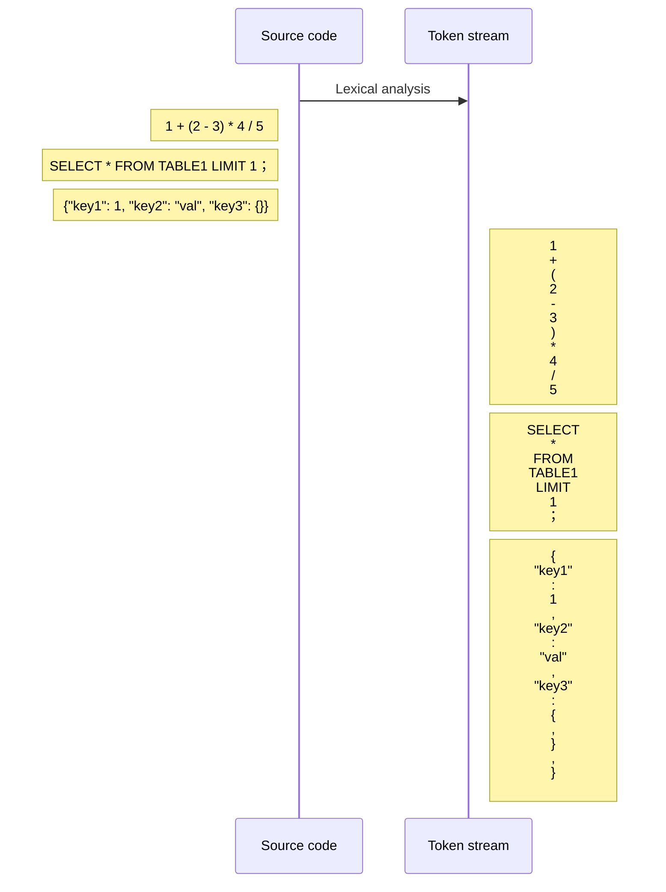
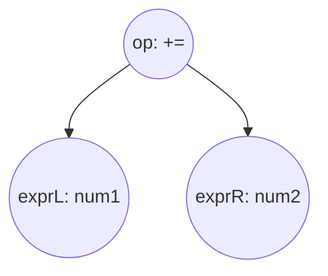

# 编译原理
> 本文主要介绍编译的几个主要过程及周边工具的使用, 对于工具内部具体实现的算法不做分析, 感兴趣的可自行搜索

## 词法分析



第一步将源代码处理成为`token stream`, 这边的源代码可以是一段简单的`go`代码, `DML`, `DSL`, 甚至是`JSON`格式的文件或者其他文本内容等等, `Lexical analysis`的目的就是按照某个定义规则将文本处理成为一连串的`token stream`
> 标记 / Token: 指处理好后的一个字串, 是构成源代码的最小单位, 比如我们可以归类 golang 中的关键字, 例如 var、const、import 等等, 或者一个字符串变量 "str" 或者操作符 :=、>=、==  等等，只要是符合我们定义的语法规则处理后出现的字串, 都可以称为一个 token

如上图, 左边框内的三条源代码案例, 经过词法分析后, 可能会(具体看自己对`token`的定义处理规则)输出右边的三块`token stream`(每一行代表一个`token`)

### lex / flex
lex / flex 是常用的词法分析器，支持正则表示某类 token

flex 文件完整格式:
```c
%{
Declarations
%}
Definitions
%%
Rules
%%
User subroutines
```

例:
test.l
```c

/* Declarations */
%{
void yyerror(const char *msg);
%}          


/* Definitions */
WHITESPACE          ([ \t\r\a]+)        
OPERATOR            ([+*-/%=,;!<>(){}]) 
INTEGER             ([0-9]+)          


/* Rules */
%%

{WHITESPACE}        { /* void */ }

{OPERATOR}          { printf("%s\n", yytext); }

{INTEGER}           { printf("%d\n", atoi(yytext)); }

\n                  { /* void */ }

.                   { printf("analysis error: unknow [%s]\n", yytext); exit(1); }

%%
       
/* User subroutines */
int main(int argc, char* argv[]) {
    FILE *fp = NULL;
    if (argc == 2) {
      fp = fopen(argv[1], "r");
      if (fp) {
        yyin = fp;
      } 
    }  
    yylex();
    if (fp) { 
       fclose(fp); 
    }
    return 0;
}

int yywrap(void) { 
    return 1;
}

void yyerror(const char *msg) {
    fprintf(stderr, "Error :\n\t%s\n", msg);
    exit(-1);
}
```


以上小段词法分析代码定义了三种`token`:`WHITESPACE`, `OPERATOR`, `INTEGER`, 分别用正则定义了他们的规则, 而后在 `Rules` 规则阶段分别对这三种 `token` 进行了各自的处理
```shell
# 编译
flex -o test.c test.l
gcc -std=c89 -o flextest test.c
./test.c test.txt
```
而后用根据我们定义的规则生成的词法分析器`flextest`来处理一个简单的案例

```shell
cat test.txt
1 + (2 - 3) * 4 / 5 sss

./flextest ./test.txt
1
+
(
2
-
3
)
*
4
/
5
analysis error: unknow [s]
```
根据输出的`token stream`可以看到, 能通过`token`规则处理的字串会完成输出一个成功处理的`token`, 规则之外的则处理失败

经过以上的小案例, 那么如果让我们自己来做一个`golang`的词法分析 `token` 的定义, 难度就不会特别大了

这边可以来简单看下`golang`编译器源码内的`token`定义

```go
// src/go/token/token.go
var tokens = [...]string{
	ILLEGAL: "ILLEGAL",

	EOF:     "EOF",
	COMMENT: "COMMENT",

	IDENT:  "IDENT",
	INT:    "INT",
	FLOAT:  "FLOAT",
	IMAG:   "IMAG",
	CHAR:   "CHAR",
	STRING: "STRING",

	ADD: "+",
	SUB: "-",
	MUL: "*",
	QUO: "/",
	REM: "%",

	AND:     "&",
	OR:      "|",
	XOR:     "^",
	SHL:     "<<",
	SHR:     ">>",
	AND_NOT: "&^",

	ADD_ASSIGN: "+=",
	SUB_ASSIGN: "-=",
	MUL_ASSIGN: "*=",
	QUO_ASSIGN: "/=",
	REM_ASSIGN: "%=",

	AND_ASSIGN:     "&=",
	OR_ASSIGN:      "|=",
	XOR_ASSIGN:     "^=",
	SHL_ASSIGN:     "<<=",
	SHR_ASSIGN:     ">>=",
	AND_NOT_ASSIGN: "&^=",

	LAND:  "&&",
	LOR:   "||",
	ARROW: "<-",
	INC:   "++",
	DEC:   "--",

	EQL:    "==",
	LSS:    "<",
	GTR:    ">",
	ASSIGN: "=",
	NOT:    "!",

	NEQ:      "!=",
	LEQ:      "<=",
	GEQ:      ">=",
	DEFINE:   ":=",
	ELLIPSIS: "...",

	LPAREN: "(",
	LBRACK: "[",
	LBRACE: "{",
	COMMA:  ",",
	PERIOD: ".",

	RPAREN:    ")",
	RBRACK:    "]",
	RBRACE:    "}",
	SEMICOLON: ";",
	COLON:     ":",

	BREAK:    "break",
	CASE:     "case",
	CHAN:     "chan",
	CONST:    "const",
	CONTINUE: "continue",

	DEFAULT:     "default",
	DEFER:       "defer",
	ELSE:        "else",
	FALLTHROUGH: "fallthrough",
	FOR:         "for",

	FUNC:   "func",
	GO:     "go",
	GOTO:   "goto",
	IF:     "if",
	IMPORT: "import",

	INTERFACE: "interface",
	MAP:       "map",
	PACKAGE:   "package",
	RANGE:     "range",
	RETURN:    "return",

	SELECT: "select",
	STRUCT: "struct",
	SWITCH: "switch",
	TYPE:   "type",
	VAR:    "var",
}
```
附上一段 `go` 内置实现的词法分析
```go
package main

import (
	"fmt"
	"go/scanner"
	"go/token"
)

func main() {
	// src is the input that we want to tokenize.
	src := `
	package main

	func main() {
		var num1, num2 int
		num1 += num2
		_ = num1
		num1 += "str"
		return
	}
	`

	// Initialize the scanner.
	var s scanner.Scanner
	fset := token.NewFileSet()                      // positions are relative to fset
	file := fset.AddFile("", fset.Base(), len(src)) // register input "file"
	s.Init(file, []byte(src), nil /* no error handler */, scanner.ScanComments)

	// Repeated calls to Scan yield the token sequence found in the input.
	fmt.Printf("%s\t%s\t%s\n", "pos", "token", "literal")
	for {
		pos, tok, lit := s.Scan()
		if tok == token.EOF {
			break
		}
		fmt.Printf("%s\t%s\t%q\n", fset.Position(pos), tok, lit)
	}
}

```
```shell
#output
pos	token	literal
2:2	package	"package"
2:10	IDENT	"main"
2:14	;	"\n"
4:2	func	"func"
4:7	IDENT	"main"
4:11	(	""
4:12	)	""
4:14	{	""
5:3	var	"var"
5:7	IDENT	"num1"
5:11	,	""
5:13	IDENT	"num2"
5:18	IDENT	"int"
5:21	;	"\n"
6:3	IDENT	"num1"
6:8	+=	""
6:11	IDENT	"num2"
6:15	;	"\n"
7:3	IDENT	"_"
7:5	=	""
7:7	IDENT	"num1"
7:11	;	"\n"
8:3	IDENT	"num1"
8:8	+=	""
8:11	STRING	"\"str\""
8:16	;	"\n"
9:3	return	"return"
9:9	;	"\n"
10:2	}	""
10:3	;	"\n"
```
注意, 这边示例代码有意使用了错误的语法, 目的是为了让大家知道`token`提取的词法分析过程中, 是没有必要同步进行语义的分析的, 输出的结果也可以和之前的`token`列表自行对照一下
## 语法分析
根据第一步[词法分析](#词法分析)我们目前已经获取到了自源代码处理好之后的一个`token stream`, 在语法分析阶段主要负责的就是把这一串「看似毫无规则」的标记流进行语法结构上的处理

例如
1. 判断某个赋值操作是否可以执行, 赋值号两边的变量及数据类型是否匹配
2. 运算规则是否符合语法规则
3. 语句优先级
4. ……

在这个阶段可以直接翻译成目标代码, 或者生成诸如语法树之类的数据结构以便后续语义分析，优化等阶段利用。

> 上下文无关文法: 文法中所有的产生式左边只有一个非终结符
> https://www.zhihu.com/question/21833944

### token stream 处理过程第一步
对于`token stream`首先我们得处理的是初步生成语法树而后交由下面的步骤进行处理, 然而这里并不是随意生成一颗语法树的, 它得以某种规则进行初步的约束, 可以试想, 如果生成的语法树有多种可能, 每次生成的结果都不一致, 那么对于这类的语法树进行后续的分析则没有任何意义

本案例中我们要实现的是一个简单的`SQL`解析器, 那么接下来看看如何通过`token stream`初步生成我们所需要的语法树

回头看下上下文无关语法的简单介绍, 所有的`产生式`右边都是由左侧唯一的`非终结符`产生的, 就例如我们常见的一条 `SQL` 
`SELECT * FROM TABLE1;` 
用上下文表达式可简单表达为
```shell
QUERY = [SELECT TOKEN] KEY [FROM TOKEN] TABLE;
KEY = [* TOKEN] | TOKEN | TOKEN ,
TABLE = TOKEN
```
> 这个案例中 `KEY` 定义为三种形式, 对应的 `SQL` 分别为 `SELECT * FROM TABLE;` `SELECT ID FROM TABLE;` `SELECT ID, COLUMN1, COLUMN2 FROPM TABLE;` 用竖线 | 来表示推到的多种可能

可以清晰地看到, 最开始看似杂乱无序的一条语句最终就可以通过分治的思想化解为一个个小问题, 以此类推最终对应到我们制定的 `TOKEN` 规则, 如果`TOKEN STREAM`最终匹配不上我们所制定的所有规则, 那么则解析失败


有了此类分析规则的简单概念后, 接下来我们就利用几个简单的工具实现这个解析器的功能
### bison
[bison](https://www.gnu.org/software/bison/) GNU bison是一个自由软件，用于自动生成语法分析器程序，实际上可用于所有常见的操作系统. 可以结合上文`flex`分析后生成的`token stream`继续进行语法部分的分析

> 继上文`flex`工具编辑一个简单的`SQL`解析器, 本案例非完全支持完整语法, 仅支持`SELECT A, B, C FROM TABLE;` `SELECT A, B, C, *;` 形式用作展示

test.l
```c
/* Declarations */
%{
#define YYSTYPE char *
#include "y.tab.h"
void yyerror(const char *msg);
#define _DUPTEXT { yylval = strdup(yytext); }
%}          


/* Definitions */
IDENTIFIER          [_a-zA-Z][_a-zA-Z0-9]*
OPERATOR            [,;*]
WHITESPACE          ([ \t\r\a]+)
/* Rules */
%%
\n                  { /* void */ }
SELECT              { _DUPTEXT; return T_SELECT; }
FROM                { _DUPTEXT; return T_FROM; }
{WHITESPACE}        { /* ignore every whitespace */ }
{OPERATOR}          { _DUPTEXT; return yytext[0]; }
{IDENTIFIER}        { _DUPTEXT; return T_IDENTIFIER; }
.                   { return 0; }

%%

int yywrap(void) { 
    return 1;
}

void yyerror(const char *s) {
    extern int yylineno;
    extern char *yytext;
    int len = strlen(yytext);
    int i = 0;
    char buf[512] = {0};
    for (; i < len; i++)
    {
        sprintf(buf, "%s%d:%c ", buf, yytext[i], yytext[i]);
    }
    fprintf(stderr, "ERROR: %s at symbol '%s' on line %d\n", s, buf, yylineno);
}
```
test.y
```c
%{
#include <stdio.h>
#include <string.h>
#include <stdlib.h>
#include "tree.h"
int columns = 0;
%}
/* 定义产生式所产生的数据类型 */
%union{
    struct ast *_ast;
    char** strs;
    char* str;
}
/* 定义各个产生式返回的数据类型 */
%type <_ast> Q
%type <strs> K
%type <str> '*' ';'
%token <str> T_SELECT T_FROM T_IDENTIFIER

%start S
/*
    SELECT A, B, C FROM TABLE;
    SELECT A, B, C, *;
*/
%%

S   :                       { /* void */ }
    |  Q                    { ast_print($1); ast_free($1); exit(0); }
    ;
/* SQL 产生式定义 */
Q   : T_SELECT K T_FROM T_IDENTIFIER ';' { 
                                            struct ast *_ast = new_ast();
                                            _ast->command = T_SELECT;
                                            ast_add_table(_ast, $4);
                                            ast_add_fields(_ast, $2);
                                            free($4);
                                            int i = 0;
                                            for (; i < _ast->filed_size; i++) {
                                                free($2[i]);
                                            }
                                            free($2);
                                            $$ = _ast; /* 将生产的 struct ast* 作为返回值返返回上一级产生式, 每个产生式的返回值有数据类型的限制, 具体看用户定义 */
                                        }

    | T_SELECT K ';'                     { 
                                            struct ast *_ast = new_ast();
                                            _ast->command = T_SELECT;
                                            ast_add_fields(_ast, $2);
                                            int i = 0;
                                            for (; i < _ast->filed_size; i++) {
                                                free($2[i]);
                                            }
                                            free($2);
                                            $$ = _ast;
                                        }
    ;
    
/* columns 产生式定义 */
K   :   '*'                 { 
                                columns++;
                                char** filed = malloc(sizeof(char*));
                                filed[0] = strdup($1);
                                $$ = filed;
                            }
    |   K ',' T_IDENTIFIER  { 
                                columns++;
                                int len = columns;
                                char** result = malloc(sizeof(char*) * len);
                                int i = 0;
                                for (; i < len-1; i++) {
                                    result[i] = strdup($1[i]);
                                    free($1[i]);
                                }
                                free($1);
                                result[i] = strdup($3);
                                $$ = result;
                            }
    |   T_IDENTIFIER        {  
                                columns++;
                                char** filed = malloc(sizeof(char*));
                                filed[0] = strdup($1);
                                $$ = filed;
                            }
    ;

%%

int main() {
    return yyparse();
}
```
tree.h
```c
struct ast
{
  int command;
  char **fileds;
  int filed_size;
  char *table;
};
void ast_add_table(struct ast *, char *);

void ast_add_fields(struct ast *, char **);

void ast_print(struct ast *);

void ast_free(struct ast *);

struct ast *new_ast();

extern int columns;
```
tree.h
```c
#include "tree.h"
#include <stdlib.h>
#include <string.h>
#include <stdio.h>
#include "y.tab.h"
struct ast *new_ast()
{
  struct ast *_ast = malloc(sizeof(struct ast));
  _ast->table = NULL;
  _ast->filed_size = 0;
  _ast->fileds = NULL;
  return _ast;
}

void ast_print(struct ast *_ast)
{
  if (!_ast)
    return;
  printf("command: %d\n", _ast->command);
  int i = 0;
  for (; i < _ast->filed_size; i++)
  {
    printf("column%i:%s\n", i, _ast->fileds[i]);
  }
  printf("tablename: %s\n", _ast->table);
  return;
}

void ast_add_table(struct ast *_ast, char *table)
{
  if (!_ast || _ast->table)
    return;
  _ast->table = strdup(table);
  return;
}

void ast_add_fields(struct ast *_ast, char **fileds)
{
  if (!_ast || _ast->fileds)
    return;
  int len = columns;
  _ast->filed_size = len;
  char **_fileds = malloc(sizeof(char *) * len);
  int i = 0;
  for (; i < len; i++)
  {
    _fileds[i] = strdup(fileds[i]);
  }
  _ast->fileds = _fileds;
}

void ast_free(struct ast *_ast)
{
  if (_ast->table)
    free(_ast->table);
  int i = 0;
  for (; i < _ast->filed_size; i++)
    free(_ast->fileds[i]);
  free(_ast->fileds);
  free(_ast);
}
```
output
```shell
flex test.l && bison -vdty test.y && gcc -std=c89 -o test y.tab.c lex.yy.c tree.c
./test
SELECT A FROM B;
command: 258
column0:A
tablename: B
```
成功解析这条小`SQL`的各个部分, 当然这边的过程生成的是一个非常简单的数据结构, 仅作对应信息的统计, 通过设计更成熟的语法树而后结合`token stream`及以上的概念就可以初步生成一棵后续步骤所需要的语法树

再回过头来看看第一步中那段`go`代码生成的语法树(依旧是用错误代码来生成，提示此处的语法树生成仅仅是初步的阶段, 后续还要进行诸多步骤的处理)
```go
package main

import (
	"go/ast"
	"go/parser"
	"go/token"
	"log"
)

func main() {
	src := `
	package main

	func main() {
		var num1, num2 int
		num1 += num2
		_ = num1
		num1 += "str"
		return
	}
	`

	// Initialize the parser.
	fset := token.NewFileSet() // positions are relative to fset
	f, err := parser.ParseFile(fset, "", src, 0)
	if err != nil {
		log.Fatalln(err)
	}
	ast.Print(fset, f)
}
```
#### AST_output:
```shell
     0  *ast.File {
     1  .  Package: 2:2
     2  .  Name: *ast.Ident {
     3  .  .  NamePos: 2:10
     4  .  .  Name: "main"
     5  .  }
     6  .  Decls: []ast.Decl (len = 1) {
     7  .  .  0: *ast.FuncDecl {
     8  .  .  .  Name: *ast.Ident {
     9  .  .  .  .  NamePos: 4:7
    10  .  .  .  .  Name: "main"
    11  .  .  .  .  Obj: *ast.Object {
    12  .  .  .  .  .  Kind: func
    13  .  .  .  .  .  Name: "main"
    14  .  .  .  .  .  Decl: *(obj @ 7)
    15  .  .  .  .  }
    16  .  .  .  }
    17  .  .  .  Type: *ast.FuncType {
    18  .  .  .  .  Func: 4:2
    19  .  .  .  .  Params: *ast.FieldList {
    20  .  .  .  .  .  Opening: 4:11
    21  .  .  .  .  .  Closing: 4:12
    22  .  .  .  .  }
    23  .  .  .  }
    24  .  .  .  Body: *ast.BlockStmt {
    25  .  .  .  .  Lbrace: 4:14
    26  .  .  .  .  List: []ast.Stmt (len = 5) {
    27  .  .  .  .  .  0: *ast.DeclStmt {
    28  .  .  .  .  .  .  Decl: *ast.GenDecl {
    29  .  .  .  .  .  .  .  TokPos: 5:3
    30  .  .  .  .  .  .  .  Tok: var
    31  .  .  .  .  .  .  .  Lparen: -
    32  .  .  .  .  .  .  .  Specs: []ast.Spec (len = 1) {
    33  .  .  .  .  .  .  .  .  0: *ast.ValueSpec {
    34  .  .  .  .  .  .  .  .  .  Names: []*ast.Ident (len = 2) {
    35  .  .  .  .  .  .  .  .  .  .  0: *ast.Ident {
    36  .  .  .  .  .  .  .  .  .  .  .  NamePos: 5:7
    37  .  .  .  .  .  .  .  .  .  .  .  Name: "num1"
    38  .  .  .  .  .  .  .  .  .  .  .  Obj: *ast.Object {
    39  .  .  .  .  .  .  .  .  .  .  .  .  Kind: var
    40  .  .  .  .  .  .  .  .  .  .  .  .  Name: "num1"
    41  .  .  .  .  .  .  .  .  .  .  .  .  Decl: *(obj @ 33)
    42  .  .  .  .  .  .  .  .  .  .  .  .  Data: 0
    43  .  .  .  .  .  .  .  .  .  .  .  }
    44  .  .  .  .  .  .  .  .  .  .  }
    45  .  .  .  .  .  .  .  .  .  .  1: *ast.Ident {
    46  .  .  .  .  .  .  .  .  .  .  .  NamePos: 5:13
    47  .  .  .  .  .  .  .  .  .  .  .  Name: "num2"
    48  .  .  .  .  .  .  .  .  .  .  .  Obj: *ast.Object {
    49  .  .  .  .  .  .  .  .  .  .  .  .  Kind: var
    50  .  .  .  .  .  .  .  .  .  .  .  .  Name: "num2"
    51  .  .  .  .  .  .  .  .  .  .  .  .  Decl: *(obj @ 33)
    52  .  .  .  .  .  .  .  .  .  .  .  .  Data: 0
    53  .  .  .  .  .  .  .  .  .  .  .  }
    54  .  .  .  .  .  .  .  .  .  .  }
    55  .  .  .  .  .  .  .  .  .  }
    56  .  .  .  .  .  .  .  .  .  Type: *ast.Ident {
    57  .  .  .  .  .  .  .  .  .  .  NamePos: 5:18
    58  .  .  .  .  .  .  .  .  .  .  Name: "int"
    59  .  .  .  .  .  .  .  .  .  }
    60  .  .  .  .  .  .  .  .  }
    61  .  .  .  .  .  .  .  }
    62  .  .  .  .  .  .  .  Rparen: -
    63  .  .  .  .  .  .  }
    64  .  .  .  .  .  }
    65  .  .  .  .  .  1: *ast.AssignStmt {
    66  .  .  .  .  .  .  Lhs: []ast.Expr (len = 1) {
    67  .  .  .  .  .  .  .  0: *ast.Ident {
    68  .  .  .  .  .  .  .  .  NamePos: 6:3
    69  .  .  .  .  .  .  .  .  Name: "num1"
    70  .  .  .  .  .  .  .  .  Obj: *(obj @ 38)
    71  .  .  .  .  .  .  .  }
    72  .  .  .  .  .  .  }
    73  .  .  .  .  .  .  TokPos: 6:8
    74  .  .  .  .  .  .  Tok: +=
    75  .  .  .  .  .  .  Rhs: []ast.Expr (len = 1) {
    76  .  .  .  .  .  .  .  0: *ast.Ident {
    77  .  .  .  .  .  .  .  .  NamePos: 6:11
    78  .  .  .  .  .  .  .  .  Name: "num2"
    79  .  .  .  .  .  .  .  .  Obj: *(obj @ 48)
    80  .  .  .  .  .  .  .  }
    81  .  .  .  .  .  .  }
    82  .  .  .  .  .  }
    83  .  .  .  .  .  2: *ast.AssignStmt {
    84  .  .  .  .  .  .  Lhs: []ast.Expr (len = 1) {
    85  .  .  .  .  .  .  .  0: *ast.Ident {
    86  .  .  .  .  .  .  .  .  NamePos: 7:3
    87  .  .  .  .  .  .  .  .  Name: "_"
    88  .  .  .  .  .  .  .  }
    89  .  .  .  .  .  .  }
    90  .  .  .  .  .  .  TokPos: 7:5
    91  .  .  .  .  .  .  Tok: =
    92  .  .  .  .  .  .  Rhs: []ast.Expr (len = 1) {
    93  .  .  .  .  .  .  .  0: *ast.Ident {
    94  .  .  .  .  .  .  .  .  NamePos: 7:7
    95  .  .  .  .  .  .  .  .  Name: "num1"
    96  .  .  .  .  .  .  .  .  Obj: *(obj @ 38)
    97  .  .  .  .  .  .  .  }
    98  .  .  .  .  .  .  }
    99  .  .  .  .  .  }
   100  .  .  .  .  .  3: *ast.AssignStmt {
   101  .  .  .  .  .  .  Lhs: []ast.Expr (len = 1) {
   102  .  .  .  .  .  .  .  0: *ast.Ident {
   103  .  .  .  .  .  .  .  .  NamePos: 8:3
   104  .  .  .  .  .  .  .  .  Name: "num1"
   105  .  .  .  .  .  .  .  .  Obj: *(obj @ 38)
   106  .  .  .  .  .  .  .  }
   107  .  .  .  .  .  .  }
   108  .  .  .  .  .  .  TokPos: 8:8
   109  .  .  .  .  .  .  Tok: +=
   110  .  .  .  .  .  .  Rhs: []ast.Expr (len = 1) {
   111  .  .  .  .  .  .  .  0: *ast.BasicLit {
   112  .  .  .  .  .  .  .  .  ValuePos: 8:11
   113  .  .  .  .  .  .  .  .  Kind: STRING
   114  .  .  .  .  .  .  .  .  Value: "\"str\""
   115  .  .  .  .  .  .  .  }
   116  .  .  .  .  .  .  }
   117  .  .  .  .  .  }
   118  .  .  .  .  .  4: *ast.ReturnStmt {
   119  .  .  .  .  .  .  Return: 9:3
   120  .  .  .  .  .  }
   121  .  .  .  .  }
   122  .  .  .  .  Rbrace: 10:2
   123  .  .  .  }
   124  .  .  }
   125  .  }
   126  .  Scope: *ast.Scope {
   127  .  .  Objects: map[string]*ast.Object (len = 1) {
   128  .  .  .  "main": *(obj @ 11)
   129  .  .  }
   130  .  }
   131  .  Unresolved: []*ast.Ident (len = 1) {
   132  .  .  0: *(obj @ 56)
   133  .  }
   134  }
```
### goyacc
`goyacc` 是一个 `golang` 版的 `yacc` 工具(作用和上文介绍的`flex & bison`)类似, 不同的是没有对应的`lex`工具, 这部分逻辑需要自己实现
接下来用`goyacc`将上述的`SQL`小解析器实现一遍

parser.y
```c
%{
package sql

var columns int;

func setResult(l yyLexer, v *ast) {
  l.(*lex).result = v
}

%}
/* 定义产生式所产生的数据类型 */
%union{
    _ast * ast
    strs []string
    str string
}
/* 定义各个产生式返回的数据类型 */
%type <_ast> Q
%type <strs> K
%type <str> '*' ';'
%token <str> T_SELECT T_FROM T_IDENTIFIER

%start S
/*
    SELECT A, B, C FROM TABLE;
    SELECT A, B, C, *;
*/
%%

S   :                       { /* void */ }
    |  Q                    { setResult(yylex, $1) }
    ;
/* SQL 产生式定义 */
Q   : T_SELECT K T_FROM T_IDENTIFIER ';' { 
                                            _ast := new_ast();
                                            _ast.command = T_SELECT;
                                            ast_add_table(_ast, $4);
                                            ast_add_fields(_ast, $2);
                                            $$ = _ast; /* 将生产的 struct ast* 作为返回值返返回上一级产生式, 每个产生式的返回值有数据类型的限制, 具体看用户定义 */
                                        }

    | T_SELECT K ';'                     { 
                                            _ast := new_ast();
                                            _ast.command = T_SELECT;
                                            ast_add_fields(_ast, $2);
                                            $$ = _ast;
                                        }
    ;
    
/* columns 产生式定义 */
K   :   '*'                 { 
                                columns++;
                                $$ = []string{$1};
                            }
    |   K ',' T_IDENTIFIER  { 
                                columns++;
                                $$ = append($1, $3);
                            }
    |   T_IDENTIFIER        {  
                                columns++;
                                $$ = []string{$1};
                            }
    ;

%%
```
tree.go
```go
package sql

import (
	"errors"
	"fmt"
	"os"
	"strings"
)

//go:generate go run golang.org/x/tools/cmd/goyacc -l -o parser.go parser.y

type ast struct {
	command    int
	fileds     []string
	filed_size int
	table      string
}
type lex struct {
	input  []byte
	pos    int
	result *ast
	err    error
}

func Parse(sql string) (*ast, error) {
	l := &lex{
		input: []byte(sql),
	}
	_ = yyParse(l) // yyParse 入参需要实现 goyacc lex 接口
	return l.result, l.err
}

func (l *lex) Lex(lval *yySymType) int { // token 解析入口
	str := l.nextString()
	switch strings.ToLower(str) {
	case "":
		return 0
	case "*", ";", ",":
		lval.str = str // 对应 flex 中 yylval = strdup(yytext); 赋值操作, 需要和返回的类型相对于, goyacc 会根据返回的类型去对应的字段获取
		return int(byte(str[0]))  // 对应 flex 中 return 返回 token 类型
	case "select":
		lval.str = str
		return T_SELECT
	case "from":
		lval.str = str
		return T_FROM
	default:
		lval.str = str
		return T_IDENTIFIER
	}
}
func (l *lex) nextString() string {
	/* trim left */
	for {
		if l.pos >= len(l.input) {
			return ""
		}
		switch l.input[l.pos] {
		case ' ', '\r', '\n', '\t', '\a':
			l.pos++
		default:
			goto next
		}
	}
next:
	/* get next string */
	var index int = l.pos
	for ; index < len(l.input); index++ {
		switch l.input[index] {
		case ' ', '\r', '\n', '\t', '\a':
			goto next_2
		case '*', ';', ',':
			if index == l.pos {
				index++
			}
			goto next_2
		default:
		}
	}
next_2:
	result := l.input[l.pos:index]
	l.pos = index
	return string(result)
}

// Error satisfies yyLexer.
func (l *lex) Error(s string) {
	l.err = errors.New(s)
}

func new_ast() *ast {
	return &ast{}
}

func ast_print(_ast *ast) {
	if _ast == nil {
		return
	}
	fmt.Printf("command:%s\n", func() string {
		switch _ast.command {
		case T_SELECT:
			return "select"
		default:
			return "unknow"
		}
	}())
	for i := range _ast.fileds {
		fmt.Printf("column%d:%s\n", i, _ast.fileds[i])
	}
	fmt.Printf("tablename:%s\n", _ast.table)
}

func ast_add_table(_ast *ast, table string) {
	if _ast == nil || _ast.table != "" {
		return
	}
	_ast.table = table
}

func ast_add_fields(_ast *ast, fileds []string) {
	if _ast == nil {
		return
	}
	_ast.fileds = fileds
	_ast.filed_size = len(fileds)
}

func ast_free(_ast *ast) {
	/* void */
	return
}

func exit(i int) {
	os.Exit(i)
}

```
lex_test.go
```go
package sql

import (
	"fmt"
	"log"
	"testing"
)

func TestLex(t *testing.T) {
	sqls := []string{
		`SELECT * FROM TABLE1;`,
		`SelecT A,B,C FROM TB;`,
		`SELECT A,B,C;`,
	}
	for _, sql := range sqls {
		_ast, err := Parse(sql)
		if err != nil {
			log.Fatalln(err)
		}
		ast_print(_ast)
		fmt.Println()
	}
}

```
output:
```shell
go run golang.org/x/tools/cmd/goyacc -l -o parser.go parser.y
go test -v .
=== RUN   TestLex
command:select
column0:*
tablename:TABLE1

command:select
column0:A
column1:B
column2:C
tablename:TB

command:select
column0:A
column1:B
column2:C
tablename:

--- PASS: TestLex (0.00s)
PASS
ok      json1/sql       0.006s
```

## 类型检查
在进行类型检查这一步的时候, 整个文件可以粗略分为`变量声明及作用域`以及`表达式`两块内容, 在检查 AST 的过程中遇到一些定义的变量会在当前作用域中查找是否有对应的声明, 如果没找到则顺着作用域向上去父级作用域寻找

### 声明及作用域
作用域可大致分为几类
1. 全局
2. 对应函数体内
3. 块级表达式内    {...}      // 单独一对花括号包裹范围内
```go
// 作用域结构体定义
type Scope struct {
	parent   *Scope           
	children []*Scope
	elems    map[string]Object // lazily allocated
	pos, end token.Pos         // scope extent; may be invalid
	comment  string            // for debugging only
	isFunc   bool              // set if this is a function scope (internal use only)
}
func (s *Scope) LookupParent(name string, pos token.Pos) (*Scope, Object) {
	for ; s != nil; s = s.parent {
		if obj := s.elems[name]; obj != nil && (!pos.IsValid() || obj.scopePos() <= pos) {
			return s, obj
		}
	}
	return nil, nil
}
```
回顾下 `AST file` 的数据结构
```go
type File struct {
	Doc        *CommentGroup   // associated documentation; or nil
	Package    token.Pos       // position of "package" keyword
	Name       *Ident          // package name
	Decls      []Decl          // top-level declarations; or nil
	Scope      *Scope          // package scope (this file only)
	Imports    []*ImportSpec   // imports in this file
	Unresolved []*Ident        // unresolved identifiers in this file
	Comments   []*CommentGroup // list of all comments in the source file
}
```
再结合之前输出的 [`AST`](#ast_output), 我们可以看到在生成的过程中, 大部分的 `identifiers token` 是能够确认对应类型的, 例如函数声明之类的, 那么对应函数名的 `token` 就可以被成功解析为对应类型的语法树中的一个节点

但是依旧存在一些在`AST`初步生成阶段无法被成功解析的, 那么会被存放在`Unresolved`字段中, 就比如上面输出的`int`, 那么这时候就通过向上从父级中依次查找, 如果最终能够找到对应定义, 那么检查成功, 否则则抛出未定义异常

例:
```go
package main

import (
	"go/ast"
	"go/parser"
	"go/token"
	"go/types"
	"log"
)

func main() {
	src := `
	
	package main

	func main() {
		var num1, num2 int
		num1 += num2
		_ = num1
		testval++
		return
	}
	`

	// Initialize the parser.
	fset := token.NewFileSet() // positions are relative to fset
	f, err := parser.ParseFile(fset, "", src, parser.AllErrors|parser.ParseComments)
	if err != nil {
		log.Fatalln(err)
	}
	pkg, err := new(types.Config).Check("test.go", fset, []*ast.File{f}, nil)
	if err != nil {
		log.Fatal(err)
	}

	_ = pkg
}

```
output:
```shell
2021/09/20 15:19:01 9:3: undeclared name: testval
```
### 表达式检查
截取之前生成的`AST`中的一小段
`num1 += num2`
```shell
65  .  .  .  .  .  1: *ast.AssignStmt {
66  .  .  .  .  .  .  Lhs: []ast.Expr (len = 1) {
67  .  .  .  .  .  .  .  0: *ast.Ident {
68  .  .  .  .  .  .  .  .  NamePos: 6:3
69  .  .  .  .  .  .  .  .  Name: "num1"
70  .  .  .  .  .  .  .  .  Obj: *(obj @ 38)
71  .  .  .  .  .  .  .  }
72  .  .  .  .  .  .  }
73  .  .  .  .  .  .  TokPos: 6:8
74  .  .  .  .  .  .  Tok: +=
75  .  .  .  .  .  .  Rhs: []ast.Expr (len = 1) {
76  .  .  .  .  .  .  .  0: *ast.Ident {
77  .  .  .  .  .  .  .  .  NamePos: 6:11
78  .  .  .  .  .  .  .  .  Name: "num2"
79  .  .  .  .  .  .  .  .  Obj: *(obj @ 48)
80  .  .  .  .  .  .  .  }
81  .  .  .  .  .  .  }
82  .  .  .  .  .  }
```
先看下这个简单的赋值表达式生成的树形结构

对于当前这部分表达式检查, 需要进行的步骤为
1. 确认当前操作符(+=)
2. 左子树表达式递归, 并确认表达式最终类型
3. 右子树表达式递归, 并确认表达式最终类型
4. 左右 expr 类型校验, 如符合当前操作符规则, 成功, 反之失败

```go
// The binary expression e may be nil. It's passed in for better error messages only.
func (check *Checker) binary(x *operand, e *ast.BinaryExpr, lhs, rhs ast.Expr, op token.Token) {
	var y operand

	check.expr(x, lhs)  // 左子树表达式递归
	check.expr(&y, rhs) // 右子树表达式递归
    /* 先判断下特殊的操作类型 */
	if x.mode == invalid {
		return
	}
	if y.mode == invalid {
		x.mode = invalid
		x.expr = y.expr
		return
	}

	if isShift(op) {
		check.shift(x, &y, e, op)
		return
	}

	check.convertUntyped(x, y.typ)
	if x.mode == invalid {
		return
	}
	check.convertUntyped(&y, x.typ)
	if y.mode == invalid {
		x.mode = invalid
		return
	}

	if isComparison(op) {
		check.comparison(x, &y, op)
		return
	}
     /* 默认要求 x y 类型一致 */
	if !check.identical(x.typ, y.typ) { // 类型校验
		// only report an error if we have valid types
		// (otherwise we had an error reported elsewhere already)
		if x.typ != Typ[Invalid] && y.typ != Typ[Invalid] {
			check.invalidOp(x.pos(), "mismatched types %s and %s", x.typ, y.typ)
		}
		x.mode = invalid
		return
	}

	if !check.op(binaryOpPredicates, x, op) {
		x.mode = invalid
		return
	}

	if op == token.QUO || op == token.REM {
		// check for zero divisor
		if (x.mode == constant_ || isInteger(x.typ)) && y.mode == constant_ && constant.Sign(y.val) == 0 {
			check.invalidOp(y.pos(), "division by zero")
			x.mode = invalid
			return
		}

		// check for divisor underflow in complex division (see issue 20227)
		if x.mode == constant_ && y.mode == constant_ && isComplex(x.typ) {
			re, im := constant.Real(y.val), constant.Imag(y.val)
			re2, im2 := constant.BinaryOp(re, token.MUL, re), constant.BinaryOp(im, token.MUL, im)
			if constant.Sign(re2) == 0 && constant.Sign(im2) == 0 {
				check.invalidOp(y.pos(), "division by zero")
				x.mode = invalid
				return
			}
		}
	}

	if x.mode == constant_ && y.mode == constant_ {
		xval := x.val
		yval := y.val
		typ := x.typ.Underlying().(*Basic)
		// force integer division of integer operands
		if op == token.QUO && isInteger(typ) {
			op = token.QUO_ASSIGN
		}
		x.val = constant.BinaryOp(xval, op, yval)
		// Typed constants must be representable in
		// their type after each constant operation.
		if isTyped(typ) {
			if e != nil {
				x.expr = e // for better error message
			}
			check.representable(x, typ)
		}
		return
	}

	x.mode = value
	// x.typ is unchanged
}
```
> 这边以 `go/types` 标准库的类型检查作为案例, 编译器整体流程大同小异

以上, 通过`TOKEN`声明以及对应作用域的维护及查找, 再结合各操作符下表达式的递归分析过程, 对于一棵语法树的类型检查就可以进行了

## 中间代码生成
## 机器码生成
## 参考资料
[flex & bison](https://pandolia.net/tinyc/index.html)
  
[goyacc 入门案例](https://github.com/sougou/parser_tutorial)