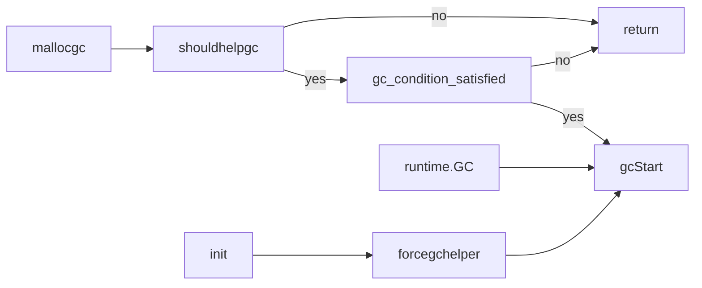

# Garbage Collection

## 大致流程

GC 和用户线程并发运行，在 GC 的概念中常见的 mutator 这个词是 Dijkstra 发明的，mutator 本意是改变者，变异子，在 GC 中将用户程序称为 mutator，是因为用户代码会不断地改变对象之间的引用关系。所以我们也看到有人说 mutator 是 fancy word for the 'real program')
```
//
// The GC runs concurrently with mutator threads, is type accurate (aka precise), allows multiple
// GC thread to run in parallel. It is a concurrent mark and sweep that uses a write barrier. It is
// non-generational and non-compacting. Allocation is done using size segregated per P allocation
// areas to minimize fragmentation while eliminating locks in the common case.
//
// The algorithm decomposes into several steps.
// This is a high level description of the algorithm being used. For an overview of GC a good
// place to start is Richard Jones' gchandbook.org.
//
// The algorithm's intellectual heritage includes Dijkstra's on-the-fly algorithm, see
// Edsger W. Dijkstra, Leslie Lamport, A. J. Martin, C. S. Scholten, and E. F. M. Steffens. 1978.
// On-the-fly garbage collection: an exercise in cooperation. Commun. ACM 21, 11 (November 1978),
// 966-975.
// For journal quality proofs that these steps are complete, correct, and terminate see
// Hudson, R., and Moss, J.E.B. Copying Garbage Collection without stopping the world.
// Concurrency and Computation: Practice and Experience 15(3-5), 2003.
//
// 1. GC performs sweep termination.
//
//    a. Stop the world. This causes all Ps to reach a GC safe-point.
//
//    b. Sweep any unswept spans. There will only be unswept spans if
//    this GC cycle was forced before the expected time.
//
// 2. GC performs the mark phase.
//
//    a. Prepare for the mark phase by setting gcphase to _GCmark
//    (from _GCoff), enabling the write barrier, enabling mutator
//    assists, and enqueueing root mark jobs. No objects may be
//    scanned until all Ps have enabled the write barrier, which is
//    accomplished using STW.
//
//    b. Start the world. From this point, GC work is done by mark
//    workers started by the scheduler and by assists performed as
//    part of allocation. The write barrier shades both the
//    overwritten pointer and the new pointer value for any pointer
//    writes (see mbarrier.go for details). Newly allocated objects
//    are immediately marked black.
//
//    c. GC performs root marking jobs. This includes scanning all
//    stacks, shading all globals, and shading any heap pointers in
//    off-heap runtime data structures. Scanning a stack stops a
//    goroutine, shades any pointers found on its stack, and then
//    resumes the goroutine.
//
//    d. GC drains the work queue of grey objects, scanning each grey
//    object to black and shading all pointers found in the object
//    (which in turn may add those pointers to the work queue).
//
//    e. Because GC work is spread across local caches, GC uses a
//    distributed termination algorithm to detect when there are no
//    more root marking jobs or grey objects (see gcMarkDone). At this
//    point, GC transitions to mark termination.
//
// 3. GC performs mark termination.
//
//    a. Stop the world.
//
//    b. Set gcphase to _GCmarktermination, and disable workers and
//    assists.
//
//    c. Perform housekeeping like flushing mcaches.
//
// 4. GC performs the sweep phase.
//
//    a. Prepare for the sweep phase by setting gcphase to _GCoff,
//    setting up sweep state and disabling the write barrier.
//
//    b. Start the world. From this point on, newly allocated objects
//    are white, and allocating sweeps spans before use if necessary.
//
//    c. GC does concurrent sweeping in the background and in response
//    to allocation. See description below.
//
// 5. When sufficient allocation has taken place, replay the sequence
// starting with 1 above. See discussion of GC rate below.

// Concurrent sweep.
//
// The sweep phase proceeds concurrently with normal program execution.
// The heap is swept span-by-span both lazily (when a goroutine needs another span)
// and concurrently in a background goroutine (this helps programs that are not CPU bound).
// At the end of STW mark termination all spans are marked as "needs sweeping".
//
// The background sweeper goroutine simply sweeps spans one-by-one.
//
// To avoid requesting more OS memory while there are unswept spans, when a
// goroutine needs another span, it first attempts to reclaim that much memory
// by sweeping. When a goroutine needs to allocate a new small-object span, it
// sweeps small-object spans for the same object size until it frees at least
// one object. When a goroutine needs to allocate large-object span from heap,
// it sweeps spans until it frees at least that many pages into heap. There is
// one case where this may not suffice: if a goroutine sweeps and frees two
// nonadjacent one-page spans to the heap, it will allocate a new two-page
// span, but there can still be other one-page unswept spans which could be
// combined into a two-page span.
//
// It's critical to ensure that no operations proceed on unswept spans (that would corrupt
// mark bits in GC bitmap). During GC all mcaches are flushed into the central cache,
// so they are empty. When a goroutine grabs a new span into mcache, it sweeps it.
// When a goroutine explicitly frees an object or sets a finalizer, it ensures that
// the span is swept (either by sweeping it, or by waiting for the concurrent sweep to finish).
// The finalizer goroutine is kicked off only when all spans are swept.
// When the next GC starts, it sweeps all not-yet-swept spans (if any).

// GC rate.
// Next GC is after we've allocated an extra amount of memory proportional to
// the amount already in use. The proportion is controlled by GOGC environment variable
// (100 by default). If GOGC=100 and we're using 4M, we'll GC again when we get to 8M
// (this mark is tracked in next_gc variable). This keeps the GC cost in linear
// proportion to the allocation cost. Adjusting GOGC just changes the linear constant
// (and also the amount of extra memory used).

// Oblets
//
// In order to prevent long pauses while scanning large objects and to
// improve parallelism, the garbage collector breaks up scan jobs for
// objects larger than maxObletBytes into "oblets" of at most
// maxObletBytes. When scanning encounters the beginning of a large
// object, it scans only the first oblet and enqueues the remaining
// oblets as new scan jobs.


```

```
                                                                                                                                                   ┌─────────────────┐                                                                                                                                                   
                                                                                           ┌───────────────────────────────────────────────────────│  forcegchelper  │                                                                                                                                                   
                                                                                           │                                                       ├─────────────────┤                                                                                                                                                   
                                                                                           ├───────────────────────────────────────────────────────│       GC        │                                                                                                                                                   
                                                                                           │                                                       ├─────────────────┤                                                                                                                                                   
                                                                                           ├───────────────────────────────────────────────────────│    mallocgc     │                                                                                                                                                   
                                                                                           │                                                       └─────────────────┘                                                                                                                                                   
                                                                                           ▼                                                                                                                                                                                                                             
                                                                                 ┌──────────────────┐                                                                                                                                                                                                                    
              ┌─────────────────────────────────────┐                            │     gcStart      │                                                                                                                                                                                                                    
              │                                     │                            ├───┬──────────────┴────────────────────┐                                                                                                                                                                                               
              ▼                                     │                            │ 1 │    semacquire(&work.startSema)    │                                                                                                                                                                                               
      ┌───────────────┐                             │                            ├───┼───────────────────────────────────┤                                                                                    ┌────────────────┐                                                                                         
      │  startCycle   │                             │                            │ 2 │      semacquire(&worldsema)       │                                                                                    │   schedule()   │                                                                                         
      ├───┬───────────┴───────────────────────┐     │                            ├───┼───────────────────────────────────┤            ┌─────────────────────────┐                                             ├────────────────┴──────────────────────┐                                                                  
      │ 1 │      init gcControllerState       │     │                            │ 3 │      gcBgMarkStartWorkers()       │───────────▶│ gcBgMarkStartWorkers()  │                                             │                 .....                 │                                                                  
      ├───┼───────────────────────────────────┤     │                            ├───┼───────────────────────────────────┤            ├───┬─────────────────────┴─────────────┐                               ├───┬───────────────────────────────────┤                                                                  
      │ 2 │            calc nextgc            │     │                            │ 4 │   systemstack(gcResetMarkState)   │            │ 1 │          loop until allp          │                               │ 1 │       gcBlackenEnabled != 0       │                                                                  
      ├───┼───────────────────────────────────┤     │                            ├───┼───────────────────────────────────┤            ├───┼───────────────────────────────────┤                               ├───┼───────────────────────────────────┤                                                                  
      │ 3 │ calc c.dedicatedMarkWorkersNeeded │     │                            │ 5 │ systemstack(stopTheWorldWithSema) │            │ 2 │       go gcBgMarkWorker(p)        │                               │ 2 │      findRunnableGCWorker()       │                                                                  
      ├───┼───────────────────────────────────┤     │                            ├───┼───────────────────────────────────┤            └───┴───────────────────────────────────┘                               └───┴───────────────────────────────────┘                                                                  
      │ 4 │         clear per-P state         │     │                            │ 6 │   systemstack(finishsweep_m())    │                                  │                                                                       ▲                                                                                    
      ├───┼───────────────────────────────────┤     │                            ├───┼───────────────────────────────────┤                                  │                                                                       │                                                                                    
      │ 5 │            c.revise()             │     │                            │ 7 │           clearpools()            │                                  │                                                                       │                                                                                    
      └───┴───────────────────────────────────┘     │                            ├───┼───────────────────────────────────┤                                  │                                                                       │                                                                                    
                                                    └────────────────────────────│ 8 │     gcController.startCycle()     │                                  │                                                                       │                                                                                    
                                                                                 ├───┼───────────────────────────────────┤                                  │                                                                       │                                                                                    
                                                                                 │10 │ work.heapGoal = memstats.next_gc  │                                  ▼                                                                       │                                                                                    
                                                                                 ├───┼───────────────────────────────────┴───────────────┐┌───────────────────────────────────┐                                                     │                                                                                    
                                                                                 │11 │if mode != gcBackgroundMode{schedEnableUser(false)}││       go gcBgMarkWorker(p)        │                                                     │                                                                                    
                                                                                 ├───┼───────────────────────────────────┬───────────────┘├───┬───────────────────────────────┴──────────┐                              ┌───────────┴──────┐                                                                             
                                                                                 │11 │        setGCPhase(_GCmark)        │                │ 1 │                 gopark()                 │◀─────────────────────────────┤      wakeup      │                                                                             
                                                                                 ├───┼───────────────────────────────────┤                ├───┼──────────────────────────────────────────┤                              └──────────────────┘                                                                             
                                                                                 │12 │         gcBgMarkPrepare()         │                │ 2 │   casgstatus(gp, _Grunning, _Gwaiting)   │                                                                                                                               
                                                                                 ├───┼───────────────────────────────────┤                ├───┼──────────────────────────────────────────┤                                                                                                                               
            ┌────────────────────────────────────────────────────────────────────│13 │        gcMarkRootPrepare()        │                │ 3 │                gcDrain()                 │───────────────────────┐                                                                                                       
            │                                                                    ├───┼───────────────────────────────────┤                ├───┼──────────────────────────────────────────┤                       │                        ┌──────────────────┐                                                           
            │                                                                    │14 │        gcMarkTinyAllocs()         │                │ 4 │   casgstatus(gp, _Gwaiting, _Grunning)   │                       └───────────────────────▶│    gcDrain()     │                                                           
            │                                                                    ├───┼───────────────────────────────────┤                ├───┼──────────────────────────────────────────┤                                                ├──────────┬───────┴────────────────────┐                                      
            │                                                                    │15 │atomic.Store(&gcBlackenEnabled, 1) │                │ 5 │            if all worker done            │                                                │   loop   │     markroot(gcw, job)     │                                      
            │                                                                    ├───┼───────────────────────────────────┤                ├───┼──────────────────────────────────────────┤                                                ├──────────┼────────────────────────────┤                                      
            │                                                                    │16 │systemstack(startTheWorldWithSema()│                │ 6 │       _p_.gcBgMarkWorker.set(nil)        │                                                │  loop2   │       gcw.balance()        │                                      
            │                                                                    ├───┼───────────────────────────────────┤                ├───┼──────────────────────────────────────────┤                                                ├──────────┼────────────────────────────┤                                      
            │                                                                    │17 │    semrelease(&work.startSema)    │                │ 7 │          releasem(park.m.ptr())          │                                                │  loop2   │      gcw.tryGetFast()      │                                      
            │                                                                    └───┴───────────────────────────────────┘                ├───┼──────────────────────────────────────────┤                                                ├──────────┼────────────────────────────┤                                      
            │                                                                                                                             │ 8 │               gcMarkDone()               │                                                │  loop2   │        gcw.tryGet()        │                                      
            │                                                                                                                             └───┴──────────────────────────────────────────┘                                                ├──────────┼────────────────────────────┤                                      
            │                                                                                                                                                       │                                                                     │  loop2   │     scanobject(b, gcw)     │                                      
            │                                                                                                                                                       │                                                                     ├──────────┼────────────────────────────┤                                      
            │                                                                                                                                                       │                                                                     │  loop2   │   flush credit to global   │                                      
            │                                                                                                                                                       │                                                                     ├──────────┼────────────────────────────┤                                      
            │                                                                                                                                                       │                                                                     │   done   │      gcFlushBgCredit       │                                      
            │                                                                                                                                                       │                                                                     └──────────┴────────────────────────────┘                                      
            │                                                                                                                                                       │                                                                                                                                                    
            │                                                                                                                                                       │                                                                                                                                                    
            │                                                                                                                                                       ▼                                                                                                                                                    
            │                                                                                                                                              ┌────────────────┐                                                                                                                                            
            │                                                                                                                                              │  gcMarkDone()  │                                                                                                                                            
            │                                                                                                                                              ├───┬────────────┴──────────────────────────────────┐                                                                                                         
            ▼                                                                                                                                              │ 1 │        semacquire(&work.markDoneSema)         │                                                                                                         
┌──────────────────────┐                                                                                                                                   ├───┼───────────────────────────────────────────────┤                                                                                                         
│ gcMarkRootPrepare()  │                                                                                                                                   │ 2 │             gcMarkDoneFlushed = 0             │                                                                                                         
├──────────────────────┴────────────┐                                                                                                                      ├───┼───────────────────────────────────────────────┤                                                                                                         
│        set work.nDataRoots        │                                                                                                                      │ 3 │     casgstatus(gp, _Grunning, _Gwaiting)      │                                                                                                         
├───────────────────────────────────┤                                                                                                                      ├───┼──────────┬──────────────────┬─────────────────┴┬──────────────────┬────────────────────────────────────┐                                                
│        set work.nBSSRoots         │                                                                                                                      │ 4 │ forEachP │ wbBufFlush1(_p_) │_p_.gcw.dispose() │_p_.gcw.dispose() │ atomic.Xadd(&gcMarkDoneFlushed, 1) │                                                
├───────────────────────────────────┤                                                                                                                      ├───┼──────────┴──────────────────┴─────────────────┬┴──────────────────┴────────────────────────────────────┘                                                
│        set work.nSpanRoots        │                                                                                                                      │ 5 │     casgstatus(gp, _Gwaiting, _Grunning)      │                                                                                                         
├───────────────────────────────────┤                                                                                                                      ├───┼───────────────────────────────────────────────┤                                                                                                         
│       set work.nStackRoots        │                                                                                                                      │ 6 │         getg().m.preemptoff = "gcing"         │                                                                                                         
├───────────────────────────────────┤                                                                                                                      ├───┼───────────────────────────────────────────────┤                                                                                                         
│       set work.markrootJobs       │                                                                                                                      │ 7 │       systemstack(stopTheWorldWithSema)       │                                                                                                         
└───────────────────────────────────┘                                                        ┌───────────────────────────────────┐                         ├───┼───────────────────────────────────────────────┤                                                                                                         
                                                                                             │                                   │                         │ 8 │      atomic.Store(&gcBlackenEnabled, 0)       │                                                                                                         
                                                                                             ▼                                   │                         ├───┼───────────────────────────────────────────────┤                                                                                                         
                                                                                   ┌───────────────────┐                         │                         │ 9 │              gcWakeAllAssists()               │                                                                                                         
                                                                                   │ gcMarkTermination │                         │                         ├───┼───────────────────────────────────────────────┤                                                                                                         
                                                                                   ├───┬───────────────┴───────────────────┐     │                         │10 │        semrelease(&work.markDoneSema)         │                                                                                                         
                                                                                   │ 1 │       gcBlackenEnabled -> 0       │     │                         ├───┼───────────────────────────────────────────────┤                                                                                                         
                                                                                   ├───┼───────────────────────────────────┤     │                         │11 │  nextTriggerRatio := gcController.endCycle()  │                                                   ┌───────────────────┐                                 
                                                                                   │ 2 │   gcphase -> _GCmarktermination   │     │                         ├───┼───────────────────────────────────────────────┤                                                   │   runtime.main    │                                 
                                                                                   ├───┼───────────────────────────────────┤     └─────────────────────────│12 │      gcMarkTermination(nextTriggerRatio)      │                                                   ├───────────────────┴──────┐                          
                                                                                   │ 3 │      mp.preemptoff = "gcing"      │                               └───┴───────────────────────────────────────────────┘                                                   │          ......          │                          
                                                                                   ├───┼───────────────────────────────────┤                                                                                                                                       ├──────────────────────────┤                          
                                                                                   │ 4 │      g : running -> waiting       │                                                                                                                                       │        gcenable()        │                          
                                                                                   ├───┼───────────────────────────────────┤                                                                                                                                       └──────────────────────────┘                          
                                                                                   │ 5 │        systemstack(gcMark)        │                                                                                                                                                     │                                       
                                                                                   ├───┼───────────────────────────────────┤                                                                                                                                                     │                                       
                                                                                   │ 6 │             gcMark()              │                                                                                                                                                     │                                       
         ┌─────────────┐                                                           ├───┼───────────────────────────────────┤                                                                                                                                                     │                                       
         │  gcMark()   │◀──────────────────────────────────────────────────────────│ 7 │         gcphase -> _GCoff         │                                                                                                                                                     │                                       
         ├─────────────┴──────────────────────────────┐                            ├───┼───────────────────────────────────┤                                                                                                                                                     ▼                                       
         │               loop for allp                │                            │ 8 │             gcSweep()             │──────┐                                                                                                                                 ┌─────────────────────────┐                          
    ┌────┼────────────────────────────────────────────┤                            ├───┼───────────────────────────────────┤      │                                                                                                                                 │      go bgsweep()       │                          
    │for │              p.wbBuf.reset()               │                            │ 9 │      g : waiting -> running       │      │                                                                                                                                 ├───┬─────────────────────┴─────────────────────────┐
    ├────┼────────────────────────────────────────────┤                            ├───┼───────────────────────────────────┤      │                                                                                                                                 │ 1 │               sweep.g = getg()                │
    │for │               gcw.dispose()                │                            │10 │        mp.preemptoff = ""         │      │                                                                                                                                 ├───┼───────────────────────────────────────────────┤
    └────┼────────────────────────────────────────────┤                            ├───┼───────────────────────────────────┤      │                                                                                                                                 │ 2 │              sweep.parked = true              │
         │                cachestats()                │                            │11 │gcSetTriggerRatio(nextTriggerRatio)│      │                                                                                                                                 ├───┼───────────────────────────────────────────────┤
         ├────────────────────────────────────────────┤                            ├───┼───────────────────────────────────┤      │      ┌─────────────────┐                                                                                                        │ 3 │ goparkunlock(&sweep.lock, "GC sweep wait", 1) │
         │          work.markrootDone = true          │                            │12 │          acc stats ....           │      └─────▶│     gcSweep     │                                                                                                        ├───┼───────────────────────────────────────────────┤
         ├────────────────────────────────────────────┤                            ├───┼───────────────────────────────────┤             ├───┬─────────────┴─────────────────────┐                                                                     ┌───────────▶│for│                  sweep work                   │
         │             cache memory stats             │                            │13 │   lock(&work.sweepWaiters.lock)   │             │ 1 │       mheap_.sweepdone -> 0       │                                                                     │            ├───┼───────────────────────────────────────────────┤
         └────────────────────────────────────────────┘                            ├───┼───────────────────────────────────┤             ├───┼───────────────────────────────────┤                                                                     │            │for│              sweep.parked = true              │
                                                                                   │14 │injectglist(&work.sweepWaiters.list│             │ 2 │      mheap_.pagesSwept -> 0       │                                                                     │            ├───┼───────────────────────────────────────────────┤
                                                                                   ├───┼───────────────────────────────────┤             ├───┼───────────────────────────────────┤                                                              ┌──────┴─────┐      │for│ goparkunlock(&sweep.lock, "GC sweep wait", 1) │
                                                                                   │15 │  unlock(&work.sweepWaiters.lock)  │             │ 3 │       sweep.parked -> false       │                                                              │   wakeup   │      └───┴───────────────────────────────────────────────┘
                                                                                   ├───┼───────────────────────────────────┤             ├───┼───────────────────────────────────┤                ┌──────────────────┐                          └──────┬─────┘                                                           
                                                                                   │16 │ systemstack startTheWorldWithSema │             │ 4 │          ready(sweep.g)           │───────────────▶│  ready(sweep.g)  │                                 │                                                                 
                                                                                   ├───┼───────────────────────────────────┤             └───┴───────────────────────────────────┘                ├───┬──────────────┴────────────────────┐            │                                                                 
                                                                                   │17 │       prepareFreeWorkbufs()       │                                                                      │ 1 │  sweep.g : Gwaiting -> Grunnable  │            │                                                                 
                                                                                   ├───┼───────────────────────────────────┤                                                                      ├───┼───────────────────────────────────┤            │                                                                 
                                                                                   │18 │    systemstack(freeStackSpans)    │                                                                      │ 2 │         runqput(sweep.g)          │            │                                                                 
                                                                                   ├───┼───────────────────────────────────┴┐                                                                     ├───┼───────────────────────────────────┤            │                                                                 
                                                                                   │   │systemstack(func() {                │                                                                     │ 3 │              wakep()              │◀───────────┘                                                                 
                                                                                   │   │    forEachP(func(_p_ *p) {         │                                                                     └───┴───────────────────────────────────┘                                                                              
                                                                                   │...│        _p_.mcache.prepareForSweep()│                                                                                                                                                                                            
                                                                                   │   │    })                              │                                                                                                                                                                                            
                                                                                   │   │})                                  │                                                                                                                                                                                            
                                                                                   ├───┼───────────────────────────────────┬┘                                                                                                                                                                                            
                                                                                   │19 │      semrelease(&worldsema)       │                                                                                                                                                                                             
                                                                                   └───┴───────────────────────────────────┘                                                                                                                                                                                             
```


## 初始化

```go
// Initialized from $GOGC.  GOGC=off means no GC.
var gcpercent int32

func gcinit() {
    if unsafe.Sizeof(workbuf{}) != _WorkbufSize {
        throw("size of Workbuf is suboptimal")
    }

    // No sweep on the first cycle.
    mheap_.sweepdone = 1

    // Set a reasonable initial GC trigger.
    memstats.triggerRatio = 7 / 8.0

    // Fake a heap_marked value so it looks like a trigger at
    // heapminimum is the appropriate growth from heap_marked.
    // This will go into computing the initial GC goal.
    memstats.heap_marked = uint64(float64(heapminimum) / (1 + memstats.triggerRatio))

    // Set gcpercent from the environment. This will also compute
    // and set the GC trigger and goal.
    _ = setGCPercent(readgogc())

    work.startSema = 1
    work.markDoneSema = 1
}

func readgogc() int32 {
    p := gogetenv("GOGC")
    if p == "off" {
        return -1
    }
    if n, ok := atoi32(p); ok {
        return n
    }
    return 100
}

// gcenable is called after the bulk of the runtime initialization,
// just before we're about to start letting user code run.
// It kicks off the background sweeper goroutine and enables GC.
func gcenable() {
    c := make(chan int, 1)
    go bgsweep(c)
    <-c
    memstats.enablegc = true // now that runtime is initialized, GC is okay
}

//go:linkname setGCPercent runtime/debug.setGCPercent
func setGCPercent(in int32) (out int32) {
    lock(&mheap_.lock)
    out = gcpercent
    if in < 0 {
        in = -1
    }
    gcpercent = in
    heapminimum = defaultHeapMinimum * uint64(gcpercent) / 100
    // Update pacing in response to gcpercent change.
    gcSetTriggerRatio(memstats.triggerRatio)
    unlock(&mheap_.lock)

    // If we just disabled GC, wait for any concurrent GC to
    // finish so we always return with no GC running.
    if in < 0 {
        // Disable phase transitions.
        lock(&work.sweepWaiters.lock)
        if gcphase == _GCmark {
            // GC is active. Wait until we reach sweeping.
            gp := getg()
            gp.schedlink = work.sweepWaiters.head
            work.sweepWaiters.head.set(gp)
            goparkunlock(&work.sweepWaiters.lock, "wait for GC cycle", traceEvGoBlock, 1)
        } else {
            // GC isn't active.
            unlock(&work.sweepWaiters.lock)
        }
    }

    return out
}
```

## gc 的调用时机

整个 gc 流程的入口是 gcStart，gcStart 的调用方为:



其实就是 mallocgc，forcegchelper，runtime.GC 这三个入口。

* mallocgc，分配堆内存时触发，会检查当前是否满足触发 gc 的条件，如果触发，那么进入 gcStart。
* forcegchelper，在 forcegchelper 中会把 forcegc.g 这个全局对象的运行 g 挂起。sysmon 会调用 test 检查上次触发 gc 的时间到当前时间是否已经经过了 forcegcperiod 长的时间，如果已经超过，那么就会将 forcegc.g 注入到 globrunq。这样会在该 g 被调度到的时候触发 gc。
* runtime.GC 是由用户主动触发的，相当于强制触发 GC。

## gcTrigger 和 gc 条件检查

```go
// A gcTrigger is a predicate for starting a GC cycle. Specifically,
// it is an exit condition for the _GCoff phase.
type gcTrigger struct {
    kind gcTriggerKind
    now  int64  // gcTriggerTime: current time
    n    uint32 // gcTriggerCycle: cycle number to start
}

type gcTriggerKind int

const (
    // 表示应该无条件地开始 GC，不管外部任何参数
    // 即使 GOGC 设置为 off，或者当前已经在进行 GC 进行中
    gcTriggerAlways gcTriggerKind = iota

    // 该枚举值表示 GC 会在 heap 大小达到 controller 计算出的阈值之后开始
    gcTriggerHeap

    // 表示从上一次 GC 之后，经过了 forcegcperiod 纳秒
    // 基于时间触发本次 GC
    gcTriggerTime

    // gcTriggerCycle indicates that a cycle should be started if
    // we have not yet started cycle number gcTrigger.n (relative
    // to work.cycles).
    gcTriggerCycle
)
```

### mallocgc 中的 trigger 类型是 gcTriggerHeap;

```go
    if shouldhelpgc {
        if t := (gcTrigger{kind: gcTriggerHeap}); t.test() {
            gcStart(gcBackgroundMode, t)
        }
    }
```

在 mallocgc 中进行 gc 可以防止内存分配过快，导致 GC 回收不过来。

### runtime.GC 中使用的是 gcTriggerCycle;

```go
    // We're now in sweep N or later. Trigger GC cycle N+1, which
    // will first finish sweep N if necessary and then enter sweep
    // termination N+1.
    gcStart(gcBackgroundMode, gcTrigger{kind: gcTriggerCycle, n: n + 1})
```

### forcegchelper 中使用的是 gcTriggerTime;

```go
    // Time-triggered, fully concurrent.
    gcStart(gcBackgroundMode, gcTrigger{kind: gcTriggerTime, now: nanotime()})
```

### sysmon 中检查时使用的也是 gcTriggerTime

这里和前面三条不一样的是，这种情况下如果 trigger.test 返回 true，会使用 forcegchelper 所在的 g 来执行 gcStart，具体做法就是上面提到的把 forcegc.g 注入到全局 runq;

```go
    // check if we need to force a GC
    if t := (gcTrigger{kind: gcTriggerTime, now: now}); t.test() && atomic.Load(&forcegc.idle) != 0 {
        lock(&forcegc.lock)
        forcegc.idle = 0
        forcegc.g.schedlink = 0
        injectglist(forcegc.g)
        unlock(&forcegc.lock)
    }
```

### trigger.test, gc 条件检查

```go
// test returns true if the trigger condition is satisfied, meaning
// that the exit condition for the _GCoff phase has been met. The exit
// condition should be tested when allocating.
func (t gcTrigger) test() bool {
    if !memstats.enablegc || panicking != 0 {
        return false
    }
    if t.kind == gcTriggerAlways {
        return true
    }
    if gcphase != _GCoff {
        return false
    }
    switch t.kind {
    case gcTriggerHeap:
        // Non-atomic access to heap_live for performance. If
        // we are going to trigger on this, this thread just
        // atomically wrote heap_live anyway and we'll see our
        // own write.
        return memstats.heap_live >= memstats.gc_trigger
    case gcTriggerTime:
        if gcpercent < 0 {
            return false
        }
        lastgc := int64(atomic.Load64(&memstats.last_gc_nanotime))
        return lastgc != 0 && t.now-lastgc > forcegcperiod
    case gcTriggerCycle:
        // t.n > work.cycles, but accounting for wraparound.
        return int32(t.n-work.cycles) > 0
    }
    return true
}
```

## gcStart

```go
// 该函数会将 GC 状态从 _GCoff 切换到 _GCmark(if !mode.stwMark)
// 或者 _GCmarktermination(if mode.stwMark)
// 开始执行 sweep termination 或者 GC 初始化
//
// 函数可能会在一些情况下未进行状态变更就返回
// 比如在 system stack 中被调用，或者 locks 被别人持有
func gcStart(mode gcMode, trigger gcTrigger) {
    // Since this is called from malloc and malloc is called in
    // the guts of a number of libraries that might be holding
    // locks, don't attempt to start GC in non-preemptible or
    // potentially unstable situations.
    mp := acquirem()
    if gp := getg(); gp == mp.g0 || mp.locks > 1 || mp.preemptoff != "" {
        releasem(mp)
        return
    }
    releasem(mp)
    mp = nil

    // Pick up the remaining unswept/not being swept spans concurrently
    //
    // This shouldn't happen if we're being invoked in background
    // mode since proportional sweep should have just finished
    // sweeping everything, but rounding errors, etc, may leave a
    // few spans unswept. In forced mode, this is necessary since
    // GC can be forced at any point in the sweeping cycle.
    //
    // We check the transition condition continuously here in case
    // this G gets delayed in to the next GC cycle.
    for trigger.test() && gosweepone() != ^uintptr(0) {
        sweep.nbgsweep++
    }

    // 进行 GC 初始化和 sweep termination
    semacquire(&work.startSema)
    // 在 transition lock 下再检查一次 transition 条件
    if !trigger.test() {
        semrelease(&work.startSema)
        return
    }

    // For stats, check if this GC was forced by the user.
    work.userForced = trigger.kind == gcTriggerAlways || trigger.kind == gcTriggerCycle

    // In gcstoptheworld debug mode, upgrade the mode accordingly.
    // We do this after re-checking the transition condition so
    // that multiple goroutines that detect the heap trigger don't
    // start multiple STW GCs.
    if mode == gcBackgroundMode {
        if debug.gcstoptheworld == 1 {
            mode = gcForceMode
        } else if debug.gcstoptheworld == 2 {
            mode = gcForceBlockMode
        }
    }

    // 获取全局锁，让别人都停下 stw
    semacquire(&worldsema)

    // 在 background 模式下
    // 启动所有标记 worker
    if mode == gcBackgroundMode {
        gcBgMarkStartWorkers()
    }

    gcResetMarkState()

    work.stwprocs, work.maxprocs = gomaxprocs, gomaxprocs
    if work.stwprocs > ncpu {
        // This is used to compute CPU time of the STW phases,
        // so it can't be more than ncpu, even if GOMAXPROCS is.
        work.stwprocs = ncpu
    }
    work.heap0 = atomic.Load64(&memstats.heap_live)
    work.pauseNS = 0
    work.mode = mode

    now := nanotime()
    work.tSweepTerm = now
    work.pauseStart = now

    systemstack(stopTheWorldWithSema)
    // Finish sweep before we start concurrent scan.
    systemstack(func() {
        finishsweep_m()
    })

    // 清除全局的 :
    // 1. sudogcache(sudog 数据结构的链表)
    // 2. deferpool(defer struct 的链表的数组)
    // 3. sync.Pool
    clearpools()

    work.cycles++
    if mode == gcBackgroundMode { // 尽量多地提高并发度
        gcController.startCycle()
        work.heapGoal = memstats.next_gc

        // 进入并发标记阶段，并让 write barriers 开始生效
        //
        // Because the world is stopped, all Ps will
        // observe that write barriers are enabled by
        // the time we start the world and begin
        // scanning.
        //
        // Write barriers must be enabled before assists are
        // enabled because they must be enabled before
        // any non-leaf heap objects are marked. Since
        // allocations are blocked until assists can
        // happen, we want enable assists as early as
        // possible.
        setGCPhase(_GCmark)

        gcBgMarkPrepare() // Must happen before assist enable.
        gcMarkRootPrepare()

        // Mark all active tinyalloc blocks. Since we're
        // allocating from these, they need to be black like
        // other allocations. The alternative is to blacken
        // the tiny block on every allocation from it, which
        // would slow down the tiny allocator.
        gcMarkTinyAllocs()

        // At this point all Ps have enabled the write
        // barrier, thus maintaining the no white to
        // black invariant. Enable mutator assists to
        // put back-pressure on fast allocating
        // mutators.
        atomic.Store(&gcBlackenEnabled, 1)

        // 协助标记的 g 和 worker 在 start the world 之后就可以开始工作了
        gcController.markStartTime = now

        // 并发标记
        systemstack(func() {
            now = startTheWorldWithSema(trace.enabled)
        })
        work.pauseNS += now - work.pauseStart
        work.tMark = now
    } else {
        t := nanotime()
        work.tMark, work.tMarkTerm = t, t
        work.heapGoal = work.heap0

        // 进行 mark termination 阶段的工作，会 restart the world
        gcMarkTermination(memstats.triggerRatio)
    }

    semrelease(&work.startSema)
}
```

## runtime.GC

```go
// GC runs a garbage collection and blocks the caller until the
// garbage collection is complete. It may also block the entire
// program.
func GC() {
    // We consider a cycle to be: sweep termination, mark, mark
    // termination, and sweep. This function shouldn't return
    // until a full cycle has been completed, from beginning to
    // end. Hence, we always want to finish up the current cycle
    // and start a new one. That means:
    //
    // 1. In sweep termination, mark, or mark termination of cycle
    // N, wait until mark termination N completes and transitions
    // to sweep N.
    //
    // 2. In sweep N, help with sweep N.
    //
    // At this point we can begin a full cycle N+1.
    //
    // 3. Trigger cycle N+1 by starting sweep termination N+1.
    //
    // 4. Wait for mark termination N+1 to complete.
    //
    // 5. Help with sweep N+1 until it's done.
    //
    // This all has to be written to deal with the fact that the
    // GC may move ahead on its own. For example, when we block
    // until mark termination N, we may wake up in cycle N+2.

    gp := getg()

    // Prevent the GC phase or cycle count from changing.
    lock(&work.sweepWaiters.lock)
    n := atomic.Load(&work.cycles)
    if gcphase == _GCmark {
        // Wait until sweep termination, mark, and mark
        // termination of cycle N complete.
        gp.schedlink = work.sweepWaiters.head
        work.sweepWaiters.head.set(gp)
        goparkunlock(&work.sweepWaiters.lock, "wait for GC cycle", traceEvGoBlock, 1)
    } else {
        // We're in sweep N already.
        unlock(&work.sweepWaiters.lock)
    }

    // We're now in sweep N or later. Trigger GC cycle N+1, which
    // will first finish sweep N if necessary and then enter sweep
    // termination N+1.
    gcStart(gcBackgroundMode, gcTrigger{kind: gcTriggerCycle, n: n + 1})

    // Wait for mark termination N+1 to complete.
    lock(&work.sweepWaiters.lock)
    if gcphase == _GCmark && atomic.Load(&work.cycles) == n+1 {
        gp.schedlink = work.sweepWaiters.head
        work.sweepWaiters.head.set(gp)
        goparkunlock(&work.sweepWaiters.lock, "wait for GC cycle", traceEvGoBlock, 1)
    } else {
        unlock(&work.sweepWaiters.lock)
    }

    // Finish sweep N+1 before returning. We do this both to
    // complete the cycle and because runtime.GC() is often used
    // as part of tests and benchmarks to get the system into a
    // relatively stable and isolated state.
    for atomic.Load(&work.cycles) == n+1 && gosweepone() != ^uintptr(0) {
        sweep.nbgsweep++
        Gosched()
    }

    // Callers may assume that the heap profile reflects the
    // just-completed cycle when this returns (historically this
    // happened because this was a STW GC), but right now the
    // profile still reflects mark termination N, not N+1.
    //
    // As soon as all of the sweep frees from cycle N+1 are done,
    // we can go ahead and publish the heap profile.
    //
    // First, wait for sweeping to finish. (We know there are no
    // more spans on the sweep queue, but we may be concurrently
    // sweeping spans, so we have to wait.)
    for atomic.Load(&work.cycles) == n+1 && atomic.Load(&mheap_.sweepers) != 0 {
        Gosched()
    }

    // Now we're really done with sweeping, so we can publish the
    // stable heap profile. Only do this if we haven't already hit
    // another mark termination.
    mp := acquirem()
    cycle := atomic.Load(&work.cycles)
    if cycle == n+1 || (gcphase == _GCmark && cycle == n+2) {
        mProf_PostSweep()
    }
    releasem(mp)
}
```

## FAQ

为什么需要 debug.FreeOsMemory 才能释放堆空间。

concurrent sweep 和普通后台sweep有什么区别，分别在什么时间触发

stw的时候在干什么

优化gc主要是在优化什么

gc时间，stw时间和响应延迟之间是什么关系

宏观来看gc划分为多少个阶段


