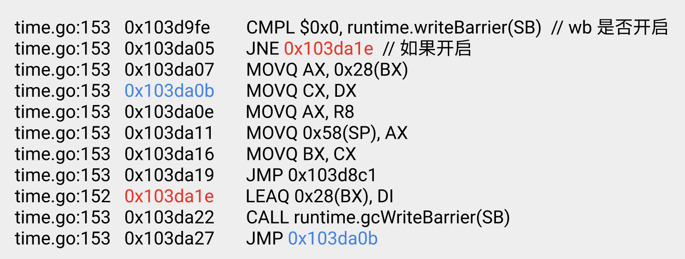
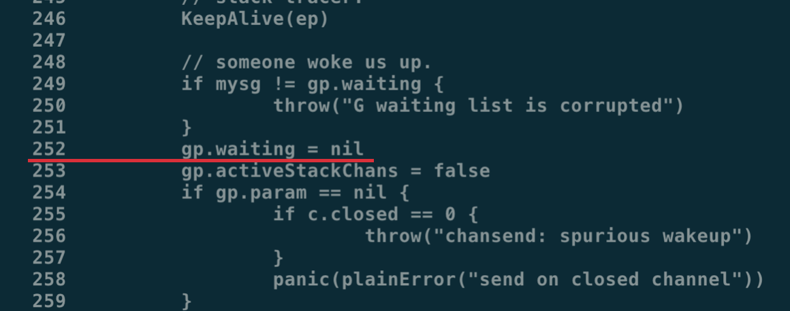

# GC write barrier 详解

在垃圾回收领域所讲的 barrier 包括 read barrier 与 write barrier，无论是哪一种，都与并发编程领域的 memory barrier 不是一回事。

在 GC 中的 barrier 其本质是 : snippet of code insert before pointer modify。

所以在阅读相关材料时，请注意不要将两者混淆。

在当前 Go 语言的实现中，GC 只有 write barrier，没有 read barrier。

在应用进入 GC 标记阶段前的 stw 阶段，会将全局变量 runtime.writeBarrier.enabled 修改为 true，当应用从 STW 中恢复，重新开始执行，垃圾回收的标记阶段便与应用逻辑开始并发执行，这时所有的堆上指针修改操作在修改之前会额外调用 runtime.gcWriteBarrier：

我们随便找找这些反汇编结果在代码中对应的行：

