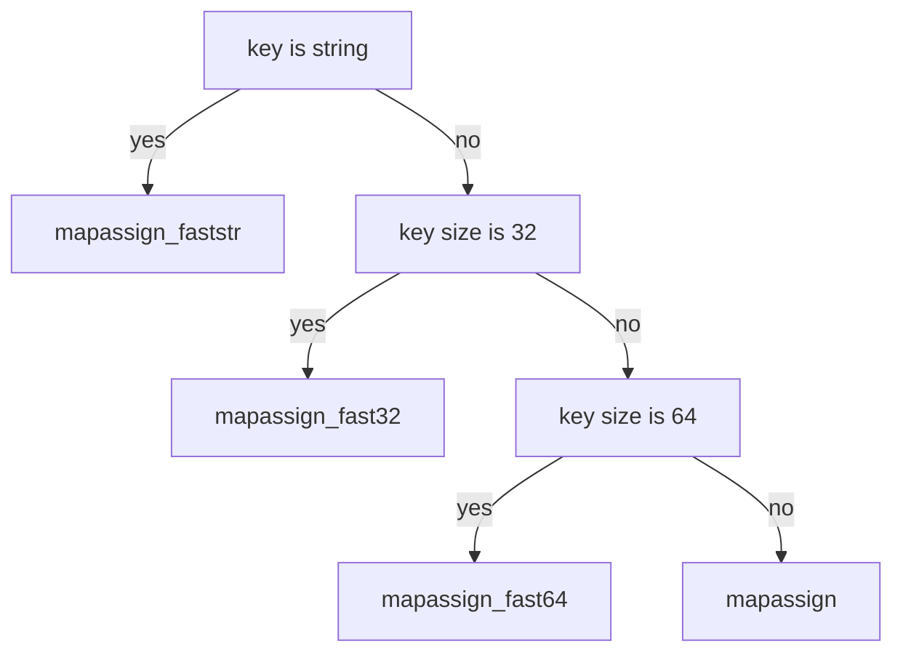

# map

```
          ┌─────────────┐                                                                                                                                                                                                           
          │    hmap     │                                                                                                                                                                                                           
          ├─────────────┴──────────────────┐           ┌───────────────┐                                        ┌─────────┐                               ┌─────────┐                                                               
          │           count int            │           │               │                     ┌─────────────────▶│  bmap   │                          ┌───▶│  bmap   │                                                               
          │                                │           │               ▼                     │                  ├─────────┴─────────────────────┐    │    ├─────────┴─────────────────────┐                                         
          ├────────────────────────────────┤           │    ────────┬─────┐                  │                  │   tophash [bucketCnt]uint8    │    │    │   tophash [bucketCnt]uint8    │                                         
          │          flags uint8           │           │       ▲    │  0  │                  │                  │                               │    │    │                               │                                         
          │                                │           │       │    │     │──────────────────┘                  ├──────────┬────────────────────┤    │    ├──────────┬────────────────────┤                                         
          ├────────────────────────────────┤           │       │    ├─────┤                                     │   keys   │                    │    │    │   keys   │                    │                                         
          │            B uint8             │           │       │    │  1  │                                     ├───┬───┬──┴┬───┬───┬───┬───┬───┤    │    ├───┬───┬──┴┬───┬───┬───┬───┬───┤                                         
          │                                │           │       │    │     │──────────────────┐                  │ 0 │ 1 │ 2 │ 3 │ 4 │ 5 │ 6 │ 7 │    │    │ 0 │ 1 │ 2 │ 3 │ 4 │ 5 │ 6 │ 7 │                                         
          ├────────────────────────────────┤           │       │    ├─────┤                  │                  ├───┴───┴──┬┴───┴───┴───┴───┴───┤    │    ├───┴───┴──┬┴───┴───┴───┴───┴───┤                                         
          │        noverflow uint16        │           │       │    │  2  │                  │                  │  values  │                    │    │    │  values  │                    │                                         
          │                                │           │       │    │     │                  │                  ├───┬───┬──┴┬───┬───┬───┬───┬───┤    │    ├───┬───┬──┴┬───┬───┬───┬───┬───┤                                         
          ├────────────────────────────────┤           │       │    ├─────┤                  │                  │ 0 │ 1 │ 2 │ 3 │ 4 │ 5 │ 6 │ 7 │    │    │ 0 │ 1 │ 2 │ 3 │ 4 │ 5 │ 6 │ 7 │                                         
          │          hash0 uint32          │           │       │    │  3  │                  │                  ├───┴───┴───┴───┴───┴───┴───┴───┤    │    ├───┴───┴───┴───┴───┴───┴───┴───┤                                         
          │                                │           │       │    │     │                  │                  │        overflow *bmap         │    │    │        overflow *bmap         │                                         
          ├────────────────────────────────┤           │       │    ├─────┤                  │                  │                               │────┘    │                               │                                         
          │     buckets unsafe.Pointer     │           │       │    │  4  │                  │                  ├─────────┬─────────────────────┘         └───────────────────────────────┘                                         
          │                                │───────────┘       │    │     │                  └─────────────────▶│  bmap   │                                                                                                         
          ├────────────────────────────────┤                        ├─────┤                                     ├─────────┴─────────────────────┐                                                                                   
          │   oldbuckets unsafe.Pointer    │                        │  5  │                                     │   tophash [bucketCnt]uint8    │                                                                                   
          │                                │                        │     │                                     │                               │                                                                                   
          ├────────────────────────────────┤         size = 2 ^ B   ├─────┤                                     ├──────────┬────────────────────┤                                                                                   
          │       nevacuate uintptr        │                        │  6  │                                     │   keys   │                    │                                                                                   
          │                                │                        │     │                                     ├───┬───┬──┴┬───┬───┬───┬───┬───┤                                                                                   
          ├────────────────────────────────┤                   │    ├─────┤                                     │ 0 │ 1 │ 2 │ 3 │ 4 │ 5 │ 6 │ 7 │                                                                                   
          │        extra *mapextra         │                   │    │  7  │                                     ├───┴───┴──┬┴───┴───┴───┴───┴───┤                                                                                   
       ┌──│                                │                   │    │     │                                     │  values  │                    │                                                                                   
       │  └────────────────────────────────┘                   │    └─────┘                                     ├───┬───┬──┴┬───┬───┬───┬───┬───┤                                                                                   
       │                                                       │      ....                                      │ 0 │ 1 │ 2 │ 3 │ 4 │ 5 │ 6 │ 7 │                                                                                   
       │                                                       │                                                ├───┴───┴───┴───┴───┴───┴───┴───┤                                                                                   
       │                                                       │    ┌─────┐                                     │        overflow *bmap         │                                                                                   
       │                                                       │    │ 61  │                                     │                               │                                                                                   
       │                                                       │    │     │                                     └───────────────────────────────┘                                                                                   
       ▼                                                       │    ├─────┤                                               ............                                                                                              
┌─────────────┐                                                │    │ 62  │                                     ┌─────────┐                               ┌─────────┐                              ┌─────────┐                      
│  mapextra   │                                                │    │     │────────────────────────────────────▶│  bmap   │                          ┌───▶│  bmap   │                         ┌───▶│  bmap   │                      
├─────────────┴──────────────┐                                 │    ├─────┤                                     ├─────────┴─────────────────────┐    │    ├─────────┴─────────────────────┐   │    ├─────────┴─────────────────────┐
│     overflow *[]*bmap      │                                 │    │ 63  │                                     │   tophash [bucketCnt]uint8    │    │    │   tophash [bucketCnt]uint8    │   │    │   tophash [bucketCnt]uint8    │
│                            │                                 ▼    │     │──────────────────┐                  │                               │    │    │                               │   │    │                               │
├────────────────────────────┤                              ────────┴─────┘                  │                  ├──────────┬────────────────────┤    │    ├──────────┬────────────────────┤   │    ├──────────┬────────────────────┤
│    oldoverflow *[]*bmap    │                                                               │                  │   keys   │                    │    │    │   keys   │                    │   │    │   keys   │                    │
│                            │                                                               │                  ├───┬───┬──┴┬───┬───┬───┬───┬───┤    │    ├───┬───┬──┴┬───┬───┬───┬───┬───┤   │    ├───┬───┬──┴┬───┬───┬───┬───┬───┤
├────────────────────────────┤                                                               │                  │ 0 │ 1 │ 2 │ 3 │ 4 │ 5 │ 6 │ 7 │    │    │ 0 │ 1 │ 2 │ 3 │ 4 │ 5 │ 6 │ 7 │   │    │ 0 │ 1 │ 2 │ 3 │ 4 │ 5 │ 6 │ 7 │
│     nextoverflow *bmap     │                                                               │                  ├───┴───┴──┬┴───┴───┴───┴───┴───┤    │    ├───┴───┴──┬┴───┴───┴───┴───┴───┤   │    ├───┴───┴──┬┴───┴───┴───┴───┴───┤
│                            │                                                               │                  │  values  │                    │    │    │  values  │                    │   │    │  values  │                    │
└────────────────────────────┘                                                               │                  ├───┬───┬──┴┬───┬───┬───┬───┬───┤    │    ├───┬───┬──┴┬───┬───┬───┬───┬───┤   │    ├───┬───┬──┴┬───┬───┬───┬───┬───┤
                                                                                             │                  │ 0 │ 1 │ 2 │ 3 │ 4 │ 5 │ 6 │ 7 │    │    │ 0 │ 1 │ 2 │ 3 │ 4 │ 5 │ 6 │ 7 │   │    │ 0 │ 1 │ 2 │ 3 │ 4 │ 5 │ 6 │ 7 │
                                                                                             │                  ├───┴───┴───┴───┴───┴───┴───┴───┤    │    ├───┴───┴───┴───┴───┴───┴───┴───┤   │    ├───┴───┴───┴───┴───┴───┴───┴───┤
                                                                                             │                  │        overflow *bmap         │    │    │        overflow *bmap         │   │    │        overflow *bmap         │
                                                                                             │                  │                               │────┘    │                               │───┘    │                               │
                                                                                             │                  ├─────────┬─────────────────────┘         └───────────────────────────────┘        └───────────────────────────────┘
                                                                                             └─────────────────▶│  bmap   │                                                                                                         
                                                                                                                ├─────────┴─────────────────────┐                                                                                   
                                                                                                                │   tophash [bucketCnt]uint8    │                                                                                   
                                                                                                                │                               │                                                                                   
                                                                                                                ├──────────┬────────────────────┤                                                                                   
                                                                                                                │   keys   │                    │                                                                                   
                                                                                                                ├───┬───┬──┴┬───┬───┬───┬───┬───┤                                                                                   
                                                                                                                │ 0 │ 1 │ 2 │ 3 │ 4 │ 5 │ 6 │ 7 │                                                                                   
                                                                                                                ├───┴───┴──┬┴───┴───┴───┴───┴───┤                                                                                   
                                                                                                                │  values  │                    │                                                                                   
                                                                                                                ├───┬───┬──┴┬───┬───┬───┬───┬───┤                                                                                   
                                                                                                                │ 0 │ 1 │ 2 │ 3 │ 4 │ 5 │ 6 │ 7 │                                                                                   
                                                                                                                ├───┴───┴───┴───┴───┴───┴───┴───┤                                                                                   
                                                                                                                │        overflow *bmap         │                                                                                   
                                                                                                                │                               │                                                                                   
                                                                                                                └───────────────────────────────┘                                                                                   
```

## 初始化

形如:

```go
make(map[k]v, hint)
```

的代码，在 hint <= 7 时，会调用 makemap_small 来进行初始化，如果 hint > 7，则调用 makemap。

```go
make(map[k]v)
```

不提供 hint 的代码，编译器始终会调用 makemap_small 来初始化。

```go
// make(map[k]v, hint)
// 如果编译器认为 map 和第一个 bucket 可以直接创建在栈上，h 和 bucket 可能都是非空
// h != nil，可以直接在 h 内创建 map
// 如果 h.buckets != nil，其指向的 bucket 可以作为第一个 bucket 来使用
func makemap(t *maptype, hint int, h *hmap) *hmap {
    // 在 64 位系统上 hmap 结构体大小为 48 字节
    // 32 位系统上是 28 字节
    if sz := unsafe.Sizeof(hmap{}); sz != 8+5*sys.PtrSize {
        println("runtime: sizeof(hmap) =", sz, ", t.hmap.size =", t.hmap.size)
        throw("bad hmap size")
    }

    if hint < 0 || hint > int(maxSliceCap(t.bucket.size)) {
        hint = 0
    }

    // 初始化 hmap
    if h == nil {
        h = (*hmap)(newobject(t.hmap))
    }
    h.hash0 = fastrand()

    // 按照提供的元素个数，找一个可以放得下这么多元素的 B 值
    B := uint8(0)
    for overLoadFactor(hint, B) {
        B++
    }
    h.B = B

    // 分配初始的 hash table
    // 如果 B == 0，buckets 字段会由 mapassign 来 lazily 分配
    // 因为如果 hint 很大的话，对这部分内存归零会花比较长时间
    if h.B != 0 {
        var nextOverflow *bmap
        h.buckets, nextOverflow = makeBucketArray(t, h.B)
        if nextOverflow != nil {
            h.extra = new(mapextra)
            h.extra.nextOverflow = nextOverflow
        }
    }

    return h
}
```

## 元素访问

元素访问有 mapaccess1，mapaccess2，mapaccessK，但几个方法都差不多，只差别在返回内容上。mapaccess1 和 mapaccess2 同时有 32 位、64 位和 string 类型的变种:

1. mapaccess1_fast32, mapaccess1_fast64, mapaccess1_faststr
2. mapaccess2_fast32, mapaccess2_fast64, mapaccess2_faststr

具体用哪一个变种函数是由编译器在编译期选择的，选择依据可以参考后面的赋值一小节。

因为这些函数实现上都大同小异，我们挑一个来看看 mapaccess2:

```go
func mapaccess2(t *maptype, h *hmap, key unsafe.Pointer) (unsafe.Pointer, bool) {
    // map 为空，或者元素数为 0，直接返回未找到
    if h == nil || h.count == 0 {
        return unsafe.Pointer(&zeroVal[0]), false
    }
    if h.flags&hashWriting != 0 {
        throw("concurrent map read and map write")
    }
    alg := t.key.alg
    // 不同类型的 key，所用的 hash 算法是不一样的
    // 具体可以参考 algarray
    hash := alg.hash(key, uintptr(h.hash0))
    // 如果 B = 3，那么结果用二进制表示就是 111
    // 如果 B = 4，那么结果用二进制表示就是 1111
    m := bucketMask(h.B)
    // 按位 &，可以 select 出对应的 bucket
    b := (*bmap)(unsafe.Pointer(uintptr(h.buckets) + (hash&m)*uintptr(t.bucketsize)))
    // 会用到 h.oldbuckets 时，说明 map 发生了扩容
    // 这时候，新的 buckets 里可能还没有老的内容
    // 所以一定要在老的里面找，否则有可能发生“消失”的诡异现象
    if c := h.oldbuckets; c != nil {
        if !h.sameSizeGrow() {
            // 说明之前只有一半的 bucket，需要除 2
            m >>= 1
        }
        oldb := (*bmap)(unsafe.Pointer(uintptr(c) + (hash&m)*uintptr(t.bucketsize)))
        if !evacuated(oldb) {
            b = oldb
        }
    }
    // tophash 取其高 8bit 的值
    top := tophash(hash)
    for ; b != nil; b = b.overflow(t) {
        // 一个 bucket 在存储满 8 个元素后，就再也放不下了
        // 这时候会创建新的 bucket
        // 挂在原来的 bucket 的 overflow 指针成员上
        for i := uintptr(0); i < bucketCnt; i++ {
            // 循环对比 bucket 中的 tophash 数组
            // 如果找到了相等的 tophash，那说明就是这个 bucket 了
            if b.tophash[i] != top {
                continue
            }
            k := add(unsafe.Pointer(b), dataOffset+i*uintptr(t.keysize))
            if t.indirectkey {
                k = *((*unsafe.Pointer)(k))
            }
            if alg.equal(key, k) {
                v := add(unsafe.Pointer(b), dataOffset+bucketCnt*uintptr(t.keysize)+i*uintptr(t.valuesize))
                if t.indirectvalue {
                    v = *((*unsafe.Pointer)(v))
                }
                return v, true
            }
        }
    }

    // 所有 bucket 都没有找到，返回零值和 false
    return unsafe.Pointer(&zeroVal[0]), false
}
```

显然，这就是我们平常在写如下代码时:

```go
v, ok := m[k]
```

所使用的底层函数。

## 赋值

### 编译器如何选择 assign 函数

mapassign 有几个变种，是由编译器决定具体用哪一个函数的。选择依据:

1. key 的类型是否是 string
2. 如果不是 string，那么根据 key 的类型大小做选择

流程图:



### 赋值流程

几个函数长得都差不多，我们看一下 mapassign 的逻辑就行了:

```go
// 和 mapaccess 函数差不多，但在没有找到 key 时，会为 key 分配一个新的槽位
func mapassign(t *maptype, h *hmap, key unsafe.Pointer) unsafe.Pointer {
    if h == nil {
        // nil map 不能进行赋值操作
        panic(plainError("assignment to entry in nil map"))
    }
    if h.flags&hashWriting != 0 {
        throw("concurrent map writes")
    }

    // 调用对应类型的 hash 算法
    alg := t.key.alg
    hash := alg.hash(key, uintptr(h.hash0))

    // 调用 alg.hash 设置 hashWriting 的 flag，因为 alg.hash 可能会 panic
    // 这时候我们没法完成一次写操作
    h.flags |= hashWriting

    if h.buckets == nil {
        // 分配第一个 buckt
        h.buckets = newobject(t.bucket) // newarray(t.bucket, 1)
    }

again:
    // 计算低 8 位 hash，根据计算出的 bucketMask 选择对应的 bucket
    // mask : 1111111
    bucket := hash & bucketMask(h.B)
    if h.growing() {
        growWork(t, h, bucket)
    }
    // 计算出存储的 bucket 的内存位置
    // pos = start + bucketNumber * bucetsize
    // 这里的命名不太好，bucket 其实是 bucketNumber
    b := (*bmap)(unsafe.Pointer(uintptr(h.buckets) + bucket*uintptr(t.bucketsize)))
    // 计算高 8 位 hash
    top := tophash(hash)

    var inserti *uint8
    var insertk unsafe.Pointer
    var val unsafe.Pointer
    for {
        for i := uintptr(0); i < bucketCnt; i++ {
            // 遍历 8 个 bucket 中的元素
            // 这里的 bucketCnt 是全局常量
            // 其实叫 bucketElemCnt 更合适
            if b.tophash[i] != top {
                // 在 b.tophash[i] != top 的情况下
                // 理论上有可能会是一个空槽位
                // 一般情况下 map 的槽位分布是这样的，e 表示 empty:
                // [h1][h2][h3][h4][h5][e][e][e]
                // 但在执行过 delete 操作时，可能会变成这样:
                // [h1][h2][e][e][h5][e][e][e]
                // 所以如果再插入的话，会尽量往前面的位置插
                // [h1][h2][e][e][h5][e][e][e]
                //          ^
                //          ^
                //       这个位置
                // 所以在循环的时候还要顺便把前面的空位置先记下来
                if b.tophash[i] == empty && inserti == nil {
                    // 如果这个槽位没有被占，说明可以往这里塞 key 和 value
                    inserti = &b.tophash[i] // tophash 的插入位置
                    insertk = add(unsafe.Pointer(b), dataOffset+i*uintptr(t.keysize))
                    val = add(unsafe.Pointer(b), dataOffset+bucketCnt*uintptr(t.keysize)+i*uintptr(t.valuesize))
                }
                continue
            }
            k := add(unsafe.Pointer(b), dataOffset+i*uintptr(t.keysize))
            if t.indirectkey {
                k = *((*unsafe.Pointer)(k))
            }
            // 如果相同的 hash 位置的 key 和要插入的 key 字面上不相等
            // 如果两个 key 的首八位后最后八位哈希值一样，就会进行其值比较
            // 算是一种哈希碰撞吧
            if !alg.equal(key, k) {
                continue
            }
            // 对应的位置已经有 key 了，直接更新就行
            if t.needkeyupdate {
                typedmemmove(t.key, k, key)
            }
            val = add(unsafe.Pointer(b), dataOffset+bucketCnt*uintptr(t.keysize)+i*uintptr(t.valuesize))
            goto done
        }
        // bucket 的 8 个槽没有满足条件的能插入或者能更新的，去 overflow 里继续找
        ovf := b.overflow(t)
        // 如果 overflow 为 nil，说明到了 overflow 链表的末端了
        if ovf == nil {
            break
        }
        // 赋值为链表的下一个元素，继续循环
        b = ovf
    }

    // 没有找到 key，分配新的空间

    // 如果触发了最大的 load factor，或者已经有太多 overflow buckets
    // 并且这个时刻没有在进行 growing 的途中，那么就开始 growing
    if !h.growing() && (overLoadFactor(h.count+1, h.B) || tooManyOverflowBuckets(h.noverflow, h.B)) {
        hashGrow(t, h)
        // hashGrow 的时候会把当前的 bucket 放到 oldbucket 里
        // 但还没有开始分配新的 bucket，所以需要到 again 重试一次
        // 重试的时候在 growWork 里会把这个 key 的 bucket 优先分配好
        goto again // Growing the table invalidates everything, so try again
    }

    if inserti == nil {
        // 前面在桶里找的时候，没有找到能塞这个 tophash 的位置
        // 说明当前所有 buckets 都是满的，分配一个新的 bucket
        newb := h.newoverflow(t, b)
        inserti = &newb.tophash[0]
        insertk = add(unsafe.Pointer(newb), dataOffset)
        val = add(insertk, bucketCnt*uintptr(t.keysize))
    }

    // 把新的 key 和 value 存储到应插入的位置
    if t.indirectkey {
        kmem := newobject(t.key)
        *(*unsafe.Pointer)(insertk) = kmem
        insertk = kmem
    }
    if t.indirectvalue {
        vmem := newobject(t.elem)
        *(*unsafe.Pointer)(val) = vmem
    }
    typedmemmove(t.key, insertk, key)
    *inserti = top
    h.count++

done:
    if h.flags&hashWriting == 0 {
        throw("concurrent map writes")
    }
    h.flags &^= hashWriting
    if t.indirectvalue {
        val = *((*unsafe.Pointer)(val))
    }
    return val
}
```

这里有件比较奇怪的事情，mapassign 并没有把用户 `m[k] = v` 时的 v 写入到 map 的 value 区域，而是直接返回了这个值所应该在的内存地址。那么把 v 拷贝到该内存区域的操作是在哪里做的呢？

```go
    var a = make(map[int]int, 7)
    for i := 0; i < 1000; i++ {
        a[i] = 99999
    }
```

看看生成的汇编部分:

```go
    0x003f 00063 (m.go:9)    MOVQ    DX, (SP) // 第一个参数
    0x0043 00067 (m.go:9)    MOVQ    AX, 8(SP) // 第二个参数
    0x0048 00072 (m.go:9)    MOVQ    CX, 16(SP) // 第三个参数
    0x004d 00077 (m.go:9)    PCDATA    $0, $1 // GC 相关
    0x004d 00077 (m.go:9)    CALL    runtime.mapassign_fast64(SB) // 调用函数
    0x0052 00082 (m.go:9)    MOVQ    24(SP), AX // 返回值，即 value 应该存放的内存地址
    0x0057 00087 (m.go:9)    MOVQ    $99999, (AX) // 把 99999 放入该地址中
```

赋值的最后一步实际上是编译器额外生成的汇编指令来完成的，可见靠 runtime 有些工作是没有做完的。这里和 go 在函数调用时插入 prologue 和 epilogue 是类似的。编译器和 runtime 配合，才能完成一些复杂的工作。

## 删除

```go
func mapdelete(t *maptype, h *hmap, key unsafe.Pointer) {
    if h == nil || h.count == 0 {
        return
    }
    if h.flags&hashWriting != 0 {
        throw("concurrent map writes")
    }

    alg := t.key.alg
    hash := alg.hash(key, uintptr(h.hash0))

    // 调用 alg.hash 设置 hashWriting 的 flag，因为 alg.hash 可能会 panic
    // 这时候我们没法完成一次写操作
    h.flags |= hashWriting

    // 按低 8 位 hash 值选择 bucket
    bucket := hash & bucketMask(h.B)
    if h.growing() {
        growWork(t, h, bucket)
    }
    // 按上面算出的桶的索引，找到 bucket 的内存地址
    // 并强制转换为需要的 bmap 结构
    b := (*bmap)(add(h.buckets, bucket*uintptr(t.bucketsize)))
    // 高 8 位 hash 值
    top := tophash(hash)
search:
    for ; b != nil; b = b.overflow(t) {
        for i := uintptr(0); i < bucketCnt; i++ {
            // 和上面的差不多，8 个槽位，分别对比 tophash
            // 没找到的话就去外围 for 循环的 overflow 链表中继续查找
            if b.tophash[i] != top {
                continue
            }

            // b.tophash[i] == top
            // 计算 k 所在的槽位的内存地址
            k := add(unsafe.Pointer(b), dataOffset+i*uintptr(t.keysize))
            k2 := k
            // 如果 key > 128 字节
            if t.indirectkey {
                k2 = *((*unsafe.Pointer)(k2))
            }

            // 当高 8 位哈希值相等时，还需要对具体值进行比较
            // 以避免哈希冲突时值覆盖
            if !alg.equal(key, k2) {
                continue
            }

            // 如果 key 中是指针，那么清空 key 的内容
            if t.indirectkey {
                *(*unsafe.Pointer)(k) = nil
            } else if t.key.kind&kindNoPointers == 0 {
                memclrHasPointers(k, t.key.size)
            }

            // 计算 value 所在的内存地址
            v := add(unsafe.Pointer(b), dataOffset+bucketCnt*uintptr(t.keysize)+i*uintptr(t.valuesize))
            // 和上面 key 的逻辑差不多
            if t.indirectvalue {
                *(*unsafe.Pointer)(v) = nil
            } else if t.elem.kind&kindNoPointers == 0 {
                memclrHasPointers(v, t.elem.size)
            } else {
                memclrNoHeapPointers(v, t.elem.size)
            }
            // 设置 tophash[i] = 0
            b.tophash[i] = empty
            // hmap 的大小计数 -1
            h.count--
            break search
        }
    }

    if h.flags&hashWriting == 0 {
        throw("concurrent map writes")
    }
    h.flags &^= hashWriting
}
```

TODO，删除时，是否会缩容，是否会释放内存

## 扩容

```go
func hashGrow(t *maptype, h *hmap) {
    // 如果已经超过了 load factor 的阈值，那么需要对 map 进行扩容，即 B = B + 1，bucket 总数会变为原来的二倍
    // 如果还没到阈值，那么只需要保持相同数量的 bucket，横向拍平就行了

    bigger := uint8(1)
    if !overLoadFactor(h.count+1, h.B) {
        bigger = 0
        h.flags |= sameSizeGrow
    }
    oldbuckets := h.buckets
    newbuckets, nextOverflow := makeBucketArray(t, h.B+bigger, nil)

    flags := h.flags &^ (iterator | oldIterator)
    if h.flags&iterator != 0 {
        flags |= oldIterator
    }

    // 提交扩容结果
    h.B += bigger
    h.flags = flags
    h.oldbuckets = oldbuckets
    h.buckets = newbuckets
    h.nevacuate = 0
    h.noverflow = 0

    if h.extra != nil && h.extra.overflow != nil {
        // 把当前的 overflow 赋值给 oldoverflow
        if h.extra.oldoverflow != nil {
            throw("oldoverflow is not nil")
        }
        h.extra.oldoverflow = h.extra.overflow
        h.extra.overflow = nil
    }
    if nextOverflow != nil {
        if h.extra == nil {
            h.extra = new(mapextra)
        }
        h.extra.nextOverflow = nextOverflow
    }

    // 实际的哈希表元素的拷贝工作是在 growWork 和 evacuate 中增量慢慢地进行的
}
```

```go
// makeBucketArray 为 map buckets 初始化底层数组
// 1<<b 是需要分配的最小数量 buckets
// dirtyalloc 要么是 nil，要么就是之前由 makeBucketArray 使用同样的 t 和 b 参数
// 分配的数组
// 如果 dirtyalloc 是 nil，那么就会分配一个新数组，否则会清空掉原来的 dirtyalloc
// 然后重用这部分内存作为新的底层数组
func makeBucketArray(t *maptype, b uint8, dirtyalloc unsafe.Pointer) (buckets unsafe.Pointer, nextOverflow *bmap) {
    // base = 1 << b
    base := bucketShift(b)
    nbuckets := base
    // 对于比较小的 b 来说，不太可能有 overflow buckets
    // 这里省掉一些计算消耗
    if b >= 4 {
        // Add on the estimated number of overflow buckets
        // required to insert the median number of elements
        // used with this value of b.
        nbuckets += bucketShift(b - 4)
        sz := t.bucket.size * nbuckets
        up := roundupsize(sz)
        if up != sz {
            nbuckets = up / t.bucket.size
        }
    }

    if dirtyalloc == nil {
        buckets = newarray(t.bucket, int(nbuckets))
    } else {
        // dirtyalloc 之前就是用上面的 newarray(t.bucket, int(nbuckets))
        // 生成的，所以是非空
        buckets = dirtyalloc
        size := t.bucket.size * nbuckets
        if t.bucket.kind&kindNoPointers == 0 {
            memclrHasPointers(buckets, size)
        } else {
            memclrNoHeapPointers(buckets, size)
        }
    }

    if base != nbuckets {
        // 我们预分配了一些 overflow buckets
        // 为了让追踪这些 overflow buckets 的成本最低
        // 我们这里约定，如果预分配的 overflow bucket 的 overflow 指针是 nil
        // 那么 there are more available by bumping the pointer.
        // 我们需要一个安全的非空指针来作为 last overflow bucket，直接用 buckets 就行了
        nextOverflow = (*bmap)(add(buckets, base*uintptr(t.bucketsize)))
        last := (*bmap)(add(buckets, (nbuckets-1)*uintptr(t.bucketsize)))
        last.setoverflow(t, (*bmap)(buckets))
    }
    return buckets, nextOverflow
}
```

```go
func growWork(t *maptype, h *hmap, bucket uintptr) {
    // 确保我们移动的 oldbucket 对应的是我们马上就要用到的那一个
    evacuate(t, h, bucket&h.oldbucketmask())

    // 如果还在 growing 状态，再多移动一个 oldbucket
    if h.growing() {
        evacuate(t, h, h.nevacuate)
    }
}
```

```go
func evacuate(t *maptype, h *hmap, oldbucket uintptr) {
    b := (*bmap)(add(h.oldbuckets, oldbucket*uintptr(t.bucketsize)))
    newbit := h.noldbuckets()
    if !evacuated(b) {
        // TODO: reuse overflow buckets instead of using new ones, if there
        // is no iterator using the old buckets.  (If !oldIterator.)

        // xy 包含的是移动的目标
        // x 表示新 bucket 数组的前(low)半部分
        // y 表示新 bucket 数组的后(high)半部分
        var xy [2]evacDst
        x := &xy[0]
        x.b = (*bmap)(add(h.buckets, oldbucket*uintptr(t.bucketsize)))
        x.k = add(unsafe.Pointer(x.b), dataOffset)
        x.v = add(x.k, bucketCnt*uintptr(t.keysize))

        if !h.sameSizeGrow() {
            // 如果 map 大小(hmap.B)增大了，那么我们只计算 y
            // 否则 GC 可能会看到损坏的指针
            y := &xy[1]
            y.b = (*bmap)(add(h.buckets, (oldbucket+newbit)*uintptr(t.bucketsize)))
            y.k = add(unsafe.Pointer(y.b), dataOffset)
            y.v = add(y.k, bucketCnt*uintptr(t.keysize))
        }

        for ; b != nil; b = b.overflow(t) {
            k := add(unsafe.Pointer(b), dataOffset)
            v := add(k, bucketCnt*uintptr(t.keysize))
            for i := 0; i < bucketCnt; i, k, v = i+1, add(k, uintptr(t.keysize)), add(v, uintptr(t.valuesize)) {
                top := b.tophash[i]
                if top == empty {
                    b.tophash[i] = evacuatedEmpty
                    continue
                }
                if top < minTopHash {
                    throw("bad map state")
                }
                k2 := k
                if t.indirectkey {
                    k2 = *((*unsafe.Pointer)(k2))
                }
                var useY uint8
                if !h.sameSizeGrow() {
                    // 计算哈希，以判断我们的数据要转移到哪一部分的 bucket
                    // 可能是 x 部分，也可能是 y 部分
                    hash := t.key.alg.hash(k2, uintptr(h.hash0))
                    if h.flags&iterator != 0 && !t.reflexivekey && !t.key.alg.equal(k2, k2) {
                        // 为什么要加 reflexivekey 的判断，可以参考这里:
                        // https://go-review.googlesource.com/c/go/+/1480
                        // key != key，只有在 float 数的 NaN 时会出现
                        // 比如:
                        // n1 := math.NaN()
                        // n2 := math.NaN()
                        // fmt.Println(n1, n2)
                        // fmt.Println(n1 == n2)
                        // 这种情况下 n1 和 n2 的哈希值也完全不一样
                        // 这里官方表示这种情况是不可复现的
                        // 需要在 iterators 参与的情况下才能复现
                        // 但是对于这种 key 我们也可以随意对其目标进行发配
                        // 同时 tophash 对于 NaN 也没啥意义
                        // 还是按正常的情况下算一个随机的 tophash
                        // 然后公平地把这些 key 平均分布到各 bucket 就好
                        useY = top & 1 // 让这个 key 50% 概率去 Y 半区
                        top = tophash(hash)
                    } else {
                        if hash&newbit != 0 {
                            useY = 1
                        }
                    }
                }

                if evacuatedX+1 != evacuatedY {
                    throw("bad evacuatedN")
                }

                b.tophash[i] = evacuatedX + useY // evacuatedX + 1 == evacuatedY
                dst := &xy[useY]                 // 移动目标

                if dst.i == bucketCnt {
                    dst.b = h.newoverflow(t, dst.b)
                    dst.i = 0
                    dst.k = add(unsafe.Pointer(dst.b), dataOffset)
                    dst.v = add(dst.k, bucketCnt*uintptr(t.keysize))
                }
                dst.b.tophash[dst.i&(bucketCnt-1)] = top // mask dst.i as an optimization, to avoid a bounds check
                if t.indirectkey {
                    *(*unsafe.Pointer)(dst.k) = k2 // 拷贝指针
                } else {
                    typedmemmove(t.key, dst.k, k) // 拷贝值
                }
                if t.indirectvalue {
                    *(*unsafe.Pointer)(dst.v) = *(*unsafe.Pointer)(v)
                } else {
                    typedmemmove(t.elem, dst.v, v)
                }
                dst.i++
                // These updates might push these pointers past the end of the
                // key or value arrays.  That's ok, as we have the overflow pointer
                // at the end of the bucket to protect against pointing past the
                // end of the bucket.
                dst.k = add(dst.k, uintptr(t.keysize))
                dst.v = add(dst.v, uintptr(t.valuesize))
            }
        }
        // Unlink the overflow buckets & clear key/value to help GC.
        if h.flags&oldIterator == 0 && t.bucket.kind&kindNoPointers == 0 {
            b := add(h.oldbuckets, oldbucket*uintptr(t.bucketsize))
            // Preserve b.tophash because the evacuation
            // state is maintained there.
            ptr := add(b, dataOffset)
            n := uintptr(t.bucketsize) - dataOffset
            memclrHasPointers(ptr, n)
        }
    }

    if oldbucket == h.nevacuate {
        advanceEvacuationMark(h, t, newbit)
    }
}
```

```go
func advanceEvacuationMark(h *hmap, t *maptype, newbit uintptr) {
    h.nevacuate++
    // Experiments suggest that 1024 is overkill by at least an order of magnitude.
    // Put it in there as a safeguard anyway, to ensure O(1) behavior.
    stop := h.nevacuate + 1024
    if stop > newbit {
        stop = newbit
    }
    for h.nevacuate != stop && bucketEvacuated(t, h, h.nevacuate) {
        h.nevacuate++
    }
    if h.nevacuate == newbit { // newbit == # of oldbuckets
        // 大小增长全部结束。释放老的 bucket array
        h.oldbuckets = nil
        // 同样可以丢弃老的 overflow buckets
        // 如果它们还被迭代器所引用的话
        // 迭代器会持有一份指向 slice 的指针
        if h.extra != nil {
            h.extra.oldoverflow = nil
        }
        h.flags &^= sameSizeGrow
    }
}
```

## indirectkey 和 indirectvalue

在上面的代码中我们见过无数次的 indirectkey 和 indirectvalue。indirectkey 和 indirectvalue 在 map 里实际存储的是指针，会造成 GC 扫描时，扫描更多的对象。至于是否是 indirect，依然是由编译器来决定的，依据是:

1. key > 128 字节时，indirectkey = true
2. value > 128 字节时，indirectvalue = true

我们可以用 lldb 来进行简单验证:

```
```

```
```

## 其它

针对 32 位、64 位 和 string 类型的 map 元素的访问、赋值、删除、扩容，Go 内部有都有对应的优化函数，比如 mapaccess1 对应有 mapaccess1_fast64，mapaccess1_fast32，mapaccess1_faststr。mapassign 对应有 mapassign_fast64，mapassign_fast32 和 mapassign_faststr。

但这些优化函数长得都差不多，不知为何官方没有用脚本来做这些优化函数的生成工作。可见有时候 Go team 的复制粘贴功力也是蛮强的。
