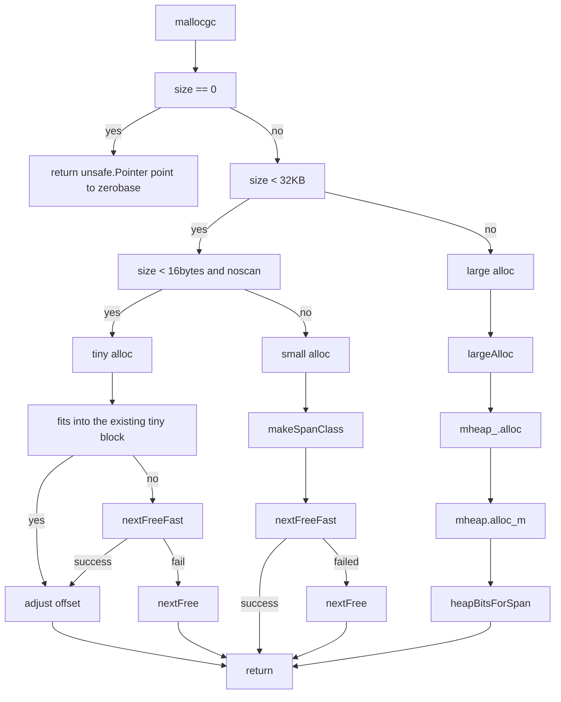

# 内存管理

## 数据结构

```go
// 内存分配器基于页工作。
// 小内存分配 (最多到 32 kB，且包含 32 kB) 会被四舍五入到 70 个大小类型
// 这 70 个大小类型，每一种都有相应的 free 内存块集合
// 任意空闲的内存页都可以被 split 为某一种大小类型的一系列对象集合
// 这些集合使用一个 bitmap 来进行管理
//
// 分配器的数据结构:
//
//    fixalloc: a free-list allocator for fixed-size off-heap objects,
//        used to manage storage used by the allocator.
//    mheap: the malloc heap, managed at page (8192-byte) granularity.
//    mspan: a run of pages managed by the mheap.
//    mcentral: collects all spans of a given size class.
//    mcache: a per-P cache of mspans with free space.
//    mstats: allocation statistics.
//
```

```
┌─────────────────┐                                     ┌─────────────────┐                                     ┌─────────────────┐                                
│      mheap      │                                     │    mSpanList    │                                     │    fixalloc     │                                
├─────────────────┴───────────────────────────────┐     ├─────────────────┴───────────────────────────────┐     ├─────────────────┴───────────────────────────────┐
│                   lock mutex                    │     │                  first *mspan                   │     │                  size uintptr                   │
├─────────────────────────────────────────────────┤     ├─────────────────────────────────────────────────┤     ├─────────────────────────────────────────────────┤
│          free [_MaxMHeapList]mSpanList          │     │                  last  *mspan                   │     │        first func(arg, p unsafe.Pointer)        │
├─────────────────────────────────────────────────┤     └─────────────────────────────────────────────────┘     ├─────────────────────────────────────────────────┤
│                freelarge mTreap                 │                                                             │               arg unsafe.Pointer                │
├─────────────────────────────────────────────────┤     ┌─────────────────┐                                     ├─────────────────────────────────────────────────┤
│          busy [_MaxMHeapList]mSpanList          │     │      mspan      │                                     │                   list *mlink                   │
├─────────────────────────────────────────────────┤     ├─────────────────┴───────────────────────────────┐     ├─────────────────────────────────────────────────┤
│               busylarge mSpanList               │     │                   next *mspan                   │     │                  chunk uintptr                  │
├─────────────────────────────────────────────────┤     ├─────────────────────────────────────────────────┤     ├─────────────────────────────────────────────────┤
│                sweepgen  uint32                 │     │                   prev *mspan                   │     │                  nchunk uint32                  │
├─────────────────────────────────────────────────┤     ├─────────────────────────────────────────────────┤     ├─────────────────────────────────────────────────┤
│                sweepdone uint32                 │     │            list *mSpanList // debug             │     │                  inuse uintptr                  │
├─────────────────────────────────────────────────┤     ├─────────────────────────────────────────────────┤     ├─────────────────────────────────────────────────┤
│                sweepers  uint32                 │     ├─────────────────────────────────────────────────┤     │                  stat *uint64                   │
├─────────────────────────────────────────────────┤     │                startAddr uintptr                │     ├─────────────────────────────────────────────────┤
├─────────────────────────────────────────────────┤     ├─────────────────────────────────────────────────┤     │                    zero bool                    │
│                allspans []*mspan                │     │                 npages uintptr                  │     └─────────────────────────────────────────────────┘
├─────────────────────────────────────────────────┤     ├─────────────────────────────────────────────────┤                                                        
│                 spans []*mspan                  │     ├─────────────────────────────────────────────────┤     ┌─────────────────┐                                
├─────────────────────────────────────────────────┤     │            manualFreeList gclinkptr             │     │      mlink      │                                
│            sweepSpans [2]gcSweepBuf             │     ├─────────────────────────────────────────────────┤     ├─────────────────┴───────────────────────────────┐
├─────────────────────────────────────────────────┤     ├─────────────────────────────────────────────────┤     │                   next *mlink                   │
│                    _ uint32                     │     │                freeindex uintptr                │     └─────────────────────────────────────────────────┘
├─────────────────────────────────────────────────┤     ├─────────────────────────────────────────────────┤                                                        
├─────────────────────────────────────────────────┤     │                 nelems uintptr                  │     ┌─────────────────┐                                
│                pagesInUse uint64                │     ├─────────────────────────────────────────────────┤     │    mcentral     │                                
├─────────────────────────────────────────────────┤     ├─────────────────────────────────────────────────┤     ├─────────────────┴───────────────────────────────┐
│                pagesSwept uint64                │     │                allocCache uint64                │     │                   lock mutex                    │
├─────────────────────────────────────────────────┤     ├─────────────────────────────────────────────────┤     ├─────────────────────────────────────────────────┤
│             pagesSweptBasis uint64              │     │               allocBits  *gcBits                │     │               spanclass spanClass               │
├─────────────────────────────────────────────────┤     ├─────────────────────────────────────────────────┤     ├─────────────────────────────────────────────────┤
│            sweepHeapLiveBasis uint64            │     │               gcmarkBits *gcBits                │     │               nonempty  mSpanList               │
├─────────────────────────────────────────────────┤     ├─────────────────────────────────────────────────┤     ├─────────────────────────────────────────────────┤
│            sweepPagesPerByte float64            │     ├─────────────────────────────────────────────────┤     │                 empty mSpanList                 │
├─────────────────────────────────────────────────┤     │                 sweepgen uint32                 │     ├─────────────────────────────────────────────────┤
├─────────────────────────────────────────────────┤     ├─────────────────────────────────────────────────┤     │                 nmalloc uint64                  │
│                largealloc uint64                │     │                  divMul uint16                  │     └─────────────────────────────────────────────────┘
├─────────────────────────────────────────────────┤     ├─────────────────────────────────────────────────┤                                                        
│               nlargealloc uint64                │     │                 baseMask uint16                 │     ┌─────────────────┐                                
├─────────────────────────────────────────────────┤     ├─────────────────────────────────────────────────┤     │   gcSweepBuf    │                                
│               largefree   uint64                │     │                allocCount uint16                │     ├─────────────────┴───────────────────────────────┐
├─────────────────────────────────────────────────┤     ├─────────────────────────────────────────────────┤     │                 spineLock mutex                 │
│               nlargefree  uint64                │     │               spanclass spanClass               │     ├─────────────────────────────────────────────────┤
├─────────────────────────────────────────────────┤     ├─────────────────────────────────────────────────┤     │              spine unsafe.Pointer               │
│       nsmallfree [_NumSizeClasses]uint64        │     │                  incache bool                   │     ├─────────────────────────────────────────────────┤
├─────────────────────────────────────────────────┤     ├─────────────────────────────────────────────────┤     │                spineLen uintptr                 │
├─────────────────────────────────────────────────┤     │                state mSpanState                 │     ├─────────────────────────────────────────────────┤
│                 bitmap uintptr                  │     ├─────────────────────────────────────────────────┤     │                spineCap uintptr                 │
├─────────────────────────────────────────────────┤     │                 needzero uint8                  │     ├─────────────────────────────────────────────────┤
│              bitmap_mapped uintptr              │     ├─────────────────────────────────────────────────┤     │                  index uint32                   │
├─────────────────────────────────────────────────┤     │                 divShift uint8                  │     └─────────────────────────────────────────────────┘
├─────────────────────────────────────────────────┤     ├─────────────────────────────────────────────────┤                                                        
│               arena_start uintptr               │     │                 divShift2 uint8                 │     ┌─────────────────┐                                
├─────────────────────────────────────────────────┤     ├─────────────────────────────────────────────────┤     │     mcache      │                                
│               arena_used  uintptr               │     │                elemsize uintptr                 │     ├─────────────────┴───────────────────────────────┐
├─────────────────────────────────────────────────┤     ├─────────────────────────────────────────────────┤     │                next_sample int32                │
│               arena_alloc uintptr               │     │                unusedsince int64                │     ├─────────────────────────────────────────────────┤
├─────────────────────────────────────────────────┤     ├─────────────────────────────────────────────────┤     │               local_scan uintptr                │
│                arena_end uintptr                │     │               npreleased uintptr                │     ├─────────────────────────────────────────────────┤
├─────────────────────────────────────────────────┤     ├─────────────────────────────────────────────────┤     │                  tiny uintptr                   │
│               arena_reserved bool               │     │                  limit uintptr                  │     ├─────────────────────────────────────────────────┤
├─────────────────────────────────────────────────┤     ├─────────────────────────────────────────────────┤     │               tinyoffset uintptr                │
│                    _ uint32                     │     │                speciallock mutex                │     ├─────────────────────────────────────────────────┤
├─────────────────────────────────────────────────┤     ├─────────────────────────────────────────────────┤     │            local_tinyallocs uintptr             │
├─────────────────────────────────────────────────┤     │                specials *special                │     ├─────────────────────────────────────────────────┤
│        central [numSpanClasses]struct {         │     └─────────────────────────────────────────────────┘     │          alloc [numSpanClasses]*mspan           │
│                  mcentral mcentral              │                                                             ├─────────────────────────────────────────────────┤
│            pad      [sys.CacheLineSize -        │                                                             │    stackcache [_NumStackOrders]stackfreelist    │
│unsafe.Sizeof(mcentral{})%sys.CacheLineSize]byte │                                                             ├─────────────────────────────────────────────────┤
├─────────────────────────────────────────────────┤                                                             │              local_nlookup uintptr              │
├─────────────────────────────────────────────────┤                                                             ├─────────────────────────────────────────────────┤
│               spanalloc fixalloc                │                                                             │             local_largefree uintptr             │
├─────────────────────────────────────────────────┤                                                             ├─────────────────────────────────────────────────┤
│               cachealloc fixalloc               │                                                             │            local_nlargefree uintptr             │
├─────────────────────────────────────────────────┤                                                             ├─────────────────────────────────────────────────┤
│               treapalloc fixalloc               │                                                             │    local_nsmallfree [_NumSizeClasses]uintptr    │
├─────────────────────────────────────────────────┤                                                             └─────────────────────────────────────────────────┘
│         specialfinalizeralloc fixalloc          │                                                                                                                
├─────────────────────────────────────────────────┤                                                                                                                
│          specialprofilealloc fixalloc           │                                                                                                                
├─────────────────────────────────────────────────┤                                                                                                                
│                speciallock mutex                │                                                                                                                
├─────────────────────────────────────────────────┤                                                                                                                
├─────────────────────────────────────────────────┤                                                                                                                
│            unused *specialfinalizer             │                                                                                                                
└─────────────────────────────────────────────────┘                                                                                                                
```

## 准备工作: 平台相关函数封装

分配、释放内存在不同的平台 (linux/win/bsd) 有差异，所以 Go 先对这些基础函数进行了封装，我们只把 linux 相关的(mem_linux.go)的摘出来:

```go

// OS-defined helpers:
//
// sysAlloc 从操作系统获取一大块已清零的内存，一般是 100 KB 或 1MB
// NOTE: sysAlloc 返回 OS 对齐的内存，但是对于堆分配器来说可能需要以更大的单位进行对齐。
// 因此 caller 需要小心地将 sysAlloc 获取到的内存重新进行对齐。
//
// sysUnused 通知操作系统内存区域的内容已经没用了，可以移作它用。
// sysUsed 通知操作系统内存区域的内容又需要用了。
//
// sysFree 无条件返回内存；只有当分配内存途中发生了 out-of-memory 错误
// 时才会使用。如果 sysFree 本身啥也没干成(no-op)也是 ok 的。
//
// sysReserve 会在不分配内存的情况下，保留一段地址空间。
// 如果传给它的指针是非 nil，意思是 caller 想保留这段地址，
// 但这种情况下，如果该段地址不可用时，sysReserve 依然可以选择另外的地址。
// 在一些操作系统的某些 case 下，sysReserve 化合简单地检查这段地址空间是否可用
// 同时并不会真地保留它。sysReserve 返回非空指针时，如果地址空间保留成功了
// 会将 *reserved 设置为 true，只是检查而未保留的话会设置为 false。
// NOTE: sysReserve 返回 系统对齐的内存，没有按堆分配器的更大对齐单位进行对齐，
// 所以 caller 需要将通过 sysAlloc 获取到的内存进行重对齐。
//
// sysMap 将之前保留的地址空间映射好以进行使用。
// 如果地址空间确实被保留的话，reserved 参数会为 true。只 check 的话是 false。
//
// sysFault 当一块内存已经被 sysAlloc 时，标记其为 fault。只在 debug runtime 的时候用用。

```

sysAlloc:

```go
// 不要栈 split，因为这个方法在调用的时候可能都没有合法的 G，没有合法的 G 的情况下不应该 morestack
//go:nosplit
func sysAlloc(n uintptr, sysStat *uint64) unsafe.Pointer {
    p, err := mmap(nil, n, _PROT_READ|_PROT_WRITE, _MAP_ANON|_MAP_PRIVATE, -1, 0)
    if err != 0 {
        if err == _EACCES {
            print("runtime: mmap: access denied\n")
            exit(2)
        }
        if err == _EAGAIN {
            print("runtime: mmap: too much locked memory (check 'ulimit -l').\n")
            exit(2)
        }
        return nil
    }
    mSysStatInc(sysStat, n)
    return p
}
```

sysUnused:

```go
func sysUnused(v unsafe.Pointer, n uintptr) {
    // 默认情况下，Linux 的透明大页支持会将 pages 合并到大页
    // 即使是只有一个单独的普通页也如此，会把我们 DONTNEED 的效果也消除掉。
    // 在 amd64 平台上，khugepaged 会将一个 4KB 的单页变成 2MB，从而将
    // 进程的 RSS 爆炸式地增长 512 倍。 (See issue #8832 and Linux kernel bug
    // https://bugzilla.kernel.org/show_bug.cgi?id=93111)
    //
    // 为了规避这个问题，我们在释放堆上页时，会显式地禁用透明大页。
    // 不过还是需要非常小心，因为修改这个 flag 会倾向于将包含 v 的 VMA(memory mapping)
    // 分割为三块 VMAs，以能够跟踪不同内存区域中 MADV_NOHUGEPAGE 的不同的值。
    // 每个内存地址都有一个 65530 的默认 VMAs 的限制(sysctl vm.max_map_count)，
    // 所以我们必须小心不要创建过多的 VMAs(see issue #12233).
    //
    // 因为大页很大，所以以较细的粒度调整 MADV_NOHUGEPAGE 收效甚微，我们通过较大粒度对
    // MADV_NOHUGEPAGE 进行调整，避免了 VMAs 的爆炸增长。只要控制好 VMA 的数量，这样
    // 做也可以利用好大页的优势。设置 hugePageSize = 2MB 的情况下，即使是最坏情况下的堆
    // 也可以在用完 VMAs 之前达到 128GB
    if sys.HugePageSize != 0 {
        var s uintptr = sys.HugePageSize // division by constant 0 is a compile-time error :(

        // 如果这是一次大内存分配，我们希望将大页功能开启。因此，只在未对齐时
        // 调整 huge page flag 至包含 v 和 v+n-1，
        var head, tail uintptr
        if uintptr(v)%s != 0 {
            // 计算包含 v 的 huge page
            head = uintptr(v) &^ (s - 1)
        }
        if (uintptr(v)+n)%s != 0 {
            // 计算包含 v+n-1 的 huge page
            tail = (uintptr(v) + n - 1) &^ (s - 1)
        }

        // 注意 madvise 在 flag 已被设置时非常有可能返回 EINVAL。这里忽略错误。
        if head != 0 && head+sys.HugePageSize == tail {
            // head 和 tail 不同，但是邻接
            // 合并为一次调用
            madvise(unsafe.Pointer(head), 2*sys.HugePageSize, _MADV_NOHUGEPAGE)
        } else {
            // advice huge page，使包含 v 和 v+n-1
            if head != 0 {
                madvise(unsafe.Pointer(head), sys.HugePageSize, _MADV_NOHUGEPAGE)
            }
            if tail != 0 && tail != head {
                madvise(unsafe.Pointer(tail), sys.HugePageSize, _MADV_NOHUGEPAGE)
            }
        }
    }

    if uintptr(v)&(physPageSize-1) != 0 || n&(physPageSize-1) != 0 {
        // madvise 会将该值 round 到某个物理页
        // 对于未对齐的 madvise 会比预想的释放更多内存的情况也涵盖在该 range 内了
        throw("unaligned sysUnused")
    }

    madvise(v, n, _MADV_DONTNEED)
}
```

sysUsed:

```go
func sysUsed(v unsafe.Pointer, n uintptr) {
    if sys.HugePageSize != 0 {
        // 部分 undo 掉 sysUnused 中，在 v 和 v + n 上打的 NOHUGEPAGE 标记
        // 尽管分配动作会覆盖到这些 huge page，但可能使 huge page 被排除在 v 和 v+n 之外，
        // 我们可以检测到这种情况并在结束的地方回滚 NOHUGEPAGE，但可能这样做不太值得
        // 因为相邻的 sysUnused 调用会释放掉分配的内存，并重新设置 NOHUGEPAGE
        var s uintptr = sys.HugePageSize

        // 向上 round v 到 huge page 边界
        beg := (uintptr(v) + (s - 1)) &^ (s - 1)
        // 向下 round v+n 到 huge page 边界
        end := (uintptr(v) + n) &^ (s - 1)

        if beg < end {
            madvise(unsafe.Pointer(beg), end-beg, _MADV_HUGEPAGE)
        }
    }
}
```

sysFree:

```go
// 不要 split stack，因为调用时可能没有合法的 G
//go:nosplit
func sysFree(v unsafe.Pointer, n uintptr, sysStat *uint64) {
    mSysStatDec(sysStat, n)
    munmap(v, n)
}
```

sysFault:

```go
func sysFault(v unsafe.Pointer, n uintptr) {
    mmap(v, n, _PROT_NONE, _MAP_ANON|_MAP_PRIVATE|_MAP_FIXED, -1, 0)
}
```

sysReserve:

```go
func sysReserve(v unsafe.Pointer, n uintptr) unsafe.Pointer {
    p, err := mmap(v, n, _PROT_NONE, _MAP_ANON|_MAP_PRIVATE, -1, 0)
    if err != 0 {
        return nil
    }
    return p
}
```

sysMap:

```go
func sysMap(v unsafe.Pointer, n uintptr, sysStat *uint64) {
    mSysStatInc(sysStat, n)

    p, err := mmap(v, n, _PROT_READ|_PROT_WRITE, _MAP_ANON|_MAP_FIXED|_MAP_PRIVATE, -1, 0)
    if err == _ENOMEM {
        throw("runtime: out of memory")
    }
    if p != v || err != 0 {
        throw("runtime: cannot map pages in arena address space")
    }
}
```

## 内存分配器初始化

初始化时，会直接要三个区域。

```
┌─────────────────┬──────────────────┬────────────────────────────────┐
│                 │                  │                                │
│  span (512 MB)  │  bitmap (32 GB)  │         arena (512 GB)         │
│                 │                  │                                │
└─────────────────┴──────────────────┴────────────────────────────────┘
```

```go
func mallocinit() {
    if class_to_size[_TinySizeClass] != _TinySize {
        throw("bad TinySizeClass")
    }

    testdefersizes()

    // 检查物理页大小
    if physPageSize == 0 {
        // 操作系统初始化代码获取物理页大小失败
        throw("failed to get system page size")
    }
    if physPageSize < minPhysPageSize {
        print("system page size (", physPageSize, ") is smaller than minimum page size (", minPhysPageSize, ")\n")
        throw("bad system page size")
    }
    if physPageSize&(physPageSize-1) != 0 {
        print("system page size (", physPageSize, ") must be a power of 2\n")
        throw("bad system page size")
    }

    // 内存区域从 p 开始，在内存中以: span, bitmap, arena 的顺序排列
    var p, pSize uintptr
    var reserved bool

    // span 数组中，对每一块 _PageSize 的 arena 内存都持有一个 *mspan
    var spansSize uintptr = (_MaxMem + 1) / _PageSize * sys.PtrSize
    spansSize = round(spansSize, _PageSize)
    // 每一个 word 的 arena 区域都在 bitmap 中占用 2 bits
    var bitmapSize uintptr = (_MaxMem + 1) / (sys.PtrSize * 8 / 2)
    bitmapSize = round(bitmapSize, _PageSize)

    // 初始化内存分配 arena，arena 是一段连续的内存，负责数据的内存分配。
    if sys.PtrSize == 8 {
        // 在 64 位机器上，分配一段连续的内存区域 512 GB(MaxMem) 现在应该是足够了。
        //
        // 代码应该能够用任意地址进行工作，但可能的情况下尽量让 sysReserve 使用 0x0000XXc000000000  (xx=00...7f)。
        // 分配 512 GB 的地址需要用掉 39 bits 来进行地址表达，amd64 平台不允许用户使用高位 17 bits
        // 所以只剩下中间的 0x00c0 中的 9 bits 能让我们用了。选择 0x00c0 表示合法的内存地址是从
        // 0x00c0, 0x00c1, ..., 0x00df 开始
        // 在小端系统上，即 c0 00, c1 00, ..., df 00。这些都不是合法的 UTF-8 序列，且距离 ff(常用的单字节) 足够远。
        // 如果分配失败，会尝试其它 0xXXc0 地址。
        // 之前使用 0x11f8 地址在 OS X 系统上会在线程分配的时候导致 out of memory 错误。
        // 0x00c0 会导致和 AddressSanitizer 的冲突，AddressSanitizer 会将 0x0100 以下的地址都进行保留
        // 这种选择是为了可调试性，且可以限制垃圾收集器(gccgo 中的版本)的保守性，以使其不要收集那些符合一定模式的内存地址中的内存。
        //
        // 实际上我们会保留 544 GB(因为 bitmap 需要用 32 GB)
        // 不过这不重要: e0 00 也不是合法的 UTF-* 字符
        //
        // 如果失败，会回退到 32 位内存策略
        //
        // 然而在 arm64 平台我们会忽略上面所有的建议，直接梭哈分配到 0x40 << 32，因为
        // 使用 4k 页搭配 3级 TLB 时，用户地址空间会被限制在 39 位能表达的范围之内，
        // 在 darwin/arm64 上，地址空间就更小了。
        arenaSize := round(_MaxMem, _PageSize)
        pSize = bitmapSize + spansSize + arenaSize + _PageSize
        for i := 0; i <= 0x7f; i++ {
            switch {
            case GOARCH == "arm64" && GOOS == "darwin":
                p = uintptr(i)<<40 | uintptrMask&(0x0013<<28)
            case GOARCH == "arm64":
                p = uintptr(i)<<40 | uintptrMask&(0x0040<<32)
            default:
                p = uintptr(i)<<40 | uintptrMask&(0x00c0<<32)
            }
            p = uintptr(sysReserve(unsafe.Pointer(p), pSize, &reserved))
            if p != 0 {
                break
            }
        }
    }

    if p == 0 {
        // 在 32 位机器上，我们没法简单粗暴地获得一段巨大的虚拟地址空间，并保留内存。
        // 取而代之，我们将内存信息的 bitmap 紧跟在 data segment 之后，
        // 这样做足够处理整个 4GB 的内存空间了(256 MB 的 bitmap 消耗)
        // 初始化阶段会保留一小段地址
        // 用完之后，我们再和 kernel 申请其它位置的内存。

        // 我们想要让 arena 区域从低地址开始，但是我们的代码可能和 C 代码进行链接，
        // 全局的构造器可能已经调用过 malloc，并且调整过进程的 brk 位置。
        // 所以需要查询一次 brk，以避免将我们的 arena 区域覆盖掉 brk 位置，
        // 这会导致 kernel 把 arena 放在其它地方，比如放在高地址。
        procBrk := sbrk0()

        // 如果分配失败，那么尝试用更小一些的 arena 区域。
        // 对于像 Android L 这样的系统是需要的，因为我们和 ART 更新同一个进程，
        // 其会更激进地保留内存。
        // 最差的情况下，会退化为 0 大小的初始 arena
        // 这种情况下希望之后紧跟着的内存保留操作能够成功。
        arenaSizes := []uintptr{
            512 << 20,
            256 << 20,
            128 << 20,
            0,
        }

        for _, arenaSize := range arenaSizes {
            // sysReserve 会把我们要求保留的地址的末尾作为一种 hint，而不一定会满足
            // 这种情况下需要我们自己对指针进行 roundup，先是 1/4 MB，以使其离开运行的二进制
            // 镜像位置，然后在 roundup 到 MB 的边界位置

            p = round(firstmoduledata.end+(1<<18), 1<<20)
            pSize = bitmapSize + spansSize + arenaSize + _PageSize
            if p <= procBrk && procBrk < p+pSize {
                // 将 start 移动到 brk 之上，给未来的 brk 扩展保留一些空间
                p = round(procBrk+(1<<20), 1<<20)
            }
            p = uintptr(sysReserve(unsafe.Pointer(p), pSize, &reserved))
            if p != 0 {
                break
            }
        }
        if p == 0 {
            throw("runtime: cannot reserve arena virtual address space")
        }
    }

    // PageSize 可能被 OS 定义的 page size 更大
    // 所以 sysReserve 会返回给我们一个未 PageSize-对齐的指针。
    // 我们需要对其进行 round up，以使其按我们的 PageSize 要求对齐
    p1 := round(p, _PageSize)
    pSize -= p1 - p

    spansStart := p1
    p1 += spansSize
    mheap_.bitmap = p1 + bitmapSize
    p1 += bitmapSize
    if sys.PtrSize == 4 {
        // 赋值 arena_start 这样我们相当于接受了 4GB 虚拟空间中的保留内存
        mheap_.arena_start = 0
    } else {
        mheap_.arena_start = p1
    }
    mheap_.arena_end = p + pSize
    mheap_.arena_used = p1
    mheap_.arena_alloc = p1
    mheap_.arena_reserved = reserved

    if mheap_.arena_start&(_PageSize-1) != 0 {
        println("bad pagesize", hex(p), hex(p1), hex(spansSize), hex(bitmapSize), hex(_PageSize), "start", hex(mheap_.arena_start))
        throw("misrounded allocation in mallocinit")
    }

    // 初始化分配器的剩余部分
    mheap_.init(spansStart, spansSize)
    _g_ := getg()
    _g_.m.mcache = allocmcache()
}
```

跟系统要完内存之后，最后几步是:

```go
    // 初始化分配器的剩余部分
    mheap_.init(spansStart, spansSize)
    _g_ := getg()
    _g_.m.mcache = allocmcache()
```

这里是初始化全局的 mheap 内部的其它结构，比如 treapalloc，spanalloc，mcentral。全局三大主要部分其中的 mcentral 就是在这里分配的。

```go
// Initialize the heap.
func (h *mheap) init(spansStart, spansBytes uintptr) {
    h.treapalloc.init(unsafe.Sizeof(treapNode{}), nil, nil, &memstats.other_sys)
    h.spanalloc.init(unsafe.Sizeof(mspan{}), recordspan, unsafe.Pointer(h), &memstats.mspan_sys)
    h.cachealloc.init(unsafe.Sizeof(mcache{}), nil, nil, &memstats.mcache_sys)
    h.specialfinalizeralloc.init(unsafe.Sizeof(specialfinalizer{}), nil, nil, &memstats.other_sys)
    h.specialprofilealloc.init(unsafe.Sizeof(specialprofile{}), nil, nil, &memstats.other_sys)

    // Don't zero mspan allocations. Background sweeping can
    // inspect a span concurrently with allocating it, so it's
    // important that the span's sweepgen survive across freeing
    // and re-allocating a span to prevent background sweeping
    // from improperly cas'ing it from 0.
    //
    // This is safe because mspan contains no heap pointers.
    h.spanalloc.zero = false

    // h->mapcache needs no init
    for i := range h.free {
        h.free[i].init()
        h.busy[i].init()
    }

    h.busylarge.init()
    for i := range h.central {
        h.central[i].mcentral.init(spanClass(i))
    }

    sp := (*slice)(unsafe.Pointer(&h.spans))
    sp.array = unsafe.Pointer(spansStart)
    sp.len = 0
    sp.cap = int(spansBytes / sys.PtrSize)

    // Map metadata structures. But don't map race detector memory
    // since we're not actually growing the arena here (and TSAN
    // gets mad if you map 0 bytes).
    h.setArenaUsed(h.arena_used, false)
}

// setArenaUsed extends the usable arena to address arena_used and
// maps auxiliary VM regions for any newly usable arena space.
//
// racemap indicates that this memory should be managed by the race
// detector. racemap should be true unless this is covering a VM hole.
func (h *mheap) setArenaUsed(arena_used uintptr, racemap bool) {
    // Map auxiliary structures *before* h.arena_used is updated.
    // Waiting to update arena_used until after the memory has been mapped
    // avoids faults when other threads try access these regions immediately
    // after observing the change to arena_used.

    // Map the bitmap.
    h.mapBits(arena_used)

    // Map spans array.
    h.mapSpans(arena_used)

    h.arena_used = arena_used
}

// mapBits maps any additional bitmap memory needed for the new arena memory.
//
// Don't call this directly. Call mheap.setArenaUsed.
//
//go:nowritebarrier
func (h *mheap) mapBits(arena_used uintptr) {
    // Caller has added extra mappings to the arena.
    // Add extra mappings of bitmap words as needed.
    // We allocate extra bitmap pieces in chunks of bitmapChunk.
    const bitmapChunk = 8192

    n := (arena_used - mheap_.arena_start) / heapBitmapScale
    n = round(n, bitmapChunk)
    n = round(n, physPageSize)
    if h.bitmap_mapped >= n {
        return
    }

    sysMap(unsafe.Pointer(h.bitmap-n), n-h.bitmap_mapped, h.arena_reserved, &memstats.gc_sys)
    h.bitmap_mapped = n
}

// mapSpans makes sure that the spans are mapped
// up to the new value of arena_used.
//
// Don't call this directly. Call mheap.setArenaUsed.
func (h *mheap) mapSpans(arena_used uintptr) {
    // Map spans array, PageSize at a time.
    n := arena_used
    n -= h.arena_start
    n = n / _PageSize * sys.PtrSize
    n = round(n, physPageSize)
    need := n / unsafe.Sizeof(h.spans[0])
    have := uintptr(len(h.spans))
    if have >= need {
        return
    }
    h.spans = h.spans[:need]
    sysMap(unsafe.Pointer(&h.spans[have]), (need-have)*unsafe.Sizeof(h.spans[0]), h.arena_reserved, &memstats.other_sys)
}
```

mcache 是个 per-P 结构，在程序启动时，会初始化化 p，并且分配对应的 mcache。实际执行是在 procresize 中:

```go
func procresize() {
    // initialize new P's
    for i := int32(0); i < nprocs; i++ {
        pp := allp[i]
        if pp == nil {
            pp = new(p)
            pp.id = i
            pp.status = _Pgcstop
            pp.sudogcache = pp.sudogbuf[:0]
            for i := range pp.deferpool {
                pp.deferpool[i] = pp.deferpoolbuf[i][:0]
            }
            pp.wbBuf.reset()
            atomicstorep(unsafe.Pointer(&allp[i]), unsafe.Pointer(pp))
        }
        if pp.mcache == nil {
            if old == 0 && i == 0 {
                if getg().m.mcache == nil {
                    throw("missing mcache?")
                }
                pp.mcache = getg().m.mcache // bootstrap
            } else {
                pp.mcache = allocmcache()
            }
        }
    }
}
```

这下 mcache、mcentral 和 mheap 便全部初始化完成了。三者的关系可以用下图来表示:

```
                                                                                                  ┌─────────────┐                                                       ┌─────────────┐                                             
                                                                                                  │      P      │                                                       │      P      │                                             
                                                                                                  │             │                                                       │             │                                             
                                                                                                  ├─────────────┴────────────────────────────────────────────┐          ├─────────────┴────────────────────────────────────────────┐
                                                                                                  │                                                          │          │                                                          │
                                                                                                  │    ┌─────────────────┐                                   │          │    ┌─────────────────┐                                   │
                                                                                                  │    │     mcache      │                                   │          │    │     mcache      │                                   │
                                                                                                  │    ├─────────────────┴───────────────────────────────┐   │          │    ├─────────────────┴───────────────────────────────┐   │
                                                                                                  │    │                next_sample int32                │   │          │    │                next_sample int32                │   │
                                                                                                  │    ├─────────────────────────────────────────────────┤   │          │    ├─────────────────────────────────────────────────┤   │
                                                                                                  │    │               local_scan uintptr                │   │          │    │               local_scan uintptr                │   │
                                                                                                  │    ├─────────────────────────────────────────────────┤   │          │    ├─────────────────────────────────────────────────┤   │
                                                                                                  │    │                  tiny uintptr                   │   │          │    │                  tiny uintptr                   │   │
                                                                                                  │    ├─────────────────────────────────────────────────┤   │          │    ├─────────────────────────────────────────────────┤   │
                                                                                                  │    │               tinyoffset uintptr                │   │          │    │               tinyoffset uintptr                │   │
                                                                                                  │    ├─────────────────────────────────────────────────┤   │          │    ├─────────────────────────────────────────────────┤   │
                                                                                                  │    │            local_tinyallocs uintptr             │   │          │    │            local_tinyallocs uintptr             │   │
                                                                                                  │    ├─────────────────────────────────────────────────┤   │          │    ├─────────────────────────────────────────────────┤   │
                                                                                                  │    │          alloc [numSpanClasses]*mspan           │──┐│          │    │          alloc [numSpanClasses]*mspan           │   │
                                                                                                  │    ├─────────────────────────────────────────────────┤  ││          │    ├─────────────────────────────────────────────────┤   │
     ┌─────────────────┐                                                                          │    │    stackcache [_NumStackOrders]stackfreelist    │  ││          │    │    stackcache [_NumStackOrders]stackfreelist    │   │
     │      mheap      │                                                                          │    ├─────────────────────────────────────────────────┤  ││          │    ├─────────────────────────────────────────────────┤   │
     ├─────────────────┴───────────────────────────────┐                                          │    │              local_nlookup uintptr              │  ││          │    │              local_nlookup uintptr              │   │
     │                   lock mutex                    │                                          │    ├─────────────────────────────────────────────────┤  ││          │    ├─────────────────────────────────────────────────┤   │
     ├─────────────────────────────────────────────────┤                                          │    │             local_largefree uintptr             │  ││          │    │             local_largefree uintptr             │   │
     │          free [_MaxMHeapList]mSpanList          │                                          │    ├─────────────────────────────────────────────────┤  ││          │    ├─────────────────────────────────────────────────┤   │
     ├─────────────────────────────────────────────────┤                                          │    │            local_nlargefree uintptr             │  ││          │    │            local_nlargefree uintptr             │   │
  ┌──│                freelarge mTreap                 │                                          │    ├─────────────────────────────────────────────────┤  ││          │    ├─────────────────────────────────────────────────┤   │
  │  ├─────────────────────────────────────────────────┤                                          │    │    local_nsmallfree [_NumSizeClasses]uintptr    │  ││          │    │    local_nsmallfree [_NumSizeClasses]uintptr    │   │
  │  │          busy [_MaxMHeapList]mSpanList          │                                          │    └─────────────────────────────────────────────────┘  ││          │    └─────────────────────────────────────────────────┘   │
  │  ├─────────────────────────────────────────────────┤                                          │                                                         ││          │                                                          │
  │  │               busylarge mSpanList               │                                          └─────────────────────────────────────────────────────────┼┘          └──────────────────────────────────────────────────────────┘
  │  ├─────────────────────────────────────────────────┤                                                                                                    │                                                                       
  │  ├─────────────────────────────────────────────────┤                                                                                                    │                                                                       
  │  │                allspans []*mspan                │                                           ┌─────────────────┐                                      │                                                                       
  │  ├─────────────────────────────────────────────────┤                ┌─────────┐                │      mspan      │◀─────────────────────────────────────┘                                                                       
  │  │                 spans []*mspan                  │───────────────▶│  spans  │                ├─────────────────┴───────────────────────────────┐                                                                              
  │  ├─────────────────────────────────────────────────┤                ├─────────┤                │                   next *mspan                   │                                                                              
  │  ├─────────────────────────────────────────────────┤                │         │                ├─────────────────────────────────────────────────┤                                                                              
  │  │                 bitmap uintptr                  │───────┐        │ bitmap  │                │                   prev *mspan                   │                                                                              
  │  ├─────────────────────────────────────────────────┤       └───────▶│         │                ├─────────────────────────────────────────────────┤                                                                              
  │  │              bitmap_mapped uintptr              │                │         │                │            list *mSpanList // debug             │                                                                              
  │  ├─────────────────────────────────────────────────┤       ┌───────▶├─────────┤                ├─────────────────────────────────────────────────┤                                                                              
  │  ├─────────────────────────────────────────────────┤       │        │         │                ├─────────────────────────────────────────────────┤                                                                              
  │  │               arena_start uintptr               │───────┘        │         │       ┌────────│                startAddr uintptr                │                                                                              
  │  ├─────────────────────────────────────────────────┤                │         │       │        ├─────────────────────────────────────────────────┤                                                                              
  │  │               arena_used  uintptr               │                │         │◀──────┘        │                 npages uintptr                  │                                                                              
  │  ├─────────────────────────────────────────────────┤                │         │                ├─────────────────────────────────────────────────┤                                                                              
  │  │               arena_alloc uintptr               │                │         │                ├─────────────────────────────────────────────────┤                                                                              
  │  ├─────────────────────────────────────────────────┤                │  arena  │                │            manualFreeList gclinkptr             │                                                                              
  │  │                arena_end uintptr                │───────┐        │         │                ├─────────────────────────────────────────────────┤                                                                              
  │  ├─────────────────────────────────────────────────┤       │        │         │                ├─────────────────────────────────────────────────┤                                                                              
  │  │               arena_reserved bool               │       │        │         │                │                freeindex uintptr                │                                                                              
  │  ├─────────────────────────────────────────────────┤       │        │         │                ├─────────────────────────────────────────────────┤                                                                              
  │  ├─────────────────────────────────────────────────┤       │        │         │                │                 nelems uintptr                  │                                                                              
  │  │        central [numSpanClasses]struct {         │       │        │         │                └─────────────────────────────────────────────────┘                                                                              
  │  │                  mcentral mcentral              │       └───────▶└─────────┘                                                                                                                                                 
  │  │            pad      [sys.CacheLineSize -        │───────────┐                                                                                                                                                                
  │  │unsafe.Sizeof(mcentral{})%sys.CacheLineSize]byte │           │                                                                                                                                                                
  │  └─────────────────────────────────────────────────┘           │                                                                                                                                                                
  │                                                                │        ┌──────────────┐           ┌──────────────┐                                                                                                             
  │                                                                │        │   mcentral   │           │   mcentral   │                                                                                                             
  │                                                                │        ├──────────────┴───────────┼──────────────┴───────────┐                                                                                                 
  │                                                                │        │        lock mutex        │        lock mutex        │                                                                                                 
  │                                                                │        ├──────────────────────────┼──────────────────────────┤                                                                                                 
  │                                                                │        │   spanclass spanClass    │   spanclass spanClass    │                                                                                                 
  │                                                                │        ├──────────────────────────┼──────────────────────────┤                                                                                                 
  │                                                                │        │   nonempty  mSpanList    │   nonempty  mSpanList    │                                                                                                 
  │                                                                │        ├──────────────────────────┼──────────────────────────┤                                                                                                 
  │                                                                │        │     empty mSpanList      │     empty mSpanList      │                                                                                                 
  │                                                                │        ├──────────────────────────┼──────────────────────────┤                                                                                                 
  │                                                                │        │      nmalloc uint64      │      nmalloc uint64      │                                                                                                 
  │                                                                │        └──────────────────────────┴──────────────────────────┘                                                                                                 
  │                                                                │                      ▲                          ▲                                                                                                              
  │                                                                │                      │                          │                                                                                                              
  │                                                                │                      │   ┌──────────────────────┘                                                                                                              
  │                                                                │                      │   │                                                                                                                                     
  │                                                                │                      │   │                                                                                                                                     
  │                                                                │                      │   │                                                                                                                                     
  │                                                                │            ┌───┬───┬───┬───┬──────────────────┬───┐                                                                                                            
  │                                                                └───────────▶│ 0 │ 1 │ 2 │ 3 │       ....       │133│                                                                                                            
  │                  ┌──────────────────────┐                                   └───┴───┴───┴───┴──────────────────┴───┘                                                                                                            
  │                  │                      │                                     │   │                                                                                                                                             
  │                  │                      │                                     │   │                                                                                                                                             
  │                  │    npagesKey: 130    │                                     │   │                                                                                                                                             
  └─────────────────▶│  spanKey: 0x1234567  │                                     │   └──────────────────────┐                                                                                                                      
                     │     priority: 1      │                                     │                          │                                                                                                                      
                     │                      │                                     │                          │                                                                                                                      
                     │                      │                                     │                          │                                                                                                                      
                     └──────────────────────┘                                     ▼                          ▼                                                                                                                      
                                 │                                        ┌──────────────┐           ┌──────────────┐                                                                                                               
            ┌────────────────────┴──────────────────┐                     │   mcentral   │           │   mcentral   │                                                                                                               
            │                                       │                     ├──────────────┴───────────┼──────────────┴───────────┐                                                                                                   
            ▼                                       ▼                     │        lock mutex        │        lock mutex        │                                                                                                   
┌──────────────────────┐                ┌──────────────────────┐          ├──────────────────────────┼──────────────────────────┤                                                                                                   
│                      │                │                      │          │   spanclass spanClass    │   spanclass spanClass    │                                                                                                   
│                      │                │                      │          ├──────────────────────────┼──────────────────────────┤                                                                                                   
│    npagesKey: 129    │                │    npagesKey: 132    │          │   nonempty  mSpanList    │   nonempty  mSpanList    │                                                                                                   
│  spanKey: 0x4231560  │                │  spanKey: 0x2234521  │          ├──────────────────────────┼──────────────────────────┤                                                                                                   
│     priority: 10     │                │     priority: 12     │          │     empty mSpanList      │     empty mSpanList      │                                                                                                   
│                      │                │                      │          ├──────────────────────────┼──────────────────────────┤                                                                                                   
│                      │                │                      │          │      nmalloc uint64      │      nmalloc uint64      │                                                                                                   
└──────────────────────┘                └──────────────────────┘          └──────────────────────────┴──────────────────────────┘                                                                                                   
                                                    │                                                                                                                                                                               
                                        ┌───────────┴───────────────────┐                                                                                                                                                           
                                        │                               │                                                                                                                                                           
                                        ▼                               ▼                                                                                                                                                           
                            ┌──────────────────────┐        ┌──────────────────────┐                                                                                                                                                
                            │                      │        │                      │                                                                                                                                                
                            │                      │        │                      │                                                                                                                                                
                            │    npagesKey: 132    │        │    npagesKey: 136    │                                                                                                                                                
                            │  spanKey: 0x2234000  │        │  spanKey: 0x2314213  │                                                                                                                                                
                            │     priority: 14     │        │    priority: 131     │                                                                                                                                                
                            │                      │        │                      │                                                                                                                                                
                            │                      │        │                      │                                                                                                                                                
                            └──────────────────────┘        └──────────────────────┘                                                                                                                                                
```

## 堆内存分配流程



```go
// 分配一个小对象会穿过几个层次的 cache:
//
//    1. 四舍五入 size 到合适的 size class 之一
//       然后在当前 P 的 mcache 中查找对应的 mspan。
//       扫描 mspan 的 free bitmap 寻找空闲的 slot。
//       如果有空闲 slot，分配之。
//       这个过程全程无需获取锁。
//
//    2. 如果 mspan 没有空闲 slot。从 mcentral 的 mspan 列表中
//       获取一个大小至少为所需 size class 大小的新 mspan。
//       作为获取一个完整的 span 的代价会对 mcentral 加锁。
//
//    3. 如果 mcentral 的 mspan 列表为空，从 mheap 中获取一系列
//       页，来为 mspan 服务。
//
//    4. 如果 mheap 是空，或者没有足够大的页，
//       向操作系统要求分配一组新的页(至少 1MB)。
//       分配一大笔页的成本主要在于和操作系统交互。
//
// Sweeping 一个 mspan 并释放空闲对象走的是类似的逻辑层次:
//
//    1. 如果 mspan 由于响应分配动作，而正在被 swept，该 mspan 会被返回到 mcache
//       以满足内存分配的需求。
//
//    2. 否则的话，如果 mspan 中仍然有分配过的内存对象，
//       则该 mspan 会被放进 mcentral 的对应 mspan size class 大小的空闲列表。
//
//    3. 否则的话，如果 mspan 中所有对象均为空，mspan 则为 "idle" 状态，
//       这时候会把 mspan 返回给 mheap 并不再对应任何 size class。
//       这一步可能会把该 mspan 和其相邻的空闲 mspan 进行合并。
//
//    4. 如果一个 mspan 抽象 idle 了很长一段时间的话，会将其所包含的页返还给操作系统。
//
// 分配和释放大对象会越过 mcache 和 mcentral，直接使用全局 mheap，
//
// mspan 中的空闲对象槽只有在 mspan.needzero 为 false 时才会被置零。
// 如果 needzero 是 true，则会在分配对象时再将其置零。延迟置零的操作有很多好处:
//
//    1. 栈帧分配能够避免一次性全置零。
//
//    2. 在空间局部性上更合理，因为程序很可能马上就要对置零的内存进行写入操作。
//
//    3. 如果内存页不被复用，那么我们永远不需要清零操作。
```

```go
// new(type) 会被翻译为 newobject，但是也不一定，要看逃逸分析的结果
// 编译前端和 SSA 后端都知道该函数的签名
func newobject(typ *_type) unsafe.Pointer {
    return mallocgc(typ.size, typ, true)
}
```

```go
// 分配 size 个字节
// 小对象会从 per-P 缓存的 free list 中进行分配
// 大对象 > 32 KB 会直接在堆上分配
func mallocgc(size uintptr, typ *_type, needzero bool) unsafe.Pointer {
    // _GCmarktermination 阶段不能进行内存分配
    if gcphase == _GCmarktermination {
        throw("mallocgc called with gcphase == _GCmarktermination")
    }

    // 所有大小为 0 的对象都使用同一块内存地址
    if size == 0 {
        return unsafe.Pointer(&zerobase)
    }

    // 如果正在执行 GC，那么需要有一个 assistG 负责这次内存分配
    // 如果没有在执行 GC，那么这个 G 可以是 nil
    var assistG *g
    if gcBlackenEnabled != 0 {
        // 要求当前的用户 G 负责这次分配
        assistG = getg()
        if assistG.m.curg != nil {
            assistG = assistG.m.curg
        }

        // 向当前的 G 要求付款。在 mallocgc 的最后阶段需要对这笔“债务”负责
        assistG.gcAssistBytes -= int64(size)

        if assistG.gcAssistBytes < 0 {
            // 当前的 G 还处于欠债状态。协助 GC，在分配内存前先还上这笔账
            // 这个动作必须发生在关闭抢占之前
            gcAssistAlloc(assistG)
        }
    }

    // 设置 mp.mallocing 状态，以使其避免被 GC 抢占
    mp := acquirem()
    if mp.mallocing != 0 {
        throw("malloc deadlock")
    }
    if mp.gsignal == getg() {
        throw("malloc during signal")
    }
    mp.mallocing = 1

    shouldhelpgc := false
    dataSize := size
    c := gomcache()
    var x unsafe.Pointer
    noscan := typ == nil || typ.kind&kindNoPointers != 0
    if size <= maxSmallSize {
        if noscan && size < maxTinySize {
            // Tiny allocator.
            //
            // Tiny allocator 会将几个 tiny 的内存分配请求组合为单个内存块。
            // 当该内存块中所有子对象都不可达时，便会释放这部分内存块。
            // 子对象必须是 noscan 类型(不包含指针)，这样可以确保浪费的内存是可控的。
            //
            // 用来组合小对象的内存块的大小是可调(tuning)的。
            // 当前的设置是 16 bytes，最坏情况下会浪费 2x 内存(当所有子对象中只有一个对象是可达状态时)。
            // 如果修改为 8 bytes ，虽然完全没有浪费，但是却不太可能进行组合操作。
            // 32 bytes 能够提高合并的可能性，但是最坏情况下会造成 4x 浪费。
            // 不考虑 block 大小的话，最好的情况下是 8x。 // The best case winning is 8x regardless of block size. ??
            //
            // 从 tiny allocator 中获得的内存不能被显式释放。
            // 因此当一个对象需要被显式释放时，我们要确保它的 size >= maxTinySize
            //
            // 当对象都是由 tiny allocator 分配时，会形成 SetFinalizer 有一种特殊 case，
            // 这种情况下会允许在一个内存块中设置内部字节的 finalizers
            //
            // 实现 tiny allocator 的主要目标是对那些小字符串和独立的逃逸变量。
            // 在一个 json benchmark 中，这个 allocator 会将其性能提升 ~12%
            // 并且使堆大小降低了 ~20%。
            off := c.tinyoffset
            // Align tiny pointer for required (conservative) alignment.
            if size&7 == 0 {
                off = round(off, 8)
            } else if size&3 == 0 {
                off = round(off, 4)
            } else if size&1 == 0 {
                off = round(off, 2)
            }
            if off+size <= maxTinySize && c.tiny != 0 {
                // 将对象适配到已存在的 tiny 块
                x = unsafe.Pointer(c.tiny + off)
                c.tinyoffset = off + size
                c.local_tinyallocs++
                mp.mallocing = 0
                releasem(mp)
                return x
            }
            // 分配一个新的 maxTinySize 大小的块
            span := c.alloc[tinySpanClass]
            v := nextFreeFast(span)
            if v == 0 {
                v, _, shouldhelpgc = c.nextFree(tinySpanClass)
            }
            x = unsafe.Pointer(v)
            (*[2]uint64)(x)[0] = 0
            (*[2]uint64)(x)[1] = 0
            // 根据剩余的空闲空间，来看看我们是否需要将已有的 tiny 块替换为新块
            if size < c.tinyoffset || c.tiny == 0 {
                c.tiny = uintptr(x)
                c.tinyoffset = size
            }
            size = maxTinySize
        } else {
            // Small allocator.
            var sizeclass uint8
            if size <= smallSizeMax-8 {
                sizeclass = size_to_class8[(size+smallSizeDiv-1)/smallSizeDiv]
            } else {
                sizeclass = size_to_class128[(size-smallSizeMax+largeSizeDiv-1)/largeSizeDiv]
            }
            size = uintptr(class_to_size[sizeclass])
            spc := makeSpanClass(sizeclass, noscan)
            span := c.alloc[spc]
            v := nextFreeFast(span)
            if v == 0 {
                v, span, shouldhelpgc = c.nextFree(spc)
            }
            x = unsafe.Pointer(v)
            if needzero && span.needzero != 0 {
                memclrNoHeapPointers(unsafe.Pointer(v), size)
            }
        }
    } else {
        // Large allocator.
        var s *mspan
        shouldhelpgc = true
        systemstack(func() {
            s = largeAlloc(size, needzero, noscan)
        })
        s.freeindex = 1
        s.allocCount = 1
        x = unsafe.Pointer(s.base())
        size = s.elemsize
    }

    var scanSize uintptr
    if !noscan {
        // 如果正在分配一个 defer+arg 块，我们需要获取一段足够大的内存来存储所有内容，
        // 将申请的内存大小削减到 defer header 大小，这样 GC bitmap 就会认为 arg 块不包含任何东西
        // (就好像是因为 size round 导致的不使用空间)
        // 这样就可以让 defer arg 区域的扫描在 scanstack 中进行了
        if typ == deferType {
            dataSize = unsafe.Sizeof(_defer{})
        }
        heapBitsSetType(uintptr(x), size, dataSize, typ)
        if dataSize > typ.size {
            // 说明是分配 Array 的空间。
            // 如果其中有指针，GC 需要扫描最后一个元素
            if typ.ptrdata != 0 {
                scanSize = dataSize - typ.size + typ.ptrdata
            }
        } else {
            scanSize = typ.ptrdata
        }
        c.local_scan += scanSize
    }

    // 确保上面初始化 x 并设置 heap 对应的 bits 之类的存储操作发生
    // 在 caller 使 x 对垃圾收集器可见之前。否则的话，在那些 weakly ordered
    // 的平台上，垃圾收集器可能会跟踪一个指向 x 的指针，
    // 但是看到的内存却是未初始化或者 heap bits 是过期的数据
    publicationBarrier()

    // GC 期间分配的黑色对象。
    // 所有持有 nil 对象的槽都无需扫描。
    // 这里可能会和 GC 发生 racing，如果正在标记 bit 时
    // 需要原子地来执行这个动作
    if gcphase != _GCoff {
        gcmarknewobject(uintptr(x), size, scanSize)
    }

    mp.mallocing = 0
    releasem(mp)

    if assistG != nil {
        // 为内部的碎片进行统计，以帮助我们记账。
        assistG.gcAssistBytes -= int64(size - dataSize)
    }

    if shouldhelpgc {
        if t := (gcTrigger{kind: gcTriggerHeap}); t.test() {
            gcStart(gcBackgroundMode, t)
        }
    }

    return x
}
```

nextFreeFast:

```go
// nextFreeFast 是从 allocCache 中查找空闲的对象，执行较快。
// 如果未找到会返回 0
func nextFreeFast(s *mspan) gclinkptr {
    theBit := sys.Ctz64(s.allocCache) // Is there a free object in the allocCache?
    if theBit < 64 {
        result := s.freeindex + uintptr(theBit)
        if result < s.nelems {
            freeidx := result + 1
            if freeidx%64 == 0 && freeidx != s.nelems {
                return 0
            }
            s.allocCache >>= uint(theBit + 1)
            s.freeindex = freeidx
            s.allocCount++
            return gclinkptr(result*s.elemsize + s.base())
        }
    }
    return 0
}
```

nextFree:

```go
// nextFree 会从 cached span 中寻找下一个空闲对象
// 如果未找到，会用一个持有可用对象的 span 来填充 cache 并将该对象返回，同时携带一个 flag
// 该 flag 会标志此次分配是否是重量级的内存分配操作。如果是重量级分配，那么 caller 必须
// 确定是否需要启动一次新的 GC 循环，如果 GC 当前活跃的话，该 goroutine 可能需要协助进行 GC
func (c *mcache) nextFree(spc spanClass) (v gclinkptr, s *mspan, shouldhelpgc bool) {
    s = c.alloc[spc]
    shouldhelpgc = false
    freeIndex := s.nextFreeIndex()
    if freeIndex == s.nelems {
        // The span is full.
        if uintptr(s.allocCount) != s.nelems {
            println("runtime: s.allocCount=", s.allocCount, "s.nelems=", s.nelems)
            throw("s.allocCount != s.nelems && freeIndex == s.nelems")
        }
        systemstack(func() {
            c.refill(spc)
        })
        shouldhelpgc = true
        s = c.alloc[spc]

        freeIndex = s.nextFreeIndex()
    }

    if freeIndex >= s.nelems {
        throw("freeIndex is not valid")
    }

    v = gclinkptr(freeIndex*s.elemsize + s.base())
    s.allocCount++
    if uintptr(s.allocCount) > s.nelems {
        println("s.allocCount=", s.allocCount, "s.nelems=", s.nelems)
        throw("s.allocCount > s.nelems")
    }
    return
}
```

largeAlloc:

```go
func largeAlloc(size uintptr, needzero bool, noscan bool) *mspan {

    if size+_PageSize < size {
        throw("out of memory")
    }
    npages := size >> _PageShift
    if size&_PageMask != 0 {
        npages++
    }

    // Deduct credit for this span allocation and sweep if
    // necessary. mHeap_Alloc will also sweep npages, so this only
    // pays the debt down to npage pages.
    deductSweepCredit(npages*_PageSize, npages)

    s := mheap_.alloc(npages, makeSpanClass(0, noscan), true, needzero)
    if s == nil {
        throw("out of memory")
    }
    s.limit = s.base() + size
    heapBitsForSpan(s.base()).initSpan(s)
    return s
}
```

### mheap 分配流程

alloc:

```go
func (h *mheap) alloc(npage uintptr, spanclass spanClass, large bool, needzero bool) *mspan {
    // 这样可能会触发栈增长，而栈增长时，需要能在 heap 上分配空间(死锁)
    // 不要在 G 栈上，做任何锁 heap 的操作。
    var s *mspan
    systemstack(func() {
        s = h.alloc_m(npage, spanclass, large)
    })

    if s != nil {
        if needzero && s.needzero != 0 {
            memclrNoHeapPointers(unsafe.Pointer(s.base()), s.npages<<_PageShift)
        }
        s.needzero = 0
    }
    return s
}

```

alloc_m:

```go
// 从 heap 上为 GC 掉的内存空间分配一个 npage 个页的新 span
// 并将其 size class 记录到 HeapMap 和 HeapMapCache
func (h *mheap) alloc_m(npage uintptr, spanclass spanClass, large bool) *mspan {
    _g_ := getg()
    if _g_ != _g_.m.g0 {
        throw("_mheap_alloc not on g0 stack")
    }
    lock(&h.lock)

    // 为了防止过度的 heap 增长，在分配 n 页之前，需要 sweep 并取回至少 n 个页
    if h.sweepdone == 0 {
        // TODO(austin): This tends to sweep a large number of
        // spans in order to find a few completely free spans
        // (for example, in the garbage benchmark, this sweeps
        // ~30x the number of pages its trying to allocate).
        // If GC kept a bit for whether there were any marks
        // in a span, we could release these free spans
        // at the end of GC and eliminate this entirely.
        if trace.enabled {
            traceGCSweepStart()
        }
        h.reclaim(npage)
        if trace.enabled {
            traceGCSweepDone()
        }
    }

    // 将状态值从 cache 扩散到全局
    memstats.heap_scan += uint64(_g_.m.mcache.local_scan)
    _g_.m.mcache.local_scan = 0
    memstats.tinyallocs += uint64(_g_.m.mcache.local_tinyallocs)
    _g_.m.mcache.local_tinyallocs = 0

    s := h.allocSpanLocked(npage, &memstats.heap_inuse)
    if s != nil {
        // 记录 span 信息，因为 gc 需要能将内部指针映射到相应的 span
        atomic.Store(&s.sweepgen, h.sweepgen)
        h.sweepSpans[h.sweepgen/2%2].push(s) // Add to swept in-use list.
        s.state = _MSpanInUse
        s.allocCount = 0
        s.spanclass = spanclass
        if sizeclass := spanclass.sizeclass(); sizeclass == 0 {
            s.elemsize = s.npages << _PageShift
            s.divShift = 0
            s.divMul = 0
            s.divShift2 = 0
            s.baseMask = 0
        } else {
            s.elemsize = uintptr(class_to_size[sizeclass])
            m := &class_to_divmagic[sizeclass]
            s.divShift = m.shift
            s.divMul = m.mul
            s.divShift2 = m.shift2
            s.baseMask = m.baseMask
        }

        // 更新状态值，sweep 列表
        h.pagesInUse += uint64(npage)
        if large {
            memstats.heap_objects++
            mheap_.largealloc += uint64(s.elemsize)
            mheap_.nlargealloc++
            atomic.Xadd64(&memstats.heap_live, int64(npage<<_PageShift))
            // 已经被 sweep 过的 span 在整个列表的末端
            if s.npages < uintptr(len(h.busy)) {
                h.busy[s.npages].insertBack(s)
            } else {
                h.busylarge.insertBack(s)
            }
        }
    }
    // heap_scan 和 heap_live 已被更新
    if gcBlackenEnabled != 0 {
        gcController.revise()
    }

    if trace.enabled {
        traceHeapAlloc()
    }

    // h.spans 会从多个线程中不同步的前提下进行并发访问。因此，必须使用
    // store/store barrier 来确保上面代码对 h.spans 的写入都发生在
    // caller 能宣布从 s 中分配的对象的指针 p 之前。
    // store 一旦完成，在另一个处理器上运行的垃圾收集器能马上 read 到 p
    // 并能在 h.spans 中找到 s。unlock 操作即当作这个 barrier 来排序这些写入操作
    // 在 read 侧，因为其数据依赖远 p 和 h.spans 中的索引，所以也会使读取操作有序
    unlock(&h.lock)
    return s
}
```

allocSpanLocked:

```go
// 分配一个对应给定 size 大小的 span，h 必须上锁
// 返回的 span 会从 free 列表中移除，但其状态依然是 MSpanFree
func (h *mheap) allocSpanLocked(npage uintptr, stat *uint64) *mspan {
    var list *mSpanList
    var s *mspan

    // Try in fixed-size lists up to max.
    for i := int(npage); i < len(h.free); i++ {
        list = &h.free[i]
        if !list.isEmpty() {
            s = list.first
            list.remove(s)
            goto HaveSpan
        }
    }
    // 在 large span 列表中寻找最合适的一个
    s = h.allocLarge(npage) // allocLarge removed s from h.freelarge for us
    if s == nil {
        if !h.grow(npage) {
            return nil
        }
        s = h.allocLarge(npage)
        if s == nil {
            return nil
        }
    }

HaveSpan:
    // 标记 span 为使用中
    if s.state != _MSpanFree {
        throw("MHeap_AllocLocked - MSpan not free")
    }
    if s.npages < npage {
        throw("MHeap_AllocLocked - bad npages")
    }
    if s.npreleased > 0 {
        sysUsed(unsafe.Pointer(s.base()), s.npages<<_PageShift)
        memstats.heap_released -= uint64(s.npreleased << _PageShift)
        s.npreleased = 0
    }

    if s.npages > npage {
        // Trim extra and put it back in the heap.
        t := (*mspan)(h.spanalloc.alloc())
        t.init(s.base()+npage<<_PageShift, s.npages-npage)
        s.npages = npage
        p := (t.base() - h.arena_start) >> _PageShift
        if p > 0 {
            h.spans[p-1] = s
        }
        h.spans[p] = t
        h.spans[p+t.npages-1] = t
        t.needzero = s.needzero
        s.state = _MSpanManual // prevent coalescing with s
        t.state = _MSpanManual
        h.freeSpanLocked(t, false, false, s.unusedsince)
        s.state = _MSpanFree
    }
    s.unusedsince = 0

    p := (s.base() - h.arena_start) >> _PageShift
    for n := uintptr(0); n < npage; n++ {
        h.spans[p+n] = s
    }

    *stat += uint64(npage << _PageShift)
    memstats.heap_idle -= uint64(npage << _PageShift)

    //println("spanalloc", hex(s.start<<_PageShift))
    if s.inList() {
        throw("still in list")
    }
    return s
}

```

#### treap 结构

mheap 中超过 128 个页的内存会在 freeLarge 中分配，freeLarge 是一个 treap 结构，其英文为 tree 和 heap 的合成词，中文一般叫“树堆”。

该结构引入的目的是为了解决当用户使用的堆大小超过 100 GB 时的分配效率问题。如果使用 mSpanList 的话，需要遍历整个列表来寻找合适的 mspan，但使用 treap，可将期望时间复杂度控制在 log(n) 以内(二叉查找树性质)。

treap 本身是一棵二叉搜索树，但在其中一般会有一个额外字段来保证二叉搜索树的结构同时满足小顶堆的性质。

```go
type treapNode struct {
    right     *treapNode // all treapNodes > this treap node
    left      *treapNode // all treapNodes < this treap node
    parent    *treapNode // direct parent of this node, nil if root
    npagesKey uintptr    // number of pages in spanKey, used as primary sort key
    spanKey   *mspan     // span of size npagesKey, used as secondary sort key
    priority  uint32     // random number used by treap algorithm keep tree probablistically balanced
}
```

几个字段的含义都比较简单:

- right/left/parent 表示当前节点和树中其它节点的关系
- npagesKey 表示该 mspan 中含有的内存页数，作为二叉搜索树的排序依据
- spanKey 是 mspan 指针，其地址的值作为二叉搜索树的第二个排序依据，即页数相同的情况下，spanKey 大的会在当前节点的右边
- priority 是随机生成的权重值，该权重值会被作为小顶堆的排序依据

下面是一个 treap 结构的示例:

```
                     ┌──────────────────────┐                                       
                     │                      │                                       
                     │                      │                                       
                     │    npagesKey: 130    │                                       
                     │  spanKey: 0x1234567  │                                       
                     │     priority: 1      │                                       
                     │                      │                                       
                     │                      │                                       
                     └──────────────────────┘                                       
                                 │                                                  
            ┌────────────────────┴──────────────────┐                               
            │                                       │                               
            ▼                                       ▼                               
┌──────────────────────┐                ┌──────────────────────┐                    
│                      │                │                      │                    
│                      │                │                      │                    
│    npagesKey: 129    │                │    npagesKey: 132    │                    
│  spanKey: 0x4231560  │                │  spanKey: 0x2234521  │                    
│     priority: 10     │                │     priority: 12     │                    
│                      │                │                      │                    
│                      │                │                      │                    
└──────────────────────┘                └──────────────────────┘                    
                                                    │                               
                                        ┌───────────┴───────────────────┐           
                                        │                               │           
                                        ▼                               ▼           
                            ┌──────────────────────┐        ┌──────────────────────┐
                            │                      │        │                      │
                            │                      │        │                      │
                            │    npagesKey: 132    │        │    npagesKey: 136    │
                            │  spanKey: 0x2234000  │        │  spanKey: 0x2314213  │
                            │     priority: 14     │        │    priority: 131     │
                            │                      │        │                      │
                            │                      │        │                      │
                            └──────────────────────┘        └──────────────────────┘
```

可以看到，把 npagesKey 和 spanKey 当作数据的话，treap 就是二叉搜索树。把 priority 当作数据，treap 就是小顶堆。

需要另外注意的是，treap 本身是一种时间复杂度随机的数据结构。我们这里说的 log(n) 是“期望”时间复杂度。因为 priority 这个字段本身是用 fastrand 随机生成的。

和这种思路类似的还有 skiplist，其层数理论上也是随机的，但在实际应用中，因为这些数据结构采用的是伪随机数生成器，所以理论上极端情况基本上是不会出现的。

## 栈内存分配流程

```go
SUB SP, $10
```

## 堆外内存

```go
// notInHeap 是用更底层的分配器，比如 sysAlloc 或者 persistentAlloc 分配的堆外内存
//
// 一般情况下，最好将具体的类型标记为 go:notinheap
// 在不可能的情况下，也会直接使用 notInHeap 这个结构(比如在 allocator 内部)。
//
//go:notinheap
type notInHeap struct{}

func (p *notInHeap) add(bytes uintptr) *notInHeap {
    return (*notInHeap)(unsafe.Pointer(uintptr(unsafe.Pointer(p)) + bytes))
}
```

### 堆外内存用法

嗯，堆外内存只是 runtime 自己玩的东西，用户态是使用不了的，属于 runtime 专用的 directive。


