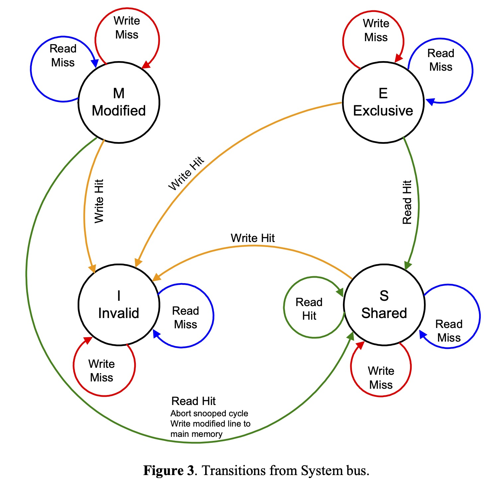

# memory barrier

memory barrier 也称为 memory fence。

## CPU 架构

```
 ┌─────────────┐                ┌─────────────┐   
 │    CPU 0    │                │    CPU 1    │   
 └───────────┬─┘                └───────────┬─┘   
   ▲         │                     ▲        │     
   │         │                     │        │     
   │         │                     │        │     
   │         │                     │        │     
   │         ▼                     │        ▼     
   │    ┌────────┐                 │    ┌────────┐
   │◀───┤ Store  │                 │◀───┤ Store  │
   ├───▶│ Buffer │                 ├───▶│ Buffer │
   │    └────┬───┘                 │    └───┬────┘
   │         │                     │        │     
   │         │                     │        │     
   │         │                     │        │     
   │         │                     │        │     
   │         ▼                     │        ▼     
┌──┴────────────┐               ┌──┴────────────┐ 
│               │               │               │ 
│     Cache     │               │     Cache     │ 
│               │               │               │ 
└───────┬───────┘               └───────┬───────┘ 
        │                               │         
        │                               │         
        │                               │         
 ┌──────┴──────┐                 ┌──────┴──────┐  
 │ Invalidate  │                 │ Invalidate  │  
 │    Queue    │                 │    Queue    │  
 └──────┬──────┘                 └──────┬──────┘  
        │                               │         
        │         Interconnect          │         
        └───────────────┬───────────────┘         
                        │                         
                        │                         
                        │                         
                        │                         
                ┌───────┴───────┐                 
                │               │                 
                │    Memory     │                 
                │               │                 
                └───────────────┘                 
```

## CPU 导致乱序

使用 litmus 进行形式化验证:

```
cat sb.litmus

X86 SB
{ x=0; y=0; }
 P0          | P1          ;
 MOV [x],$1  | MOV [y],$1  ;
 MOV EAX,[y] | MOV EAX,[x] ;
locations [x;y;]
exists (0:EAX=0 /\ 1:EAX=0)
```

```shell
~ ❯❯❯ bin/litmus7 ./sb.litmus
%%%%%%%%%%%%%%%%%%%%%%%%%%%
% Results for ./sb.litmus %
%%%%%%%%%%%%%%%%%%%%%%%%%%%
X86 SB

{x=0; y=0;}

 P0          | P1          ;
 MOV [x],$1  | MOV [y],$1  ;
 MOV EAX,[y] | MOV EAX,[x] ;

locations [x; y;]
exists (0:EAX=0 /\ 1:EAX=0)
Generated assembler
	##START _litmus_P0
	movl	$1, -4(%rbx,%rcx,4)
	movl	-4(%rsi,%rcx,4), %eax
	##START _litmus_P1
	movl	$1, -4(%rsi,%rcx,4)
	movl	-4(%rbx,%rcx,4), %eax

Test SB Allowed
Histogram (4 states)
96    *>0:EAX=0; 1:EAX=0; x=1; y=1;
499878:>0:EAX=1; 1:EAX=0; x=1; y=1;
499862:>0:EAX=0; 1:EAX=1; x=1; y=1;
164   :>0:EAX=1; 1:EAX=1; x=1; y=1;
Ok

Witnesses
Positive: 96, Negative: 999904
Condition exists (0:EAX=0 /\ 1:EAX=0) is validated
Hash=2d53e83cd627ba17ab11c875525e078b
Observation SB Sometimes 96 999904
Time SB 0.11
```

## mesi 协议

| | p0 | p1 | p2 | p3 |
|---|:----:|:----:|:--:| :--: |
| initial state | I | I | I | I |
| p0 reads X | E | I | I | I |
| p1 reads X | S | S | I | I |
| p2 reads X | S | S | S | I |
| p3 writes X | I | I | I | M |
| p0 readx X | S | I | I | S |




## 编译器导致乱序

## lfence, sfence, mfence

## write barrier, read barrier

## memory order

## atomic/lock 操作成本 in Go

## false sharing / true sharing

参考资料：

https://homes.cs.washington.edu/~bornholt/post/memory-models.html

https://people.eecs.berkeley.edu/~rcs/research/interactive_latency.html

https://monkeysayhi.github.io/2017/12/28/%E4%B8%80%E6%96%87%E8%A7%A3%E5%86%B3%E5%86%85%E5%AD%98%E5%B1%8F%E9%9A%9C/

https://blog.csdn.net/zhangxiao93/article/details/42966279

http://kaiyuan.me/2017/09/22/memory-barrier/

https://blog.csdn.net/dd864140130/article/details/56494925

https://preshing.com/20120515/memory-reordering-caught-in-the-act/

https://preshing.com/20120710/memory-barriers-are-like-source-control-operations/

https://preshing.com/20120625/memory-ordering-at-compile-time/

https://preshing.com/20120612/an-introduction-to-lock-free-programming/

https://preshing.com/20130922/acquire-and-release-fences/

https://webcourse.cs.technion.ac.il/234267/Spring2016/ho/WCFiles/tirgul%205%20mesi.pdf

https://www.scss.tcd.ie/Jeremy.Jones/VivioJS/caches/MESIHelp.htm

http://15418.courses.cs.cmu.edu/spring2017/lectures
https://software.intel.com/en-us/articles/how-memory-is-accessed

https://software.intel.com/en-us/articles/detect-and-avoid-memory-bottlenecks#_Move_Instructions_into
