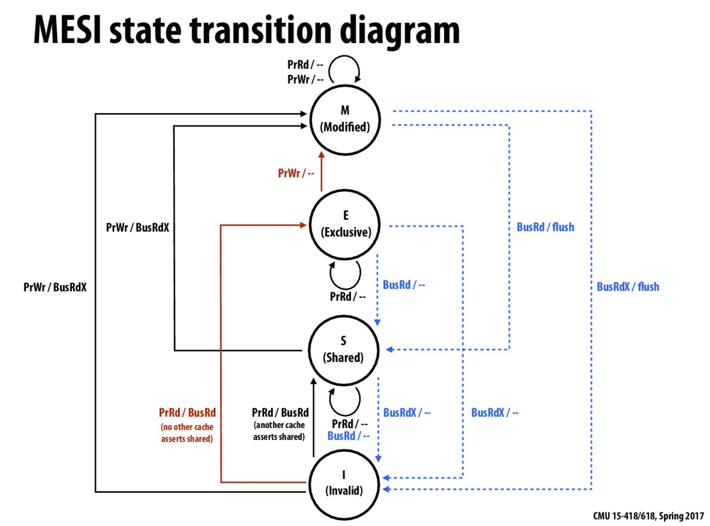

# memory barrier

> There are only two hard things in Computer Science: cache invalidation and naming things.

> -- Phil Karlton

https://martinfowler.com/bliki/TwoHardThings.html

memory barrier 也称为 memory fence。

## CPU 架构

```
 ┌─────────────┐                ┌─────────────┐   
 │    CPU 0    │                │    CPU 1    │   
 └───────────┬─┘                └───────────┬─┘   
   ▲         │                     ▲        │     
   │         │                     │        │     
   │         │                     │        │     
   │         │                     │        │     
   │         ▼                     │        ▼     
   │    ┌────────┐                 │    ┌────────┐
   │◀───┤ Store  │                 │◀───┤ Store  │
   ├───▶│ Buffer │                 ├───▶│ Buffer │
   │    └────┬───┘                 │    └───┬────┘
   │         │                     │        │     
   │         │                     │        │     
   │         │                     │        │     
   │         │                     │        │     
   │         ▼                     │        ▼     
┌──┴────────────┐               ┌──┴────────────┐ 
│               │               │               │ 
│     Cache     │               │     Cache     │ 
│               │               │               │ 
└───────┬───────┘               └───────┬───────┘ 
        │                               │         
        │                               │         
        │                               │         
 ┌──────┴──────┐                 ┌──────┴──────┐  
 │ Invalidate  │                 │ Invalidate  │  
 │    Queue    │                 │    Queue    │  
 └──────┬──────┘                 └──────┬──────┘  
        │                               │         
        │         Interconnect          │         
        └───────────────┬───────────────┘         
                        │                         
                        │                         
                        │                         
                        │                         
                ┌───────┴───────┐                 
                │               │                 
                │    Memory     │                 
                │               │                 
                └───────────────┘                 
```

CPU 和内存间是个多层的架构，有些资料上会把 L1/L2/L3 都叫作内存，并把这个整体称为内存分层: memory hierachy。

CPU 的 cache 层需要保证其本身能保证一定的一致性，一般叫 cache coherence，这是通过 MESI 协议来保证的。

但是 MESI 协议中，如果要写入，需要把其它 cache 中的数据 invalidate 掉。这会导致 CPU 需要等待本地的 cacheline 变为 E(Exclusive)状态才能写入，也就是会带来等待，为了优化这种等待，最好是攒一波写，统一进行触发，所以积攒这些写入操作的地方就是 store buffer。

如果 CPU 收到了其它核心发来的 invalidate 消息(BusRdX)，这时候 CPU 需要将本地的 cache invalidate 掉，又涉及了 cacheline 的修改和 store buffer 的处理，需要等待。为了消除这个等待，CPU 会把这些 invalidate 消息放在 invalidate queue 中，只要保证该消息之后一定会被处理后才对相应的 cache line 进行处理，那么就可以立即对其它核心发来的 invalidate 消息进行响应，以避免阻塞其它核心的流程处理。

这样的多层结构在我们编写程序的时候，也给我们带来了一些困扰。

不过我们先来看看 cache 层怎么保证多核心间数据的一致性，即 mesi 协议。

## mesi 协议

| | p0 | p1 | p2 | p3 |
|---|:----:|:----:|:--:| :--: |
| initial state | I | I | I | I |
| p0 reads X | E | I | I | I |
| p1 reads X | S | S | I | I |
| p2 reads X | S | S | S | I |
| p3 writes X | I | I | I | M |
| p0 readx X | S | I | I | S |



下面是不同类型的处理器请求和总线侧的请求:

处理器向 Cache 发请求包括下面这些操作:

PrRd: 处理器请求读取一个 Cache block
PrWr: 处理器请求写入一个 Cache block

总线侧的请求包含:

BusRd: 监听到请求，表示当前有其它处理器正在发起对某个 Cache block 的读请求

BusRdX: 监听到请求，表示当前有其它处理器正在发起对某个其未拥有的 Cache block 的写请求

BusUpgr: 监听到请求，表示有另一个处理器正在发起对某 Cache block 的写请求，该处理器已经持有此 Cache block 块

Flush: 监听到请求，表示整个 cache 块已被另一个处理器写入到主存中

FlushOpt: 监听到请求，表示一个完整的 cache 块已经被发送到总线，以提供给另一个处理器使用(Cache 到 Cache 传数)

Cache 到 Cache 的传送可以降低 read miss 导致的延迟，如果不这样做，需要先将该 block 写回到主存，再读取，延迟会大大增加，在基于总线的系统中，这个结论是正确的。但在多核架构中，coherence 是在 L2 caches 这一级保证的，从 L3 中取可能要比从另一个 L2 中取还要快。

mesi 协议解决了多核环境下，内存多层级带来的问题。使得 cache 层对于 CPU 来说可以认为是透明的，不存在的。单一地址的变量的写入，可以以线性的逻辑进行理解。

但 mesi 协议有两个问题没有解决，一种是 RMW 操作，或者叫 CAS；一种是 ADD 操作。因为这两种操作都需要先读到原始值，进行修改，然后再写回到内存中。

同时，在 CPU 架构中我们看到 CPU 除了 cache 这一层之外，还存在 store buffer，而 store buffer 导致的内存乱序问题，mesi 协议是解决不了的，这是 memory consistency 范畴讨论的问题。

下面一节是 wikipedia 上对于 store buffer 和 invalidate queue 的描述，可能比我开头写的要权威一些。

## store buffer 和 invalidate queue

>Store Buffer：

>当写入到一行 invalidate 状态的 cache line 时便会使用到 store buffer。写如果要继续执行，CPU 需要先发出一条 read-invalid 消息(因为需要确保所有其它缓存了当前内存地址的 CPU 的 cache line 都被 invalidate 掉)，然后将写推入到 store buffer 中，当最终 cache line 达到当前 CPU 时再执行这个写操作。

>CPU 存在 store buffer 的直接影响是，当 CPU 提交一个写操作时，这个写操作不会立即写入到 cache 中。因而，无论什么时候 CPU 需要从 cache line 中读取，都需要先扫描它自己的 store buffer 来确认是否存在相同的 line，因为有可能当前 CPU 在这次操作之前曾经写入过 cache，但该数据还没有被刷入过 cache(之前的写操作还在 store buffer 中等待)。需要注意的是，虽然 CPU 可以读取其之前写入到 store buffer 中的值，但其它 CPU 并不能在该 CPU 将 store buffer 中的内容 flush 到 cache 之前看到这些值。即 store buffer 是不能跨核心访问的，CPU 核心看不到其它核心的 store buffer。

>Invalidate Queues：

>为了处理 invalidation 消息，CPU 实现了 invalidate queue，借以处理新达到的 invalidate 请求，在这些请求到达时，可以马上进行响应，但可以不马上处理。取而代之的，invalidation 消息只是会被推进一个 invalidation 队列，并在之后尽快处理(但不是马上)。因此，CPU 可能并不知道在它 cache 里的某个 cache line 是 invalid 状态的，因为 invalidation 队列包含有收到但还没有处理的 invalidation 消息，这是因为 CPU 和 invalidation 队列从物理上来讲是位于 cache 的两侧的。

>从结果上来讲，memory barrier 是必须的。一个 store barrier 会把 store buffer flush 掉，确保所有的写操作都被应用到 CPU 的 cache。一个 read barrier 会把 invalidation queue flush 掉，也就确保了其它 CPU 的写入对执行 flush 操作的当前这个 CPU 可见。再进一步，MMU 没有办法扫描 store buffer，会导致类似的问题。这种效果对于单线程处理器来说已经是会发生的了。

因为前面提到的 store buffer 的存在，会导致多核心运行用户代码时，读和写以非程序顺序的顺序完成。下面我们用工具来对这种乱序进行一些观察。

## CPU 导致乱序

使用 litmus 进行验证:

```
cat sb.litmus

X86 SB
{ x=0; y=0; }
 P0          | P1          ;
 MOV [x],$1  | MOV [y],$1  ;
 MOV EAX,[y] | MOV EAX,[x] ;
locations [x;y;]
exists (0:EAX=0 /\ 1:EAX=0)
```

```shell
~ ❯❯❯ bin/litmus7 ./sb.litmus
%%%%%%%%%%%%%%%%%%%%%%%%%%%
% Results for ./sb.litmus %
%%%%%%%%%%%%%%%%%%%%%%%%%%%
X86 SB

{x=0; y=0;}

 P0          | P1          ;
 MOV [x],$1  | MOV [y],$1  ;
 MOV EAX,[y] | MOV EAX,[x] ;

locations [x; y;]
exists (0:EAX=0 /\ 1:EAX=0)
Generated assembler
	##START _litmus_P0
	movl	$1, -4(%rbx,%rcx,4)
	movl	-4(%rsi,%rcx,4), %eax
	##START _litmus_P1
	movl	$1, -4(%rsi,%rcx,4)
	movl	-4(%rbx,%rcx,4), %eax

Test SB Allowed
Histogram (4 states)
96    *>0:EAX=0; 1:EAX=0; x=1; y=1;
499878:>0:EAX=1; 1:EAX=0; x=1; y=1;
499862:>0:EAX=0; 1:EAX=1; x=1; y=1;
164   :>0:EAX=1; 1:EAX=1; x=1; y=1;
Ok

Witnesses
Positive: 96, Negative: 999904
Condition exists (0:EAX=0 /\ 1:EAX=0) is validated
Hash=2d53e83cd627ba17ab11c875525e078b
Observation SB Sometimes 96 999904
Time SB 0.11
```

在两个核心上运行汇编指令，意料之外的情况 100w 次中出现了 96 次。虽然很少，但确实是客观存在的情况。

有文档提到，x86 体系的内存序本身比较严格，除了 store-load 以外不存在其它类型的重排，也可以用下列脚本验证:

```
X86 RW
{ x=0; y=0; }
 P0          | P1          ;
 MOV EAX,[y] | MOV EAX,[x] ;
 MOV [x],$1  | MOV [y],$1  ;
locations [x;y;]
exists (0:EAX=1 /\ 1:EAX=1)
```

```
%%%%%%%%%%%%%%%%%%%%%%%%%
% Results for sb.litmus %
%%%%%%%%%%%%%%%%%%%%%%%%%
X86 OOO

{x=0; y=0;}

 P0          | P1          ;
 MOV EAX,[y] | MOV EAX,[x] ;
 MOV [x],$1  | MOV [y],$1  ;

locations [x; y;]
exists (0:EAX=1 /\ 1:EAX=1)
Generated assembler
	##START _litmus_P0
	movl	-4(%rsi,%rcx,4), %eax
	movl	$1, -4(%rbx,%rcx,4)
	##START _litmus_P1
	movl	-4(%rbx,%rcx,4), %eax
	movl	$1, -4(%rsi,%rcx,4)

Test OOO Allowed
Histogram (2 states)
500000:>0:EAX=1; 1:EAX=0; x=1; y=1;
500000:>0:EAX=0; 1:EAX=1; x=1; y=1;
No

Witnesses
Positive: 0, Negative: 1000000
Condition exists (0:EAX=1 /\ 1:EAX=1) is NOT validated
Hash=7cdd62e8647b817c1615cf8eb9d2117b
Observation OOO Never 0 1000000
Time OOO 0.14
```

无论运行多少次，Positive 应该都是 0。

## barrier

从功能上来讲，barrier 有四种:

|#LoadLoad|#LoadStore|
|-|-|
|#StoreLoad|#StoreStore|

具体说明:

|barrier name|desc|
|-|-|
|#LoadLoad|阻止不相关的 Load 操作发生重排|
|#LoadStore|阻止 Store 被重排到 Load 之前|
|#StoreLoad|阻止 Load 被重排到 Store 之前|
|#StoreStore|阻止 Store 被重排到 Store 之前|

需要注意的是，这里所说的重排都是内存一致性范畴，即全局视角的不同变量操作。如果是同一个变量的读写的话，显然是不会发生重排的，因为不按照 program order 来执行程序的话，相当于对用户的程序发生了破坏行为。

## lfence, sfence, mfence

Intel x86/x64 平台，total store ordering(但未来不一定还是 TSO):

mm_lfence("load fence": wait for all loads to complete)

不保证在 lfence 之前的写全局可见(globally visible)。并不是把读操作都序列化。只是保证这些读操作和 lfence 之间的先后关系。

mm_sfence("store fence": wait for all stores to complete)

>The Semantics of a Store Fence
>On all Intel and AMD processors, a store fence has two effects:

>Serializes all memory stores. All stores that precede the store fence in program order will become globally observable before any stores that succeed the store fence in program order become globally observable. Note that a store fence is ordered, by definition, with other store fences.
>In the cycle that follows the cycle when the store fence instruction retires, all stores that precede the store fence in program order are guaranteed to be globally observable. Any store that succeeds the store fence in program order may or may not be globally observable immediately after retiring the store fence. See Section 7.4 of the Intel optimization manual and Section 7.5 of the Intel developer manual Volume 2. Global observability will be discussed in the next section.
>However, that “SFENCE operation” is not actually a fully store serializing operation even though there is the word SFENCE in its name. This is clarified by the emphasized part. I think there is a typo here; it should read “store fence” not “store, fence.” The manual specifies that while clearing IA32_RTIT_CTL.TraceEn serializes all previous stores with respect to all later stores, it does not by itself ensure global observability of previous stores. It is exactly for this reason why the Linux kernel uses a full store fence (called wmb, which is basically SFENCE) after clearing TraceEn.

mm_mfence("mem fence": wait for all memory operations to complete)

mfence 会等待当前核心中的 store buffer 排空之后再执行后续指令。

https://stackoverflow.com/questions/27595595/when-are-x86-lfence-sfence-and-mfence-instructions-required

直接考虑硬件的 fence 指令太复杂了，因为硬件提供的 fence 指令和我们前面说的 RW RR WW WR barrier 逻辑并不是严格对应的。

我们在写程序的时候的思考过程应该是，先从程序逻辑出发，然后考虑需要使用哪种 barrier/fence(LL LS SS SL)，然后再找对应硬件平台上对应的 fence 指令。

## acquire/release 语义


https://preshing.com/20130922/acquire-and-release-fences/

在 x86/64 平台上，只有 StoreLoad 乱序，所以你使用 acquire release 时，实际上生成的 fence 是 NOP。

在 Go 语言中也不需要操心这个问题，Go 语言的 atomic 默认是最强的内存序保证，即 sequential consistency。该一致性保证由 Go 保证，在所有运行 Go 的硬件平台上都是一致的。当然，这里说的只是 sync/atomic 暴露出来的接口。Go 在 runtime 层有较弱内存序的相关接口，位置在: runtime/internal/atomic。

## memory order 参数

硬件会提供其 memory order，而语言本身可能也会有自己的 memory order，在 C/C++ 语言中会根据传给 atomic 的参数来决定其使用的 memory order，从而进行一些重排，这里的重排不但有硬件重排，还有编译器级别的重排。

下面是 C++ 中对 memory_order 参数的描述:
> std::memory_order specifies how memory accesses, including regular, non-atomic memory accesses, are to be ordered around an atomic operation. Absent any constraints on a multi-core system, when multiple threads simultaneously read and write to several variables, one thread can observe the values change in an order different from the order another thread wrote them. Indeed, the apparent order of changes can even differ among multiple reader threads. Some similar effects can occur even on uniprocessor systems due to compiler transformations allowed by the memory model.

> The default behavior of all atomic operations in the library provides for sequentially consistent ordering (see discussion below). That default can hurt performance, but the library's atomic operations can be given an additional std::memory_order argument to specify the exact constraints, beyond atomicity, that the compiler and processor must enforce for that operation.

这也是一个 Go 不需要操心的问题。

## sequential consistency

> Sequential consistency is a strong safety property for concurrent systems. Informally, sequential consistency implies that operations appear to take place in some total order, and that that order is consistent with the order of operations on each individual process.

可以理解为，同一块内存每次一定只有一个核心能执行。是最符合人的直觉的多线程执行顺序，可以用顺序的逻辑来理解程序执行结果。可以理解为完全没有读写重排。

其执行流程类似下图:

```
┌──────────────┐    ┌──────────────┐   ┌──────────────┐    ┌──────────────┐
│ Processor 1  │    │ Processor 2  │   │ Processor 3  │    │ Processor 4  │
└──────────────┘    └──────────────┘   └──────────────┘    └──────────────┘
        ▲                                                                  
        │                                                                  
        │                                                                  
        │                                                                  
        │                                                                  
        │                                                                  
        │                                                                  
        └──────────────────────────┐                                       
                                   │                                       
                                   │                                       
                                   │                                       
                                   │                                       
                                   │                                       
                                   │                                       
                                   │                                       
                         ┌──────────────────┐                              
                         │                  │                              
                         │      Memory      │                              
                         │                  │                              
                         └──────────────────┘                              
```

内存上有一个开关，可以拨到任意一个 Processor 上，拨动到位后 Processor 即开始访问和修改内存。

保证 Sequential Consistency 的话，性能会非常差。体现不了多核心的优势。Intel 的 TSO 虽然是较强的 Memory Model，但也会有 WR 的重排。

## cache coherency vs memory consistency

MESI 协议使 cache 层对 CPU 透明。多线程程序不需要担心某个核心读到过期数据，或者多个核心同时写入到一行 cache line 的不同部分，而导致 half write 的 cache line 被同步到主存中。

然而这种一致性机制没有办法解决 read-modify-write 操作的问题，比如 increment 操作，compare and swap 等操作。MESI 协议并不会阻止两个核心读到相同的内存内容，然后每个核心分别对其加一，再将新的相同的值写回到内存中，相当于将两次加一操作合并成了一次。

在现代 CPU 上，Lock 前缀会将 cache line 上锁，从而使 read-modify-write 操作在逻辑上具备原子性。下面的说明进行了简化，不过应该可以说明问题。

Unlocked increment:

1. Acquire cache line, shareable is fine. Read the value.
2. Add one to the read value.
3. Acquire cache line exclusive (if not already E or M) and lock it.
4. Write the new value to the cache line.
5. Change the cache line to modified and unlock it.

Locked increment:

1. Acquire cache line exclusive (if not already E or M) and lock it.
2. Read value.
3. Add one to it.
4. Write the new value to the cache line.
5. Change the cache line to modified and unlock it.

在 unlocked increment 操作中，cache line 只在写内存操作时被锁住，和所有类型的写一样。在 locked increment 中，cache line 在整个指令阶段都被持有，从读一直到最后的写操作。

某些 CPU 除了 cache 之外，还有其它的组件会影响内存的可见性。比如一些 CPU 有一个 read prefetcher(预取器)或者 write buffer，会导致内存操作执行乱序。不管有什么组件，LOCK 前缀(或其它 CPU 上的等价方式)可以避免一些内存操作上的顺序问题。

https://stackoverflow.com/questions/29880015/lock-prefix-vs-mesi-protocol

总结一下，cache coherence 解决的是单一地址的写问题，可以使多核心对同一地址的写入序列化。而 memory consistency 说的是不同地址的读写的顺序问题。即全局视角对读写的观测顺序问题。解决 cache coherence 的协议(MESI)并不能解决 CAS 类的问题。同时也解决不了 memory consistency，即不同内存地址读写的可见性问题，要解决 memory consistency 的问题，需要使用 memory barrier 之类的工具。

## 编译器导致乱序

snippet 1
```python
X = 0
for i in range(100):
    X = 1
    print X
```

snippet 2
```python
X = 1
for i in range(100):
    print X

```

snippet 1 和 snippet 2 从逻辑上等价的。

如果这时候，假设有 Processor 2 同时在执行一条指令：

```python
X = 0
```

P2 中的指令和 snippet 1 交错执行时，可能产生的结果是：111101111..

P2 中的指令和 snippet 2 交错执行时，可能产生的结果是：11100000…​

多核心下，编译器对代码的优化也可能导致内存读写的重排。

有人说这个例子不够有说服力，我们看看参考资料中的另一个例子:

```c
int a, b;
int foo()
{
    a = b + 1;
    b = 0; 
    return 1;
}
```

输出汇编:
```
mov eax, DWORD PTR b[rip]
add eax, 1
mov DWORD PTR a[rip], eax    // --> store to a
mov DWORD PTR b[rip], 0      // --> store to b
```

开启 O2 优化后，输出汇编:
```
mov eax, DWORD PTR b[rip]
mov DWORD PTR b[rip], 0      // --> store to b
add eax, 1
mov DWORD PTR a[rip], eax    // --> store to a
```

可见 compiler 也是可能会修改赋值的顺序的。

## atomic/lock 操作成本 in Go

```go
package main

import (
	"sync/atomic"
	"testing"
)

var a int64

func BenchmarkAtomic(b *testing.B) {
	for i := 0; i < b.N; i++ {
		atomic.StoreInt64(&a, int64(i))
	}
}

func BenchmarkNormal(b *testing.B) {
	for i := 0; i < b.N; i++ {
		a = 1
	}
}

func BenchmarkAtomicParallel(b *testing.B) {
	b.SetParallelism(100)
	b.RunParallel(func(pb *testing.PB) {
		for pb.Next() {
			atomic.StoreInt64(&a, int64(0))
		}
	})
}

```

结果:

```shell
goos: darwin
goarch: amd64
BenchmarkAtomic-4           	200000000	         7.01 ns/op
BenchmarkNormal-4           	2000000000	         0.63 ns/op
BenchmarkAtomicParallel-4   	100000000	        15.8 ns/op
PASS
ok  	_/Users/didi/test/go/atomic_bench	5.051s
```

可见，atomic 耗时比普通赋值操作要高一个数量级，在有竞争的情况下会更加慢。

## false sharing / true sharing

true sharing 的概念比较好理解，在对全局变量或局部变量进行多线程修改时，就是一种形式的共享，而且非常字面意思，就是 true sharing。true sharing 带来的明显的问题，例如 RWMutex scales poorly 的官方 issue，即 RWMutex 的 RLock 会对 RWMutex 这个对象的 readerCount 原子加一。本质上就是一种 true sharing。

false sharing 指的是那些意料之外的共享。我们知道 CPU 是以 cacheline 为单位进行内存加载的，L1 的 cache line 大小一般是 64 bytes，如果两个变量，或者两个结构体在内存上相邻，那么在 CPU 加载并修改前一个变量的时候，会把第二个变量也加载到 cache line 中，这时候如果恰好另一个核心在使用第二个变量，那么在 P1 修改掉第一个变量的时候，会把整个 cache line invalidate 掉，这时候 P2 要修改第二个变量的话，就需要再重新加载该 cache line。导致了无谓的加载。

在 Go 的 runtime 中有不少例子，特别是那些 per-P 的结构，大多都有针对 false sharing 的优化:

runtime/time.go

```go
var timers [timersLen]struct {
	timersBucket

	// The padding should eliminate false sharing
	// between timersBucket values.
	pad [cpu.CacheLinePadSize - unsafe.Sizeof(timersBucket{})%cpu.CacheLinePadSize]byte
}
```

runtime/sema.go

```go
var semtable [semTabSize]struct {
	root semaRoot
	pad  [cpu.CacheLinePadSize - unsafe.Sizeof(semaRoot{})]byte
}
```

用户态的代码对 false sharing 其实关注的比较少。

例：
sync/pool.go

```go
type poolLocal struct {
	poolLocalInternal

	// Prevents false sharing on widespread platforms with
	// 128 mod (cache line size) = 0 .
	pad [128 - unsafe.Sizeof(poolLocalInternal{})%128]byte
}
```


## runtime 中的 publicationBarrier

TODO

https://github.com/golang/go/issues/35541

参考资料：

https://homes.cs.washington.edu/~bornholt/post/memory-models.html

https://people.eecs.berkeley.edu/~rcs/research/interactive_latency.html

https://monkeysayhi.github.io/2017/12/28/%E4%B8%80%E6%96%87%E8%A7%A3%E5%86%B3%E5%86%85%E5%AD%98%E5%B1%8F%E9%9A%9C/

https://blog.csdn.net/zhangxiao93/article/details/42966279

http://kaiyuan.me/2017/09/22/memory-barrier/

https://blog.csdn.net/dd864140130/article/details/56494925

https://preshing.com/20120515/memory-reordering-caught-in-the-act/

https://preshing.com/20120710/memory-barriers-are-like-source-control-operations/

https://preshing.com/20120625/memory-ordering-at-compile-time/

https://preshing.com/20120612/an-introduction-to-lock-free-programming/

https://preshing.com/20130922/acquire-and-release-fences/

https://webcourse.cs.technion.ac.il/234267/Spring2016/ho/WCFiles/tirgul%205%20mesi.pdf

https://www.scss.tcd.ie/Jeremy.Jones/VivioJS/caches/MESIHelp.htm

http://15418.courses.cs.cmu.edu/spring2017/lectures

https://software.intel.com/en-us/articles/how-memory-is-accessed

https://software.intel.com/en-us/articles/detect-and-avoid-memory-bottlenecks#_Move_Instructions_into

https://stackoverflow.com/questions/29880015/lock-prefix-vs-mesi-protocol

https://github.com/torvalds/linux/blob/master/Documentation/memory-barriers.txt

http://www.overbyte.com.au/misc/Lesson3/CacheFun.html


