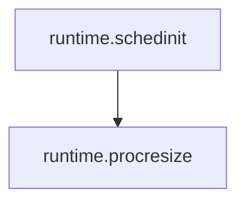
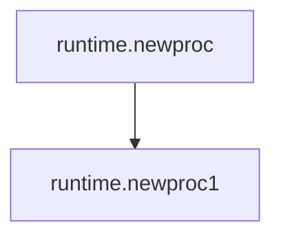
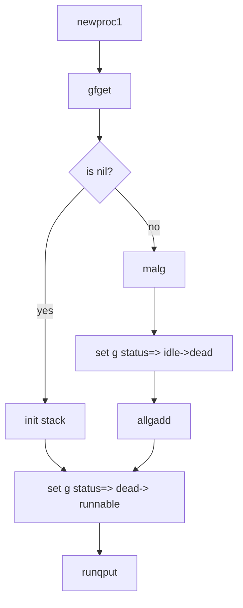

# 调度

## 基本数据结构

goroutine 在 runtime 中的数据结构:

```go
// Stack describes a Go execution stack.
// The bounds of the stack are exactly [lo, hi),
// with no implicit data structures on either side.
type stack struct {
    lo uintptr
    hi uintptr
}

type g struct {
    // Stack parameters.
    // stack describes the actual stack memory: [stack.lo, stack.hi).
    // stackguard0 is the stack pointer compared in the Go stack growth prologue.
    // It is stack.lo+StackGuard normally, but can be StackPreempt to trigger a preemption.
    // stackguard1 is the stack pointer compared in the C stack growth prologue.
    // It is stack.lo+StackGuard on g0 and gsignal stacks.
    // It is ~0 on other goroutine stacks, to trigger a call to morestackc (and crash).
    stack       stack   // offset known to runtime/cgo
    stackguard0 uintptr // offset known to liblink
    stackguard1 uintptr // offset known to liblink

    _panic         *_panic // innermost panic - offset known to liblink
    _defer         *_defer // innermost defer
    m              *m      // current m; offset known to arm liblink
    sched          gobuf
    syscallsp      uintptr        // if status==Gsyscall, syscallsp = sched.sp to use during gc
    syscallpc      uintptr        // if status==Gsyscall, syscallpc = sched.pc to use during gc
    stktopsp       uintptr        // expected sp at top of stack, to check in traceback
    param          unsafe.Pointer // passed parameter on wakeup
    atomicstatus   uint32
    stackLock      uint32 // sigprof/scang lock; TODO: fold in to atomicstatus
    goid           int64
    waitsince      int64  // approx time when the g become blocked
    waitreason     string // if status==Gwaiting
    schedlink      guintptr
    preempt        bool     // preemption signal, duplicates stackguard0 = stackpreempt
    throwsplit     bool     // must not split stack
    raceignore     int8     // ignore race detection events
    sysblocktraced bool     // StartTrace has emitted EvGoInSyscall about this goroutine
    sysexitticks   int64    // cputicks when syscall has returned (for tracing)
    traceseq       uint64   // trace event sequencer
    tracelastp     puintptr // last P emitted an event for this goroutine
    lockedm        muintptr
    sig            uint32
    writebuf       []byte
    sigcode0       uintptr
    sigcode1       uintptr
    sigpc          uintptr
    gopc           uintptr // pc of go statement that created this goroutine
    startpc        uintptr // pc of goroutine function
    racectx        uintptr
    waiting        *sudog         // sudog structures this g is waiting on (that have a valid elem ptr); in lock order
    cgoCtxt        []uintptr      // cgo traceback context
    labels         unsafe.Pointer // profiler labels
    timer          *timer         // cached timer for time.Sleep
    selectDone     uint32         // are we participating in a select and did someone win the race?
}
```

当 g 遇到阻塞，或需要等待的场景时，会被打包成 sudog 这样一个结构。一个 g 可能被打包为多个 sudog 分别挂在不同的等待队列上:

```go
// sudog represents a g in a wait list, such as for sending/receiving
// on a channel.
//
// sudog is necessary because the g ↔ synchronization object relation
// is many-to-many. A g can be on many wait lists, so there may be
// many sudogs for one g; and many gs may be waiting on the same
// synchronization object, so there may be many sudogs for one object.
//
// sudogs are allocated from a special pool. Use acquireSudog and
// releaseSudog to allocate and free them.
type sudog struct {
    // The following fields are protected by the hchan.lock of the
    // channel this sudog is blocking on. shrinkstack depends on
    // this for sudogs involved in channel ops.

    g *g

    // isSelect indicates g is participating in a select, so
    // g.selectDone must be CAS'd to win the wake-up race.
    isSelect bool
    next     *sudog
    prev     *sudog
    elem     unsafe.Pointer // data element (may point to stack)

    // The following fields are never accessed concurrently.
    // For channels, waitlink is only accessed by g.
    // For semaphores, all fields (including the ones above)
    // are only accessed when holding a semaRoot lock.

    acquiretime int64
    releasetime int64
    ticket      uint32
    parent      *sudog // semaRoot binary tree
    waitlink    *sudog // g.waiting list or semaRoot
    waittail    *sudog // semaRoot
    c           *hchan // channel
}
```

线程在 runtime 中的结构，对应一个 pthread，pthread 也会对应唯一的内核线程(task_struct):

```go
type m struct {
    g0      *g     // goroutine with scheduling stack
    morebuf gobuf  // gobuf arg to morestack
    divmod  uint32 // div/mod denominator for arm - known to liblink

    // Fields not known to debuggers.
    procid        uint64       // for debuggers, but offset not hard-coded
    gsignal       *g           // signal-handling g
    goSigStack    gsignalStack // Go-allocated signal handling stack
    sigmask       sigset       // storage for saved signal mask
    tls           [6]uintptr   // thread-local storage (for x86 extern register)
    mstartfn      func()
    curg          *g       // current running goroutine
    caughtsig     guintptr // goroutine running during fatal signal
    p             puintptr // attached p for executing go code (nil if not executing go code)
    nextp         puintptr
    id            int64
    mallocing     int32
    throwing      int32
    preemptoff    string // if != "", keep curg running on this m
    locks         int32
    softfloat     int32
    dying         int32
    profilehz     int32
    helpgc        int32
    spinning      bool // m is out of work and is actively looking for work
    blocked       bool // m is blocked on a note
    inwb          bool // m is executing a write barrier
    newSigstack   bool // minit on C thread called sigaltstack
    printlock     int8
    incgo         bool   // m is executing a cgo call
    freeWait      uint32 // if == 0, safe to free g0 and delete m (atomic)
    fastrand      [2]uint32
    needextram    bool
    traceback     uint8
    ncgocall      uint64      // number of cgo calls in total
    ncgo          int32       // number of cgo calls currently in progress
    cgoCallersUse uint32      // if non-zero, cgoCallers in use temporarily
    cgoCallers    *cgoCallers // cgo traceback if crashing in cgo call
    park          note
    alllink       *m // on allm
    schedlink     muintptr
    mcache        *mcache
    lockedg       guintptr
    createstack   [32]uintptr    // stack that created this thread.
    freglo        [16]uint32     // d[i] lsb and f[i]
    freghi        [16]uint32     // d[i] msb and f[i+16]
    fflag         uint32         // floating point compare flags
    lockedExt     uint32         // tracking for external LockOSThread
    lockedInt     uint32         // tracking for internal lockOSThread
    nextwaitm     muintptr       // next m waiting for lock
    waitunlockf   unsafe.Pointer // todo go func(*g, unsafe.pointer) bool
    waitlock      unsafe.Pointer
    waittraceev   byte
    waittraceskip int
    startingtrace bool
    syscalltick   uint32
    thread        uintptr // thread handle
    freelink      *m      // on sched.freem

    // these are here because they are too large to be on the stack
    // of low-level NOSPLIT functions.
    libcall   libcall
    libcallpc uintptr // for cpu profiler
    libcallsp uintptr
    libcallg  guintptr
    syscall   libcall // stores syscall parameters on windows

    mOS
}
```

抽象数据结构，可以认为是 processor 的抽象，代表了任务执行时的上下文，m 必须获得 p 才能执行:

```go
type p struct {
    lock mutex

    id          int32
    status      uint32 // one of pidle/prunning/...
    link        puintptr
    schedtick   uint32     // incremented on every scheduler call
    syscalltick uint32     // incremented on every system call
    sysmontick  sysmontick // last tick observed by sysmon
    m           muintptr   // back-link to associated m (nil if idle)
    mcache      *mcache
    racectx     uintptr

    deferpool    [5][]*_defer // pool of available defer structs of different sizes (see panic.go)
    deferpoolbuf [5][32]*_defer

    // Cache of goroutine ids, amortizes accesses to runtime·sched.goidgen.
    goidcache    uint64
    goidcacheend uint64

    // Queue of runnable goroutines. Accessed without lock.
    runqhead uint32
    runqtail uint32
    runq     [256]guintptr
    // runnext, if non-nil, is a runnable G that was ready'd by
    // the current G and should be run next instead of what's in
    // runq if there's time remaining in the running G's time
    // slice. It will inherit the time left in the current time
    // slice. If a set of goroutines is locked in a
    // communicate-and-wait pattern, this schedules that set as a
    // unit and eliminates the (potentially large) scheduling
    // latency that otherwise arises from adding the ready'd
    // goroutines to the end of the run queue.
    runnext guintptr

    // Available G's (status == Gdead)
    gfree    *g
    gfreecnt int32

    sudogcache []*sudog
    sudogbuf   [128]*sudog

    tracebuf traceBufPtr

    // traceSweep indicates the sweep events should be traced.
    // This is used to defer the sweep start event until a span
    // has actually been swept.
    traceSweep bool
    // traceSwept and traceReclaimed track the number of bytes
    // swept and reclaimed by sweeping in the current sweep loop.
    traceSwept, traceReclaimed uintptr

    palloc persistentAlloc // per-P to avoid mutex

    // Per-P GC state
    gcAssistTime         int64 // Nanoseconds in assistAlloc
    gcFractionalMarkTime int64 // Nanoseconds in fractional mark worker
    gcBgMarkWorker       guintptr
    gcMarkWorkerMode     gcMarkWorkerMode

    // gcMarkWorkerStartTime is the nanotime() at which this mark
    // worker started.
    gcMarkWorkerStartTime int64

    // gcw is this P's GC work buffer cache. The work buffer is
    // filled by write barriers, drained by mutator assists, and
    // disposed on certain GC state transitions.
    gcw gcWork

    // wbBuf is this P's GC write barrier buffer.
    //
    // TODO: Consider caching this in the running G.
    wbBuf wbBuf

    runSafePointFn uint32 // if 1, run sched.safePointFn at next safe point

    pad [sys.CacheLineSize]byte
}
```

全局调度器，全局只有一个 schedt 类型的实例:

```go
type schedt struct {
    // accessed atomically. keep at top to ensure alignment on 32-bit systems.
    goidgen  uint64
    lastpoll uint64

    lock mutex

    // When increasing nmidle, nmidlelocked, nmsys, or nmfreed, be
    // sure to call checkdead().

    midle        muintptr // idle m's waiting for work
    nmidle       int32    // number of idle m's waiting for work
    nmidlelocked int32    // number of locked m's waiting for work
    mnext        int64    // number of m's that have been created and next M ID
    maxmcount    int32    // maximum number of m's allowed (or die)
    nmsys        int32    // number of system m's not counted for deadlock
    nmfreed      int64    // cumulative number of freed m's

    ngsys uint32 // number of system goroutines; updated atomically

    pidle      puintptr // idle p's
    npidle     uint32
    nmspinning uint32 // See "Worker thread parking/unparking" comment in proc.go.

    // Global runnable queue.
    runqhead guintptr
    runqtail guintptr
    runqsize int32

    // Global cache of dead G's.
    gflock       mutex
    gfreeStack   *g
    gfreeNoStack *g
    ngfree       int32

    // Central cache of sudog structs.
    sudoglock  mutex
    sudogcache *sudog

    // Central pool of available defer structs of different sizes.
    deferlock mutex
    deferpool [5]*_defer

    // freem is the list of m's waiting to be freed when their
    // m.exited is set. Linked through m.freelink.
    freem *m

    gcwaiting  uint32 // gc is waiting to run
    stopwait   int32
    stopnote   note
    sysmonwait uint32
    sysmonnote note

    // safepointFn should be called on each P at the next GC
    // safepoint if p.runSafePointFn is set.
    safePointFn   func(*p)
    safePointWait int32
    safePointNote note

    profilehz int32 // cpu profiling rate

    procresizetime int64 // nanotime() of last change to gomaxprocs
    totaltime      int64 // ∫gomaxprocs dt up to procresizetime
}
```

## g/p/m 的关系

Go 实现了所谓的 M:N 模型，执行用户代码的 goroutine 可以认为都是对等的 goroutine。不考虑 g0 和 gsignal 的话，我们可以简单地认为调度就是将 m 绑定到 p，然后在 m 中不断循环执行调度函数(runtime.schedule)，寻找可用的 g 来执行，下图为 m 绑定到 p 时，可能得到的 g 的来源:

```
                                                +--------------+
                                                |    binded    +-------------------------------------+
                                                +-------+------+                                     |
+------------------------------------+                  |                                            v                         +------------------------------------+
|                                    |                  |                         +------------------------------------+       |                                    |
|             +------------------+   |                  |                         |                                    |       |            +------------------+    |
|             | Local Run Queue  |   |                  |                         |             +------------------+   |       |            | Global Run Queue |    |
|   other P   +-+-+-+-+-+-+-+-+--+   |                  |                         |             | Local Run Queue  |   |       |  schedt    +--+-+-+-+-+-+-+---+    |
|               |G|G|G|G|G|G|G|      |                  |                         |    P        +-+-+-+-+-+-+-+-+--+   |       |               |G|G|G|G|G|G|        |
|               +-+-+-+-+-+-+-+      |                  |                         |               |G|G|G|G|G|G|G|      |       |               +-+-+-+-+-+-+        |
|                ^                   |                  |                         |               +-+-+-+-+-+-+-+      |       |                ^                   |
+----------------+-------------------+                  |                         |                ^                   |       +----------------+-------------------+
                 |                                      |                         +----------------+-------------------+                        |
                 |                                      |                                          |                                            |
                 |                                      |                                          |                                            |
                 |                                      |                                          |                                            |
                 |                                      |                                          |                                            |
                 |                                      |                                          |                                            |
                 |                                      |                                          |                                            |
                 |                                      |                                          |                                            |
                 |                                      |                                          |                                            |
                 |                                      |                                          |                                            |
                 |                                      |                                          |                                            |
                 |                                      |                                          |                                            |
                 |                                      v                                          |                                            |
          +------+-------+                             .-.      +----------------+                 |                                            |
          |    steal     +----------------------------( M )-----+    runqget     +-----------------+                                            |
          +--------------+                             `-'      +----------------+                                                              |
                                                        |                                                                                       |
                                                        |                                                                           +-----------+-----+
                                                        +---------------------------------------------------------------------------+   globrunqget   |
                                                        |                                                                           +-----------------+
                                                        |
                                                        |
                                                        |
                                                        |
                                                        |
                                                        |
                                             +----------+--------+
                                             |   get netpoll g   |
                                             +----------+--------+
                                                        |
                                                        |
                                                        |
                                                        |
                                                        |
                                         +--------------+--------------------+
                                         |              |                    |
                                         |              |                    |
                                         |   netpoll    v                    |
                                         |             +-+-+-+-+             |
                                         |             |G|G|G|G|             |
                                         |             +-+-+-+-+             |
                                         |                                   |
                                         +-----------------------------------+
```


这张图展示了 g、p、m 三者之间的大致关系。m 是执行实体，对应的是操作系统线程。可以看到 m 会从绑定的 p 的本地队列、sched 中的全局队列、netpoll 中获取可运行的 g，实在找不着还会去其它的 p 那里去偷。

## p 如何初始化

程序启动时，会依次调用：



在 procresize 中会将全局 p 数组初始化，并将这些 p 串成链表放进 sched 全局调度器的 pidle 队列中:

```go
for i := nprocs - 1; i >= 0; i-- {
    p := allp[i]

    // ...
    // 设置 p 的状态
    p.status = _Pidle
    // 初始化时，所有 p 的 runq 都是空的，所以一定会走这个 if
    if runqempty(p) {
        // 将 p 放到全局调度器的 pidle 队列中
        pidleput(p)
    } else {
        // ...
    }
}
```

pidleput 也比较简单，没啥可说的:

```go
func pidleput(_p_ *p) {
    if !runqempty(_p_) {
        throw("pidleput: P has non-empty run queue")
    }
    // 简单的链表操作
    _p_.link = sched.pidle
    sched.pidle.set(_p_)

    // pidle count + 1
    atomic.Xadd(&sched.npidle, 1)
}
```

所有 p 在程序启动的时候就已经被初始化完毕了，除非手动调用 runtime.GOMAXPROCS。

```go
func GOMAXPROCS(n int) int {
    lock(&sched.lock)
    ret := int(gomaxprocs)
    unlock(&sched.lock)
    if n <= 0 || n == ret {
        return ret
    }

    stopTheWorld("GOMAXPROCS")

    // newprocs will be processed by startTheWorld
    newprocs = int32(n)

    startTheWorld()
    return ret
}
```

在 startTheWorld 中会调用 procresize。

## g 如何创建

在用户代码里一般这么写:

```go
go func() {
    // do the stuff
}()
```

实际上会被翻译成 `runtime.newproc`，特权语法只是个语法糖。如果你要在其它语言里实现类似的东西，只要实现编译器翻译之后的内容就好了。具体流程:



newproc 干的事情也比较简单

```go
func newproc(siz int32, fn *funcval) {
    // add 是一个指针运算，跳过函数指针
    // 把栈上的参数起始地址找到
    argp := add(unsafe.Pointer(&fn), sys.PtrSize)
    pc := getcallerpc()
    systemstack(func() {
        newproc1(fn, (*uint8)(argp), siz, pc)
    })
}

// funcval 是一个变长结构，第一个成员是函数指针
// 所以上面的 add 是跳过这个 fn
type funcval struct {
    fn uintptr
    // variable-size, fn-specific data here
}
```

runtime 里比较常见的 getcallerpc 和 getcallersp，代码里的注释写的比较明白了:

```go
// For example:
//
// func f(arg1, arg2, arg3 int) {
//    pc := getcallerpc()
//    sp := getcallersp(unsafe.Pointer(&arg1))
//}
//
// These two lines find the PC and SP immediately following
// the call to f (where f will return).
//
```

getcallerpc 返回的是调用函数之后的那条程序指令的地址，即 callee 函数返回时要执行的下一条指令的地址。

systemstack 在 runtime 中用的也比较多，其功能为让 m 切换到 g0 上执行各种调度函数。至于啥是 g0，在讲 m 的时候再说。

newproc1 的工作流程也比较简单:



删掉了不关心的细节后的代码:

```go
func newproc1(fn *funcval, argp *uint8, narg int32, callerpc uintptr) {
    _g_ := getg()

    if fn == nil {
        _g_.m.throwing = -1 // do not dump full stacks
        throw("go of nil func value")
    }
    _g_.m.locks++ // disable preemption because it can be holding p in a local var
    siz := narg
    siz = (siz + 7) &^ 7


    _p_ := _g_.m.p.ptr()
    newg := gfget(_p_)
    if newg == nil {
        newg = malg(_StackMin)
        casgstatus(newg, _Gidle, _Gdead)
        allgadd(newg) // publishes with a g->status of Gdead so GC scanner doesn't look at uninitialized stack.
    }

    totalSize := 4*sys.RegSize + uintptr(siz) + sys.MinFrameSize // extra space in case of reads slightly beyond frame
    totalSize += -totalSize & (sys.SpAlign - 1)                  // align to spAlign
    sp := newg.stack.hi - totalSize
    spArg := sp

    // 初始化 g，g 的 gobuf 现场，g 的 m 的 curg
    // 以及各种寄存器
    memclrNoHeapPointers(unsafe.Pointer(&newg.sched), unsafe.Sizeof(newg.sched))
    newg.sched.sp = sp
    newg.stktopsp = sp
    newg.sched.pc = funcPC(goexit) + sys.PCQuantum // +PCQuantum so that previous instruction is in same function
    newg.sched.g = guintptr(unsafe.Pointer(newg))
    gostartcallfn(&newg.sched, fn)
    newg.gopc = callerpc
    newg.startpc = fn.fn
    if _g_.m.curg != nil {
        newg.labels = _g_.m.curg.labels
    }

    casgstatus(newg, _Gdead, _Grunnable)

    newg.goid = int64(_p_.goidcache)
    _p_.goidcache++
    runqput(_p_, newg, true)

    if atomic.Load(&sched.npidle) != 0 && atomic.Load(&sched.nmspinning) == 0 && mainStarted {
        wakep()
    }
    _g_.m.locks--
    if _g_.m.locks == 0 && _g_.preempt { // restore the preemption request in case we've cleared it in newstack
        _g_.stackguard0 = stackPreempt
    }
}
```

所以 `go func` 执行的结果是调用 runqput 将 g 放进了执行队列。什么时候开始执行并不是用户代码能决定得了的。再看看 runqput 这个函数:

```go
// runqput tries to put g on the local runnable queue.
// If next if false, runqput adds g to the tail of the runnable queue.
// If next is true, runqput puts g in the _p_.runnext slot.
// If the run queue is full, runnext puts g on the global queue.
// Executed only by the owner P.
func runqput(_p_ *p, gp *g, next bool) {
    if randomizeScheduler && next && fastrand()%2 == 0 {
        next = false
    }

    if next {
    retryNext:
        oldnext := _p_.runnext
        if !_p_.runnext.cas(oldnext, guintptr(unsafe.Pointer(gp))) {
            goto retryNext
        }
        if oldnext == 0 {
            return
        }
        // Kick the old runnext out to the regular run queue.
        gp = oldnext.ptr()
    }

retry:
    h := atomic.Load(&_p_.runqhead) // load-acquire, synchronize with consumers
    t := _p_.runqtail
    if t-h < uint32(len(_p_.runq)) {
        _p_.runq[t%uint32(len(_p_.runq))].set(gp)
        atomic.Store(&_p_.runqtail, t+1) // store-release, makes the item available for consumption
        return
    }
    if runqputslow(_p_, gp, h, t) {
        return
    }
    // the queue is not full, now the put above must succeed
    goto retry
}
```

## m 工作机制

### 主线程 m0

#### sysmon

### 普通线程(非 m0)

## g 的状态迁移

## p 的状态迁移


> Written with [StackEdit](https://stackedit.io/).
<!--stackedit_data:
eyJoaXN0b3J5IjpbLTE5MzYwMjIwODBdfQ==
-->
