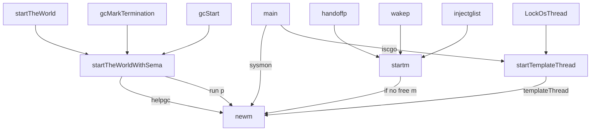

# 调度

## 基本数据结构

goroutine 在 runtime 中的数据结构:

```go
// stack 描述的是 Go 的执行栈，下界和上界分别为 [lo, hi]
// 如果从传统内存布局的角度来讲，Go 的栈实际上是分配在 C 语言中的堆区的
// 所以才能比 ulimit -s 的 stack size 还要大(1GB)
type stack struct {
    lo uintptr
    hi uintptr
}

type g struct {
    // Stack parameters.
    // stack describes the actual stack memory: [stack.lo, stack.hi).
    // stackguard0 is the stack pointer compared in the Go stack growth prologue.
    // It is stack.lo+StackGuard normally, but can be StackPreempt to trigger a preemption.
    // stackguard1 is the stack pointer compared in the C stack growth prologue.
    // It is stack.lo+StackGuard on g0 and gsignal stacks.
    // It is ~0 on other goroutine stacks, to trigger a call to morestackc (and crash).
    stack       stack   // offset known to runtime/cgo
    stackguard0 uintptr // offset known to liblink
    stackguard1 uintptr // offset known to liblink

    _panic         *_panic // innermost panic - offset known to liblink
    _defer         *_defer // innermost defer
    m              *m      // current m; offset known to arm liblink
    sched          gobuf
    syscallsp      uintptr        // if status==Gsyscall, syscallsp = sched.sp to use during gc
    syscallpc      uintptr        // if status==Gsyscall, syscallpc = sched.pc to use during gc
    stktopsp       uintptr        // expected sp at top of stack, to check in traceback
    param          unsafe.Pointer // passed parameter on wakeup
    atomicstatus   uint32
    stackLock      uint32 // sigprof/scang lock; TODO: fold in to atomicstatus
    goid           int64
    waitsince      int64  // approx time when the g become blocked
    waitreason     string // if status==Gwaiting
    schedlink      guintptr
    preempt        bool     // preemption signal, duplicates stackguard0 = stackpreempt
    throwsplit     bool     // must not split stack
    raceignore     int8     // ignore race detection events
    sysblocktraced bool     // StartTrace has emitted EvGoInSyscall about this goroutine
    sysexitticks   int64    // cputicks when syscall has returned (for tracing)
    traceseq       uint64   // trace event sequencer
    tracelastp     puintptr // last P emitted an event for this goroutine
    lockedm        muintptr
    sig            uint32
    writebuf       []byte
    sigcode0       uintptr
    sigcode1       uintptr
    sigpc          uintptr
    gopc           uintptr // pc of go statement that created this goroutine
    startpc        uintptr // pc of goroutine function
    racectx        uintptr
    waiting        *sudog         // sudog structures this g is waiting on (that have a valid elem ptr); in lock order
    cgoCtxt        []uintptr      // cgo traceback context
    labels         unsafe.Pointer // profiler labels
    timer          *timer         // cached timer for time.Sleep
    selectDone     uint32         // are we participating in a select and did someone win the race?
}
```

当 g 遇到阻塞，或需要等待的场景时，会被打包成 sudog 这样一个结构。一个 g 可能被打包为多个 sudog 分别挂在不同的等待队列上:

```go
// sudog represents a g in a wait list, such as for sending/receiving
// on a channel.
//
// sudog is necessary because the g ↔ synchronization object relation
// is many-to-many. A g can be on many wait lists, so there may be
// many sudogs for one g; and many gs may be waiting on the same
// synchronization object, so there may be many sudogs for one object.
//
// sudogs are allocated from a special pool. Use acquireSudog and
// releaseSudog to allocate and free them.
type sudog struct {
    // The following fields are protected by the hchan.lock of the
    // channel this sudog is blocking on. shrinkstack depends on
    // this for sudogs involved in channel ops.

    g *g

    // isSelect indicates g is participating in a select, so
    // g.selectDone must be CAS'd to win the wake-up race.
    isSelect bool
    next     *sudog
    prev     *sudog
    elem     unsafe.Pointer // data element (may point to stack)

    // The following fields are never accessed concurrently.
    // For channels, waitlink is only accessed by g.
    // For semaphores, all fields (including the ones above)
    // are only accessed when holding a semaRoot lock.

    acquiretime int64
    releasetime int64
    ticket      uint32
    parent      *sudog // semaRoot binary tree
    waitlink    *sudog // g.waiting list or semaRoot
    waittail    *sudog // semaRoot
    c           *hchan // channel
}
```

线程在 runtime 中的结构，对应一个 pthread，pthread 也会对应唯一的内核线程(task_struct):

```go
type m struct {
    g0      *g     // goroutine with scheduling stack
    morebuf gobuf  // gobuf arg to morestack
    divmod  uint32 // div/mod denominator for arm - known to liblink

    // Fields not known to debuggers.
    procid        uint64       // for debuggers, but offset not hard-coded
    gsignal       *g           // signal-handling g
    goSigStack    gsignalStack // Go-allocated signal handling stack
    sigmask       sigset       // storage for saved signal mask
    tls           [6]uintptr   // thread-local storage (for x86 extern register)
    mstartfn      func()
    curg          *g       // current running goroutine
    caughtsig     guintptr // goroutine running during fatal signal
    p             puintptr // attached p for executing go code (nil if not executing go code)
    nextp         puintptr
    id            int64
    mallocing     int32
    throwing      int32
    preemptoff    string // if != "", keep curg running on this m
    locks         int32
    softfloat     int32
    dying         int32
    profilehz     int32
    helpgc        int32
    spinning      bool // m is out of work and is actively looking for work
    blocked       bool // m is blocked on a note
    inwb          bool // m is executing a write barrier
    newSigstack   bool // minit on C thread called sigaltstack
    printlock     int8
    incgo         bool   // m is executing a cgo call
    freeWait      uint32 // if == 0, safe to free g0 and delete m (atomic)
    fastrand      [2]uint32
    needextram    bool
    traceback     uint8
    ncgocall      uint64      // number of cgo calls in total
    ncgo          int32       // number of cgo calls currently in progress
    cgoCallersUse uint32      // if non-zero, cgoCallers in use temporarily
    cgoCallers    *cgoCallers // cgo traceback if crashing in cgo call
    park          note
    alllink       *m // on allm
    schedlink     muintptr
    mcache        *mcache
    lockedg       guintptr
    createstack   [32]uintptr    // stack that created this thread.
    freglo        [16]uint32     // d[i] lsb and f[i]
    freghi        [16]uint32     // d[i] msb and f[i+16]
    fflag         uint32         // floating point compare flags
    lockedExt     uint32         // tracking for external LockOSThread
    lockedInt     uint32         // tracking for internal lockOSThread
    nextwaitm     muintptr       // next m waiting for lock
    waitunlockf   unsafe.Pointer // todo go func(*g, unsafe.pointer) bool
    waitlock      unsafe.Pointer
    waittraceev   byte
    waittraceskip int
    startingtrace bool
    syscalltick   uint32
    thread        uintptr // thread handle
    freelink      *m      // on sched.freem

    // these are here because they are too large to be on the stack
    // of low-level NOSPLIT functions.
    libcall   libcall
    libcallpc uintptr // for cpu profiler
    libcallsp uintptr
    libcallg  guintptr
    syscall   libcall // stores syscall parameters on windows

    mOS
}
```

抽象数据结构，可以认为是 processor 的抽象，代表了任务执行时的上下文，m 必须获得 p 才能执行:

```go
type p struct {
    lock mutex

    id          int32
    status      uint32 // one of pidle/prunning/...
    link        puintptr
    schedtick   uint32     // incremented on every scheduler call
    syscalltick uint32     // incremented on every system call
    sysmontick  sysmontick // last tick observed by sysmon
    m           muintptr   // back-link to associated m (nil if idle)
    mcache      *mcache
    racectx     uintptr

    deferpool    [5][]*_defer // pool of available defer structs of different sizes (see panic.go)
    deferpoolbuf [5][32]*_defer

    // Cache of goroutine ids, amortizes accesses to runtime·sched.goidgen.
    goidcache    uint64
    goidcacheend uint64

    // Queue of runnable goroutines. Accessed without lock.
    runqhead uint32
    runqtail uint32
    runq     [256]guintptr
    // runnext, if non-nil, is a runnable G that was ready'd by
    // the current G and should be run next instead of what's in
    // runq if there's time remaining in the running G's time
    // slice. It will inherit the time left in the current time
    // slice. If a set of goroutines is locked in a
    // communicate-and-wait pattern, this schedules that set as a
    // unit and eliminates the (potentially large) scheduling
    // latency that otherwise arises from adding the ready'd
    // goroutines to the end of the run queue.
    runnext guintptr

    // Available G's (status == Gdead)
    gfree    *g
    gfreecnt int32

    sudogcache []*sudog
    sudogbuf   [128]*sudog

    tracebuf traceBufPtr

    // traceSweep indicates the sweep events should be traced.
    // This is used to defer the sweep start event until a span
    // has actually been swept.
    traceSweep bool
    // traceSwept and traceReclaimed track the number of bytes
    // swept and reclaimed by sweeping in the current sweep loop.
    traceSwept, traceReclaimed uintptr

    palloc persistentAlloc // per-P to avoid mutex

    // Per-P GC state
    gcAssistTime         int64 // Nanoseconds in assistAlloc
    gcFractionalMarkTime int64 // Nanoseconds in fractional mark worker
    gcBgMarkWorker       guintptr
    gcMarkWorkerMode     gcMarkWorkerMode

    // gcMarkWorkerStartTime is the nanotime() at which this mark
    // worker started.
    gcMarkWorkerStartTime int64

    // gcw is this P's GC work buffer cache. The work buffer is
    // filled by write barriers, drained by mutator assists, and
    // disposed on certain GC state transitions.
    gcw gcWork

    // wbBuf is this P's GC write barrier buffer.
    //
    // TODO: Consider caching this in the running G.
    wbBuf wbBuf

    runSafePointFn uint32 // if 1, run sched.safePointFn at next safe point

    pad [sys.CacheLineSize]byte
}
```

全局调度器，全局只有一个 schedt 类型的实例:

```go
type schedt struct {
    // accessed atomically. keep at top to ensure alignment on 32-bit systems.
    goidgen  uint64
    lastpoll uint64

    lock mutex

    // When increasing nmidle, nmidlelocked, nmsys, or nmfreed, be
    // sure to call checkdead().

    midle        muintptr // idle m's waiting for work
    nmidle       int32    // number of idle m's waiting for work
    nmidlelocked int32    // number of locked m's waiting for work
    mnext        int64    // number of m's that have been created and next M ID
    maxmcount    int32    // maximum number of m's allowed (or die)
    nmsys        int32    // number of system m's not counted for deadlock
    nmfreed      int64    // cumulative number of freed m's

    ngsys uint32 // number of system goroutines; updated atomically

    pidle      puintptr // idle p's
    npidle     uint32
    nmspinning uint32 // See "Worker thread parking/unparking" comment in proc.go.

    // Global runnable queue.
    runqhead guintptr
    runqtail guintptr
    runqsize int32

    // Global cache of dead G's.
    gflock       mutex
    gfreeStack   *g
    gfreeNoStack *g
    ngfree       int32

    // Central cache of sudog structs.
    sudoglock  mutex
    sudogcache *sudog

    // Central pool of available defer structs of different sizes.
    deferlock mutex
    deferpool [5]*_defer

    // freem is the list of m's waiting to be freed when their
    // m.exited is set. Linked through m.freelink.
    freem *m

    gcwaiting  uint32 // gc is waiting to run
    stopwait   int32
    stopnote   note
    sysmonwait uint32
    sysmonnote note

    // safepointFn should be called on each P at the next GC
    // safepoint if p.runSafePointFn is set.
    safePointFn   func(*p)
    safePointWait int32
    safePointNote note

    profilehz int32 // cpu profiling rate

    procresizetime int64 // nanotime() of last change to gomaxprocs
    totaltime      int64 // ∫gomaxprocs dt up to procresizetime
}
```

## g/p/m 的关系

Go 实现了所谓的 M:N 模型，执行用户代码的 goroutine 可以认为都是对等的 goroutine。不考虑 g0 和 gsignal 的话，我们可以简单地认为调度就是将 m 绑定到 p，然后在 m 中不断循环执行调度函数(runtime.schedule)，寻找可用的 g 来执行，下图为 m 绑定到 p 时，可能得到的 g 的来源:

```
                                                +--------------+
                                                |    binded    +-------------------------------------+
                                                +-------+------+                                     |
+------------------------------------+                  |                                            v                         +------------------------------------+
|                                    |                  |                         +------------------------------------+       |                                    |
|             +------------------+   |                  |                         |                                    |       |            +------------------+    |
|             | Local Run Queue  |   |                  |                         |             +------------------+   |       |            | Global Run Queue |    |
|   other P   +-+-+-+-+-+-+-+-+--+   |                  |                         |             | Local Run Queue  |   |       |  schedt    +--+-+-+-+-+-+-+---+    |
|               |G|G|G|G|G|G|G|      |                  |                         |    P        +-+-+-+-+-+-+-+-+--+   |       |               |G|G|G|G|G|G|        |
|               +-+-+-+-+-+-+-+      |                  |                         |               |G|G|G|G|G|G|G|      |       |               +-+-+-+-+-+-+        |
|                ^                   |                  |                         |               +-+-+-+-+-+-+-+      |       |                ^                   |
+----------------+-------------------+                  |                         |                ^                   |       +----------------+-------------------+
                 |                                      |                         +----------------+-------------------+                        |
                 |                                      |                                          |                                            |
                 |                                      |                                          |                                            |
                 |                                      |                                          |                                            |
                 |                                      |                                          |                                            |
                 |                                      |                                          |                                            |
                 |                                      |                                          |                                            |
                 |                                      |                                          |                                            |
                 |                                      |                                          |                                            |
                 |                                      |                                          |                                            |
                 |                                      |                                          |                                            |
                 |                                      |                                          |                                            |
                 |                                      v                                          |                                            |
          +------+-------+                             .-.      +----------------+                 |                                            |
          |    steal     +----------------------------( M )-----+    runqget     +-----------------+                                            |
          +--------------+                             `-'      +----------------+                                                              |
                                                        |                                                                                       |
                                                        |                                                                           +-----------+-----+
                                                        +---------------------------------------------------------------------------+   globrunqget   |
                                                        |                                                                           +-----------------+
                                                        |
                                                        |
                                                        |
                                                        |
                                                        |
                                                        |
                                             +----------+--------+
                                             |   get netpoll g   |
                                             +----------+--------+
                                                        |
                                                        |
                                                        |
                                                        |
                                                        |
                                         +--------------+--------------------+
                                         |              |                    |
                                         |              |                    |
                                         |   netpoll    v                    |
                                         |             +-+-+-+-+             |
                                         |             |G|G|G|G|             |
                                         |             +-+-+-+-+             |
                                         |                                   |
                                         +-----------------------------------+
```


这张图展示了 g、p、m 三者之间的大致关系。m 是执行实体，对应的是操作系统线程。可以看到 m 会从绑定的 p 的本地队列、sched 中的全局队列、netpoll 中获取可运行的 g，实在找不着还会去其它的 p 那里去偷。

## p 如何初始化

程序启动时，会依次调用：


在 procresize 中会将全局 p 数组初始化，并将这些 p 串成链表放进 sched 全局调度器的 pidle 队列中:

```go
for i := nprocs - 1; i >= 0; i-- {
    p := allp[i]

    // ...
    // 设置 p 的状态
    p.status = _Pidle
    // 初始化时，所有 p 的 runq 都是空的，所以一定会走这个 if
    if runqempty(p) {
        // 将 p 放到全局调度器的 pidle 队列中
        pidleput(p)
    } else {
        // ...
    }
}
```

pidleput 也比较简单，没啥可说的:

```go
func pidleput(_p_ *p) {
    if !runqempty(_p_) {
        throw("pidleput: P has non-empty run queue")
    }
    // 简单的链表操作
    _p_.link = sched.pidle
    sched.pidle.set(_p_)

    // pidle count + 1
    atomic.Xadd(&sched.npidle, 1)
}
```

所有 p 在程序启动的时候就已经被初始化完毕了，除非手动调用 runtime.GOMAXPROCS。

```go
func GOMAXPROCS(n int) int {
    lock(&sched.lock)
    ret := int(gomaxprocs)
    unlock(&sched.lock)
    if n <= 0 || n == ret {
        return ret
    }

    stopTheWorld("GOMAXPROCS")

    // newprocs will be processed by startTheWorld
    newprocs = int32(n)

    startTheWorld()
    return ret
}
```

在 startTheWorld 中会调用 procresize。

## g 如何创建

在用户代码里一般这么写:

```go
go func() {
    // do the stuff
}()
```

实际上会被翻译成 `runtime.newproc`，特权语法只是个语法糖。如果你要在其它语言里实现类似的东西，只要实现编译器翻译之后的内容就好了。具体流程:


newproc 干的事情也比较简单

```go
func newproc(siz int32, fn *funcval) {
    // add 是一个指针运算，跳过函数指针
    // 把栈上的参数起始地址找到
    argp := add(unsafe.Pointer(&fn), sys.PtrSize)
    pc := getcallerpc()
    systemstack(func() {
        newproc1(fn, (*uint8)(argp), siz, pc)
    })
}

// funcval 是一个变长结构，第一个成员是函数指针
// 所以上面的 add 是跳过这个 fn
type funcval struct {
    fn uintptr
    // variable-size, fn-specific data here
}
```

runtime 里比较常见的 getcallerpc 和 getcallersp，代码里的注释写的比较明白了:

```go
// For example:
//
// func f(arg1, arg2, arg3 int) {
//    pc := getcallerpc()
//    sp := getcallersp(unsafe.Pointer(&arg1))
//}
//
// These two lines find the PC and SP immediately following
// the call to f (where f will return).
//
```

getcallerpc 返回的是调用函数之后的那条程序指令的地址，即 callee 函数返回时要执行的下一条指令的地址。

systemstack 在 runtime 中用的也比较多，其功能为让 m 切换到 g0 上执行各种调度函数。至于啥是 g0，在讲 m 的时候再说。

newproc1 的工作流程也比较简单:


删掉了不关心的细节后的代码:

```go
func newproc1(fn *funcval, argp *uint8, narg int32, callerpc uintptr) {
    _g_ := getg()

    if fn == nil {
        _g_.m.throwing = -1 // do not dump full stacks
        throw("go of nil func value")
    }
    _g_.m.locks++ // disable preemption because it can be holding p in a local var
    siz := narg
    siz = (siz + 7) &^ 7


    _p_ := _g_.m.p.ptr()
    newg := gfget(_p_)
    if newg == nil {
        newg = malg(_StackMin)
        casgstatus(newg, _Gidle, _Gdead)
        allgadd(newg) // publishes with a g->status of Gdead so GC scanner doesn't look at uninitialized stack.
    }

    totalSize := 4*sys.RegSize + uintptr(siz) + sys.MinFrameSize // extra space in case of reads slightly beyond frame
    totalSize += -totalSize & (sys.SpAlign - 1)                  // align to spAlign
    sp := newg.stack.hi - totalSize
    spArg := sp

    // 初始化 g，g 的 gobuf 现场，g 的 m 的 curg
    // 以及各种寄存器
    memclrNoHeapPointers(unsafe.Pointer(&newg.sched), unsafe.Sizeof(newg.sched))
    newg.sched.sp = sp
    newg.stktopsp = sp
    newg.sched.pc = funcPC(goexit) + sys.PCQuantum // +PCQuantum so that previous instruction is in same function
    newg.sched.g = guintptr(unsafe.Pointer(newg))
    gostartcallfn(&newg.sched, fn)
    newg.gopc = callerpc
    newg.startpc = fn.fn
    if _g_.m.curg != nil {
        newg.labels = _g_.m.curg.labels
    }

    casgstatus(newg, _Gdead, _Grunnable)

    newg.goid = int64(_p_.goidcache)
    _p_.goidcache++
    runqput(_p_, newg, true)

    if atomic.Load(&sched.npidle) != 0 && atomic.Load(&sched.nmspinning) == 0 && mainStarted {
        wakep()
    }
    _g_.m.locks--
    if _g_.m.locks == 0 && _g_.preempt { // restore the preemption request in case we've cleared it in newstack
        _g_.stackguard0 = stackPreempt
    }
}
```

所以 `go func` 执行的结果是调用 runqput 将 g 放进了执行队列。什么时候开始执行并不是用户代码能决定得了的。再看看 runqput 这个函数:

```go
// runqput tries to put g on the local runnable queue.
// If next if false, runqput adds g to the tail of the runnable queue.
// If next is true, runqput puts g in the _p_.runnext slot.
// If the run queue is full, runnext puts g on the global queue.
// Executed only by the owner P.
func runqput(_p_ *p, gp *g, next bool) {
    if randomizeScheduler && next && fastrand()%2 == 0 {
        next = false
    }

    if next {
    retryNext:
        oldnext := _p_.runnext
        if !_p_.runnext.cas(oldnext, guintptr(unsafe.Pointer(gp))) {
            goto retryNext
        }
        if oldnext == 0 {
            return
        }
        // Kick the old runnext out to the regular run queue.
        gp = oldnext.ptr()
    }

retry:
    h := atomic.Load(&_p_.runqhead) // load-acquire, synchronize with consumers
    t := _p_.runqtail
    if t-h < uint32(len(_p_.runq)) {
        _p_.runq[t%uint32(len(_p_.runq))].set(gp)
        atomic.Store(&_p_.runqtail, t+1) // store-release, makes the item available for consumption
        return
    }
    if runqputslow(_p_, gp, h, t) {
        return
    }
    // the queue is not full, now the put above must succeed
    goto retry
}
```

## m 工作机制

在 runtime 中有三种线程，一种是主线程，一种是用来跑 sysmon 的线程，一种是普通的用户线程。主线程在 runtime 由对应的全局变量: `runtime.m0` 来表示。用户线程就是普通的线程了，和 p 绑定，执行 g 中的任务。虽然说是有三种，实际上前两种线程整个 runtime 就只有一个实例。用户线程才会有很多实例。

### 主线程 m0

主线程中用来跑 `runtime.main`，流程线性执行，没有跳转:


### sysmon 线程

sysmon 是在 `runtime.main` 中启动的，不过需要注意的是 sysmon 并不是在 m0 上执行的。因为:

```go
systemstack(func() {
    newm(sysmon, nil)
})
```

创建了新的 m，但这个 m 又与普通的线程不一样，因为不需要绑定 p 就可以执行。是与整个调度系统脱离的。

sysmon 内部是个死循环，主要负责以下几件事情:

1. checkdead，检查是否所有 goroutine 都已经锁死，如果是的话，直接调用 runtime.throw，强制退出

2. 将 netpoll 返回的结果注入到全局 sched 的任务队列

3. 收回因为 syscall 而长时间阻塞的 p，同时抢占那些执行时间过长的 g

4. 如果 span 内存闲置超过 5min，那么释放掉

```go
// Always runs without a P, so write barriers are not allowed.
//
//go:nowritebarrierrec
func sysmon() {
    lock(&sched.lock)
    sched.nmsys++
    checkdead()
    unlock(&sched.lock)

    // If a heap span goes unused for 5 minutes after a garbage collection,
    // we hand it back to the operating system.
    scavengelimit := int64(5 * 60 * 1e9)

    if debug.scavenge > 0 {
        // Scavenge-a-lot for testing.
        forcegcperiod = 10 * 1e6
        scavengelimit = 20 * 1e6
    }

    lastscavenge := nanotime()
    nscavenge := 0

    lasttrace := int64(0)
    idle := 0 // how many cycles in succession we had not wokeup somebody
    delay := uint32(0)
    for {
        if idle == 0 { // start with 20us sleep...
            delay = 20
        } else if idle > 50 { // start doubling the sleep after 1ms...
            delay *= 2
        }
        if delay > 10*1000 { // up to 10ms
            delay = 10 * 1000
        }
        usleep(delay)
        if debug.schedtrace <= 0 && (sched.gcwaiting != 0 || atomic.Load(&sched.npidle) == uint32(gomaxprocs)) {
            lock(&sched.lock)
            if atomic.Load(&sched.gcwaiting) != 0 || atomic.Load(&sched.npidle) == uint32(gomaxprocs) {
                atomic.Store(&sched.sysmonwait, 1)
                unlock(&sched.lock)
                // Make wake-up period small enough
                // for the sampling to be correct.
                maxsleep := forcegcperiod / 2
                if scavengelimit < forcegcperiod {
                    maxsleep = scavengelimit / 2
                }
                shouldRelax := true
                if osRelaxMinNS > 0 {
                    next := timeSleepUntil()
                    now := nanotime()
                    if next-now < osRelaxMinNS {
                        shouldRelax = false
                    }
                }
                if shouldRelax {
                    osRelax(true)
                }
                notetsleep(&sched.sysmonnote, maxsleep)
                if shouldRelax {
                    osRelax(false)
                }
                lock(&sched.lock)
                atomic.Store(&sched.sysmonwait, 0)
                noteclear(&sched.sysmonnote)
                idle = 0
                delay = 20
            }
            unlock(&sched.lock)
        }
        // trigger libc interceptors if needed
        if *cgo_yield != nil {
            asmcgocall(*cgo_yield, nil)
        }
        // poll network if not polled for more than 10ms
        lastpoll := int64(atomic.Load64(&sched.lastpoll))
        now := nanotime()
        if netpollinited() && lastpoll != 0 && lastpoll+10*1000*1000 < now {
            atomic.Cas64(&sched.lastpoll, uint64(lastpoll), uint64(now))
            gp := netpoll(false) // non-blocking - returns list of goroutines
            if gp != nil {
                // Need to decrement number of idle locked M's
                // (pretending that one more is running) before injectglist.
                // Otherwise it can lead to the following situation:
                // injectglist grabs all P's but before it starts M's to run the P's,
                // another M returns from syscall, finishes running its G,
                // observes that there is no work to do and no other running M's
                // and reports deadlock.
                incidlelocked(-1)
                injectglist(gp)
                incidlelocked(1)
            }
        }
        // retake P's blocked in syscalls
        // and preempt long running G's
        if retake(now) != 0 {
            idle = 0
        } else {
            idle++
        }
        // check if we need to force a GC
        if t := (gcTrigger{kind: gcTriggerTime, now: now}); t.test() && atomic.Load(&forcegc.idle) != 0 {
            lock(&forcegc.lock)
            forcegc.idle = 0
            forcegc.g.schedlink = 0
            injectglist(forcegc.g)
            unlock(&forcegc.lock)
        }
        // scavenge heap once in a while
        if lastscavenge+scavengelimit/2 < now {
            mheap_.scavenge(int32(nscavenge), uint64(now), uint64(scavengelimit))
            lastscavenge = now
            nscavenge++
        }
        if debug.schedtrace > 0 && lasttrace+int64(debug.schedtrace)*1000000 <= now {
            lasttrace = now
            schedtrace(debug.scheddetail > 0)
        }
    }
}
```

retake:

```go
// forcePreemptNS is the time slice given to a G before it is
// preempted.
const forcePreemptNS = 10 * 1000 * 1000 // 10ms

func retake(now int64) uint32 {
    n := 0
    // Prevent allp slice changes. This lock will be completely
    // uncontended unless we're already stopping the world.
    lock(&allpLock)
    // We can't use a range loop over allp because we may
    // temporarily drop the allpLock. Hence, we need to re-fetch
    // allp each time around the loop.
    for i := 0; i < len(allp); i++ {
        _p_ := allp[i]
        if _p_ == nil {
            // This can happen if procresize has grown
            // allp but not yet created new Ps.
            continue
        }
        pd := &_p_.sysmontick
        s := _p_.status
        if s == _Psyscall {
            // Retake P from syscall if it's there for more than 1 sysmon tick (at least 20us).
            t := int64(_p_.syscalltick)
            if int64(pd.syscalltick) != t {
                pd.syscalltick = uint32(t)
                pd.syscallwhen = now
                continue
            }
            // On the one hand we don't want to retake Ps if there is no other work to do,
            // but on the other hand we want to retake them eventually
            // because they can prevent the sysmon thread from deep sleep.
            if runqempty(_p_) && atomic.Load(&sched.nmspinning)+atomic.Load(&sched.npidle) > 0 && pd.syscallwhen+10*1000*1000 > now {
                continue
            }
            // Drop allpLock so we can take sched.lock.
            unlock(&allpLock)
            // Need to decrement number of idle locked M's
            // (pretending that one more is running) before the CAS.
            // Otherwise the M from which we retake can exit the syscall,
            // increment nmidle and report deadlock.
            incidlelocked(-1)
            if atomic.Cas(&_p_.status, s, _Pidle) {
                if trace.enabled {
                    traceGoSysBlock(_p_)
                    traceProcStop(_p_)
                }
                n++
                _p_.syscalltick++
                handoffp(_p_)
            }
            incidlelocked(1)
            lock(&allpLock)
        } else if s == _Prunning {
            // Preempt G if it's running for too long.
            t := int64(_p_.schedtick)
            if int64(pd.schedtick) != t {
                pd.schedtick = uint32(t)
                pd.schedwhen = now
                continue
            }
            if pd.schedwhen+forcePreemptNS > now {
                continue
            }
            preemptone(_p_)
        }
    }
    unlock(&allpLock)
    return uint32(n)
}
```

### 普通线程

普通线程就是我们 G/P/M 模型里的 M 了，M 对应的就是操作系统的线程。

#### 线程创建

上面在创建 sysmon 线程的时候也看到了，创建线程的函数是 newm。


最终会走到 linux 创建线程的系统调用 `clone`，代码里大段和 cgo 相关的内容我们就不关心了，摘掉 cgo 相关的逻辑后的代码如下:

```go
// Create a new m. It will start off with a call to fn, or else the scheduler.
// fn needs to be static and not a heap allocated closure.
// May run with m.p==nil, so write barriers are not allowed.
//go:nowritebarrierrec
func newm(fn func(), _p_ *p) {
    mp := allocm(_p_, fn)
    mp.nextp.set(_p_)
    mp.sigmask = initSigmask
    newm1(mp)
}
```

传入的 p 会被赋值给 m 的 nextp 成员，在 m 执行 schedule 时，会将 nextp 拿出来，进行之后真正的绑定操作(其实就是把 nextp 赋值为 nil，并把这个 nextp 赋值给 m.p，把 m 赋值给 p.m)。

```go
func newm1(mp *m) {
    execLock.rlock() // Prevent process clone.
    newosproc(mp, unsafe.Pointer(mp.g0.stack.hi))
    execLock.runlock()
}
```

```go
func newosproc(mp *m, stk unsafe.Pointer) {
    // Disable signals during clone, so that the new thread starts
    // with signals disabled. It will enable them in minit.
    var oset sigset
    sigprocmask(_SIG_SETMASK, &sigset_all, &oset)
    ret := clone(cloneFlags, stk, unsafe.Pointer(mp), unsafe.Pointer(mp.g0), unsafe.Pointer(funcPC(mstart)))
    sigprocmask(_SIG_SETMASK, &oset, nil)

    if ret < 0 {
        print("runtime: failed to create new OS thread (have ", mcount(), " already; errno=", -ret, ")\n")
        if ret == -_EAGAIN {
            println("runtime: may need to increase max user processes (ulimit -u)")
        }
        throw("newosproc")
    }
}
```

#### 工作流程

首先空闲的 m 会被丢进全局调度器的 midle 队列中，在需要 m 的时候，会先从这里取:

```go
// Try to get an m from midle list.
// Sched must be locked.
// May run during STW, so write barriers are not allowed.
//go:nowritebarrierrec
func mget() *m {
    mp := sched.midle.ptr()
    if mp != nil {
        sched.midle = mp.schedlink
        sched.nmidle--
    }
    return mp
}
```

取不到的话就会调用之前提到的 newm 来创建新线程，创建的线程是不会被销毁的，哪怕之后不需要这么多 m 了，也就只是会把 m 放在 midle 中。

什么时候会创建线程呢，可以追踪一下 newm 的调用方:



TODO，依次说明

创建好的线程需要绑定到 p 之后才会开始执行，如果运行 syscall 时间过长，会被剥夺掉 p，但这时候实际上 m 还是在运行中的(TODO，看看这个描述是否精确)。

工作线程执行的内容核心其实就只有俩: `schedule()` 和 `findrunnable()`。

```go
// One round of scheduler: find a runnable goroutine and execute it.
// Never returns.
func schedule() {
    _g_ := getg()

    if _g_.m.locks != 0 {
        throw("schedule: holding locks")
    }

    if _g_.m.lockedg != 0 {
        stoplockedm()
        execute(_g_.m.lockedg.ptr(), false) // Never returns.
    }

    // We should not schedule away from a g that is executing a cgo call,
    // since the cgo call is using the m's g0 stack.
    if _g_.m.incgo {
        throw("schedule: in cgo")
    }

top:
    if sched.gcwaiting != 0 {
        gcstopm()
        goto top
    }
    if _g_.m.p.ptr().runSafePointFn != 0 {
        runSafePointFn()
    }

    var gp *g
    var inheritTime bool
    if trace.enabled || trace.shutdown {
        gp = traceReader()
        if gp != nil {
            casgstatus(gp, _Gwaiting, _Grunnable)
            traceGoUnpark(gp, 0)
        }
    }
    if gp == nil && gcBlackenEnabled != 0 {
        gp = gcController.findRunnableGCWorker(_g_.m.p.ptr())
    }
    if gp == nil {
        // Check the global runnable queue once in a while to ensure fairness.
        // Otherwise two goroutines can completely occupy the local runqueue
        // by constantly respawning each other.
        if _g_.m.p.ptr().schedtick%61 == 0 && sched.runqsize > 0 {
            lock(&sched.lock)
            gp = globrunqget(_g_.m.p.ptr(), 1)
            unlock(&sched.lock)
        }
    }
    if gp == nil {
        gp, inheritTime = runqget(_g_.m.p.ptr())
        if gp != nil && _g_.m.spinning {
            throw("schedule: spinning with local work")
        }
    }
    if gp == nil {
        gp, inheritTime = findrunnable() // blocks until work is available
    }

    // This thread is going to run a goroutine and is not spinning anymore,
    // so if it was marked as spinning we need to reset it now and potentially
    // start a new spinning M.
    if _g_.m.spinning {
        resetspinning()
    }

    if gp.lockedm != 0 {
        // Hands off own p to the locked m,
        // then blocks waiting for a new p.
        startlockedm(gp)
        goto top
    }

    execute(gp, inheritTime)
}
```

```go
// Finds a runnable goroutine to execute.
// Tries to steal from other P's, get g from global queue, poll network.
func findrunnable() (gp *g, inheritTime bool) {
    _g_ := getg()

    // The conditions here and in handoffp must agree: if
    // findrunnable would return a G to run, handoffp must start
    // an M.

top:
    _p_ := _g_.m.p.ptr()
    if sched.gcwaiting != 0 {
        gcstopm()
        goto top
    }
    if _p_.runSafePointFn != 0 {
        runSafePointFn()
    }
    if fingwait && fingwake {
        if gp := wakefing(); gp != nil {
            ready(gp, 0, true)
        }
    }
    if *cgo_yield != nil {
        asmcgocall(*cgo_yield, nil)
    }

    // local runq
    if gp, inheritTime := runqget(_p_); gp != nil {
        return gp, inheritTime
    }

    // global runq
    if sched.runqsize != 0 {
        lock(&sched.lock)
        gp := globrunqget(_p_, 0)
        unlock(&sched.lock)
        if gp != nil {
            return gp, false
        }
    }

    // Poll network.
    // This netpoll is only an optimization before we resort to stealing.
    // We can safely skip it if there are no waiters or a thread is blocked
    // in netpoll already. If there is any kind of logical race with that
    // blocked thread (e.g. it has already returned from netpoll, but does
    // not set lastpoll yet), this thread will do blocking netpoll below
    // anyway.
    if netpollinited() && atomic.Load(&netpollWaiters) > 0 && atomic.Load64(&sched.lastpoll) != 0 {
        if gp := netpoll(false); gp != nil { // non-blocking
            // netpoll returns list of goroutines linked by schedlink.
            injectglist(gp.schedlink.ptr())
            casgstatus(gp, _Gwaiting, _Grunnable)
            if trace.enabled {
                traceGoUnpark(gp, 0)
            }
            return gp, false
        }
    }

    // Steal work from other P's.
    procs := uint32(gomaxprocs)
    if atomic.Load(&sched.npidle) == procs-1 {
        // Either GOMAXPROCS=1 or everybody, except for us, is idle already.
        // New work can appear from returning syscall/cgocall, network or timers.
        // Neither of that submits to local run queues, so no point in stealing.
        goto stop
    }
    // If number of spinning M's >= number of busy P's, block.
    // This is necessary to prevent excessive CPU consumption
    // when GOMAXPROCS>>1 but the program parallelism is low.
    if !_g_.m.spinning && 2*atomic.Load(&sched.nmspinning) >= procs-atomic.Load(&sched.npidle) {
        goto stop
    }
    if !_g_.m.spinning {
        _g_.m.spinning = true
        atomic.Xadd(&sched.nmspinning, 1)
    }
    for i := 0; i < 4; i++ {
        for enum := stealOrder.start(fastrand()); !enum.done(); enum.next() {
            if sched.gcwaiting != 0 {
                goto top
            }
            stealRunNextG := i > 2 // first look for ready queues with more than 1 g
            if gp := runqsteal(_p_, allp[enum.position()], stealRunNextG); gp != nil {
                return gp, false
            }
        }
    }

stop:

    // We have nothing to do. If we're in the GC mark phase, can
    // safely scan and blacken objects, and have work to do, run
    // idle-time marking rather than give up the P.
    if gcBlackenEnabled != 0 && _p_.gcBgMarkWorker != 0 && gcMarkWorkAvailable(_p_) {
        _p_.gcMarkWorkerMode = gcMarkWorkerIdleMode
        gp := _p_.gcBgMarkWorker.ptr()
        casgstatus(gp, _Gwaiting, _Grunnable)
        if trace.enabled {
            traceGoUnpark(gp, 0)
        }
        return gp, false
    }

    // Before we drop our P, make a snapshot of the allp slice,
    // which can change underfoot once we no longer block
    // safe-points. We don't need to snapshot the contents because
    // everything up to cap(allp) is immutable.
    allpSnapshot := allp

    // return P and block
    lock(&sched.lock)
    if sched.gcwaiting != 0 || _p_.runSafePointFn != 0 {
        unlock(&sched.lock)
        goto top
    }
    if sched.runqsize != 0 {
        gp := globrunqget(_p_, 0)
        unlock(&sched.lock)
        return gp, false
    }
    if releasep() != _p_ {
        throw("findrunnable: wrong p")
    }
    pidleput(_p_)
    unlock(&sched.lock)

    // Delicate dance: thread transitions from spinning to non-spinning state,
    // potentially concurrently with submission of new goroutines. We must
    // drop nmspinning first and then check all per-P queues again (with
    // #StoreLoad memory barrier in between). If we do it the other way around,
    // another thread can submit a goroutine after we've checked all run queues
    // but before we drop nmspinning; as the result nobody will unpark a thread
    // to run the goroutine.
    // If we discover new work below, we need to restore m.spinning as a signal
    // for resetspinning to unpark a new worker thread (because there can be more
    // than one starving goroutine). However, if after discovering new work
    // we also observe no idle Ps, it is OK to just park the current thread:
    // the system is fully loaded so no spinning threads are required.
    // Also see "Worker thread parking/unparking" comment at the top of the file.
    wasSpinning := _g_.m.spinning
    if _g_.m.spinning {
        _g_.m.spinning = false
        if int32(atomic.Xadd(&sched.nmspinning, -1)) < 0 {
            throw("findrunnable: negative nmspinning")
        }
    }

    // check all runqueues once again
    for _, _p_ := range allpSnapshot {
        if !runqempty(_p_) {
            lock(&sched.lock)
            _p_ = pidleget()
            unlock(&sched.lock)
            if _p_ != nil {
                acquirep(_p_)
                if wasSpinning {
                    _g_.m.spinning = true
                    atomic.Xadd(&sched.nmspinning, 1)
                }
                goto top
            }
            break
        }
    }

    // Check for idle-priority GC work again.
    if gcBlackenEnabled != 0 && gcMarkWorkAvailable(nil) {
        lock(&sched.lock)
        _p_ = pidleget()
        if _p_ != nil && _p_.gcBgMarkWorker == 0 {
            pidleput(_p_)
            _p_ = nil
        }
        unlock(&sched.lock)
        if _p_ != nil {
            acquirep(_p_)
            if wasSpinning {
                _g_.m.spinning = true
                atomic.Xadd(&sched.nmspinning, 1)
            }
            // Go back to idle GC check.
            goto stop
        }
    }

    // poll network
    if netpollinited() && atomic.Load(&netpollWaiters) > 0 && atomic.Xchg64(&sched.lastpoll, 0) != 0 {
        if _g_.m.p != 0 {
            throw("findrunnable: netpoll with p")
        }
        if _g_.m.spinning {
            throw("findrunnable: netpoll with spinning")
        }
        gp := netpoll(true) // block until new work is available
        atomic.Store64(&sched.lastpoll, uint64(nanotime()))
        if gp != nil {
            lock(&sched.lock)
            _p_ = pidleget()
            unlock(&sched.lock)
            if _p_ != nil {
                acquirep(_p_)
                injectglist(gp.schedlink.ptr())
                casgstatus(gp, _Gwaiting, _Grunnable)
                if trace.enabled {
                    traceGoUnpark(gp, 0)
                }
                return gp, false
            }
            injectglist(gp)
        }
    }
    stopm()
    goto top
}
```


## g 的状态迁移

## p 的状态迁移


> Written with [StackEdit](https://stackedit.io/).
<!--stackedit_data:
eyJoaXN0b3J5IjpbLTE5MzYwMjIwODBdfQ==
-->


> Written with [StackEdit](https://stackedit.io/).
<!--stackedit_data:
eyJoaXN0b3J5IjpbLTQ4NzM1ODY2MF19
-->